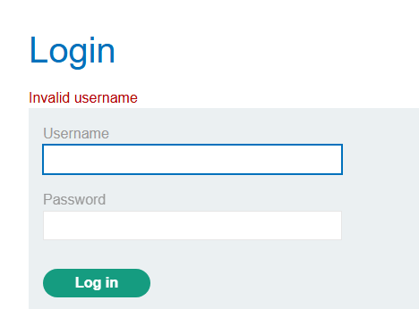
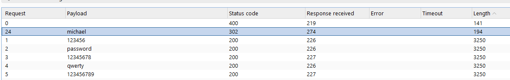
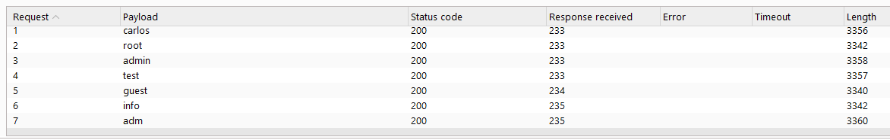
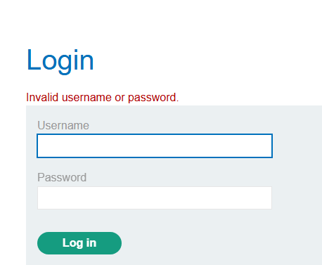
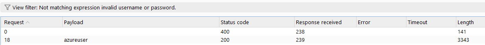

# Authentication vulnerabilities
## Khái niệm
**Authentication**, hay **Xác thực**, là quá trình kiểm tra xem user đăng nhập vào có đúng là chính chủ tài khoản hay không. Khái niệm đơn giản nhất cho việc xác thực chính là mật khẩu, sau đó là các hình thức khác như 2FA, passkey,... Tuy nhiên, kẻ tấn công vẫn có thể xâm nhập vào tài khoản dù không biết chính xác mật khẩu.
## Lab
### Lab: Username enumeration via different responses
Lab này giả định kẻ tấn công có 1 danh sách tài khoản và mật khẩu, giờ cần kiểm tra xem tài khoản nào hợp lệ và mật khẩu nào cho tài khoản đó. Ta sẽ sử dụng Burp Intruder để bruteforce lab này.

Đối với tài khoản nào không hợp lệ, hệ thống báo `Invalid username`

Còn với tài khoản hợp lệ, hệ thống báo `Incorrect Password`

Sau khi tìm được username, ta chuyển sang bruteforce mật khẩu

Mật khẩu đúng sẽ có status 302. Lấy tài khoản và mật khẩu đăng nhập để hoàn thành lab.

### Lab: Username enumeration via subtly different responses
Cũng cách thức tương tự như trên, tuy nhiên khi bruteforce danh sách tài khoản ta nhận thấy độ dài của các request chỉ chênh lệch từ 3-12 kí tự:

Điều đó là do ở trong các dòng HTML của page xuất hiện dòng `fetch('/analytics?id=***')`

Mục đích chính của dòng trên chỉ mang tính chất gây nhiễu để ta không thể check request bằng độ dài. 

Khi kiểm tra thông báo của các request sai, ta thấy đều là `Invalid username or password.`

Vậy nếu ta thử filter lọc đi những request chứa câu đó thì sao?

Bước còn lại là bruteforce để tìm mật khẩu.

