# Cross-site request forgery (CSRF)
## Khái niệm
CSRF là kỹ thuật tấn công bằng cách mượn quyền xác nhận danh tính người dùng đối với một website, với mục đích tấn công vào quyền hạn và dữ liệu của người dùng. Cho đến nay, có nhiều cách để tấn công CSRF, nhưng sẽ quy chung về 2 phương pháp chính:
+ Dụ dỗ nạn nhân bấm vào đường link độc: Kẻ tấn công cố gắng lừa nạn nhân bấm vào 1 đường link độc, có thể là dẫn tới trang web giả mạo hoặc là trang web thật nhưng đã bị chèn mã độc. 
+ Mã độc đã được lưu trên trang web: Mã độc được chèn trong các bài đăng, comment, đánh giá,... Nếu browser của người dùng load các bài đăng hay đánh giá đó, mã độc sẽ được kích hoạt.

## Lab
### Lab: CSRF vulnerability with no defenses
Lab này chứa vuln CSRF rất cơ bản khi mà ở chức năng `change email` xác thực phụ thuộc hoàn toàn vào session của user:

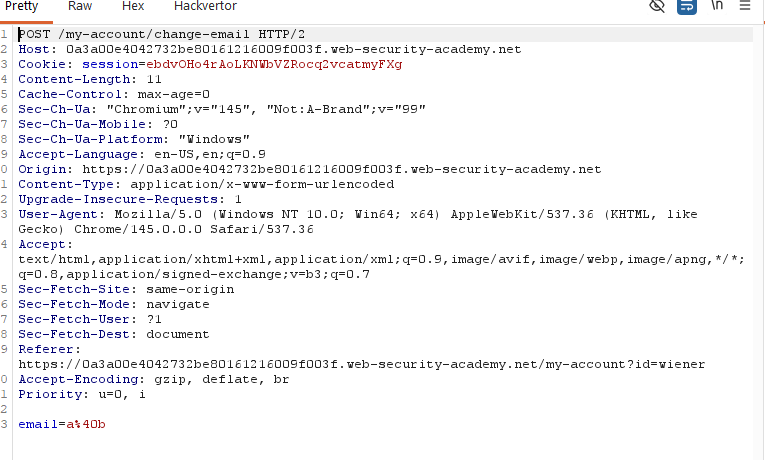

Đối với các Lab, thì thay vì tạo 1 trang HTML, ta có thể sử dụng chức năng tạo CSRF PoC của BurpSuite để tiết kiệm thời gian. 

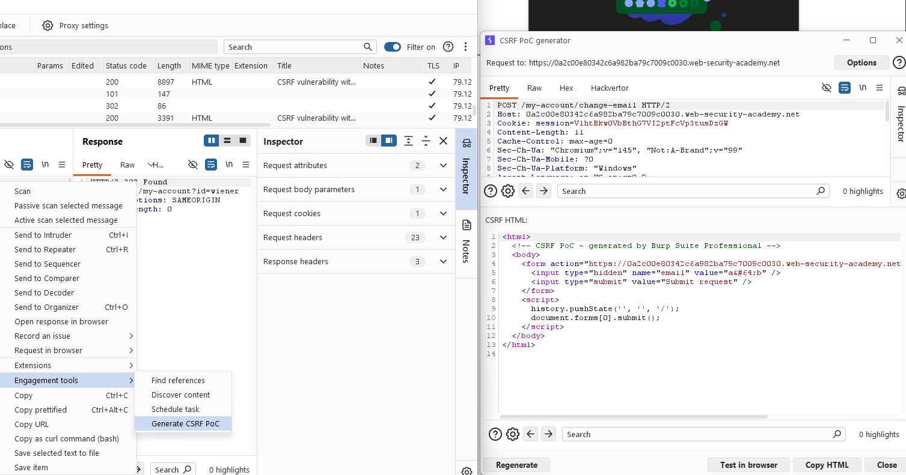

Copy đoạn HTML này vào exploit, thay thế domain email là domain của server exploit rồi gửi đến nạn nhân là hoàn tất.

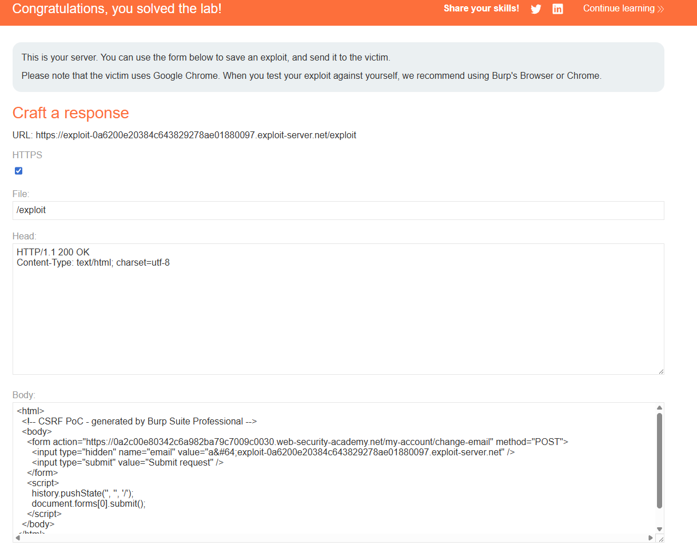

Về chức năng của đoạn HTML này, thì nó tự tạo 1 nút bấm chứa chức năng `change email`, với input là email do ta muốn. Sau đó script sẽ trigger nút bấm để thay đổi email. Do chức năng `change email` không có token xác thực nào khác ngoài cookie `Session`, thứ sẽ tự động được thêm vào khi request được gửi tới server, nên email của nạn nhân sẽ chắc chắn bị thay đổi.

### Lab: CSRF where token validation depends on request method
Để bảo vệ khỏi các cuộc tấn công CSRF, các website thêm token CSRF ở các chức năng quan trọng, ví dụ như đổi mật khẩu hay đổi email.

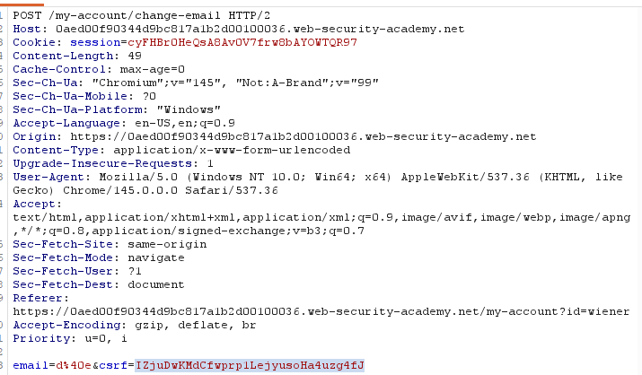

Tuy nhiên, sẽ có một vài lỗ hỏng trong việc xác thực CSRF token. Đối với lab này, lỗ hỏng đó nằm ở Request method khi mà ta đổi từ Method `POST` sang `GET`, CSRF Token khi này là không cần thiết:

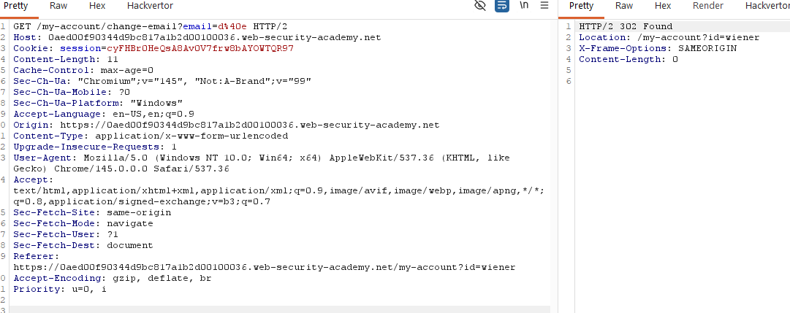

Việc còn lại làm tương tự như lab đầu tiên.

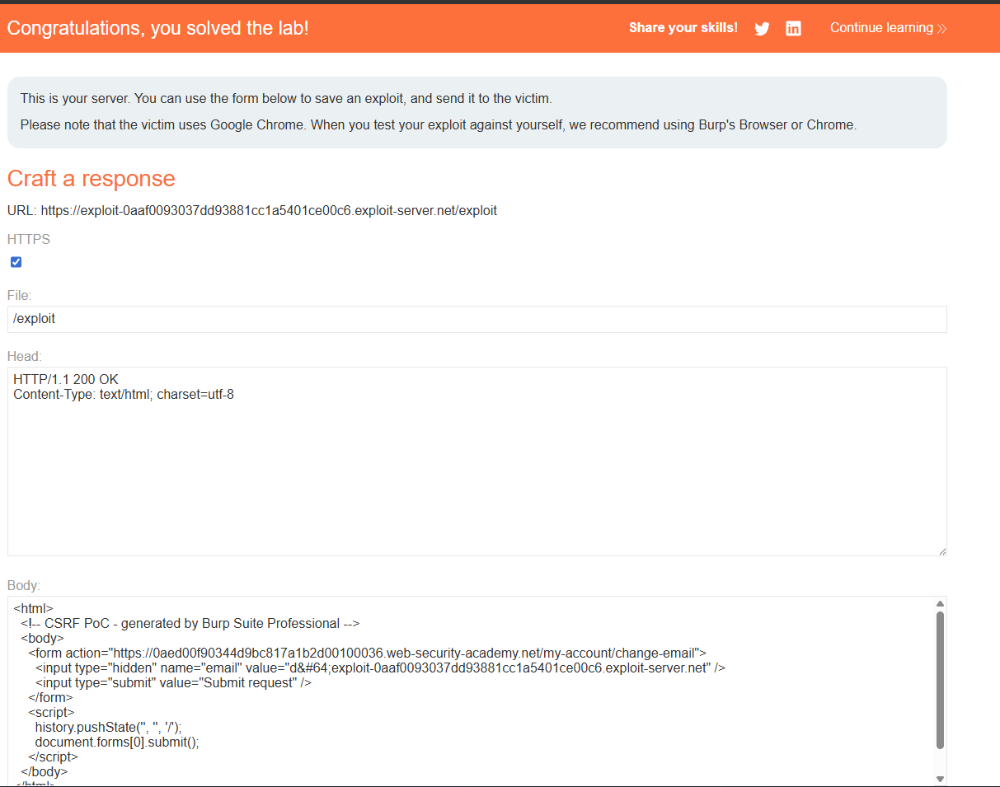

### Lab: CSRF where token validation depends on token being present
Một lỗi khác của việc xác thực CSRF token là đôi khi, việc xác thực chỉ xảy ra nếu token tồn tại ở Request, tức là ta có thể xoá đi token để bypass.

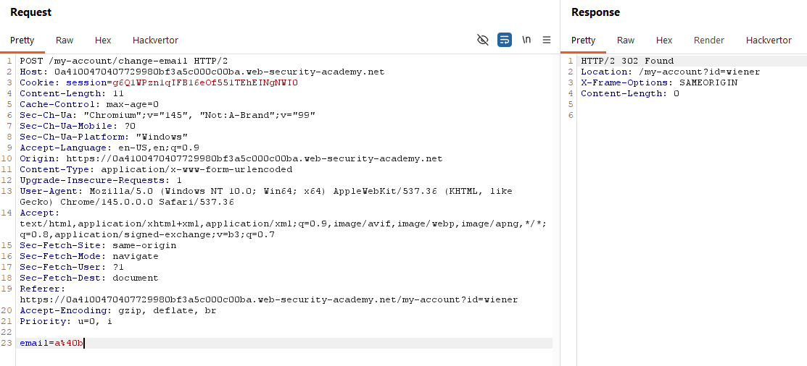

Việc còn lại làm tương tự với lab đầu tiên.

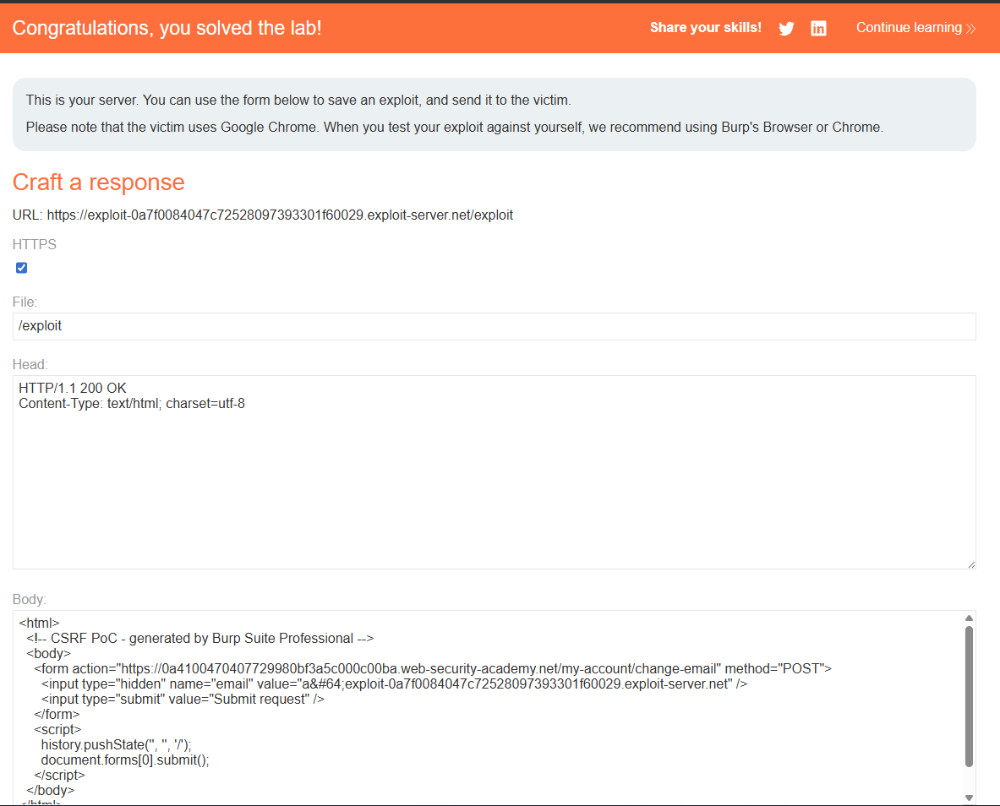

### Lab: CSRF where token is not tied to user session
Một lỗi khác của việc xác thực CSRF token là token không liên kết với Session cookie. Điều này xảy ra thường do có thể token được tạo ngẫu nhiên liên tục sau mỗi lần sử dụng mà không phụ thuộc vào cookie Session, dẫn tới việc 2 user khác nhau có thể sử dụng token của nhau. Như ở ví dụ dưới, user `carlos` đã sử dụng toke CSRF của user `wiener` mà vẫn hợp lệ.

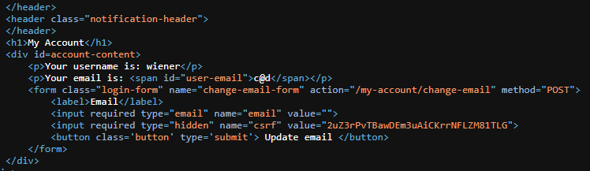

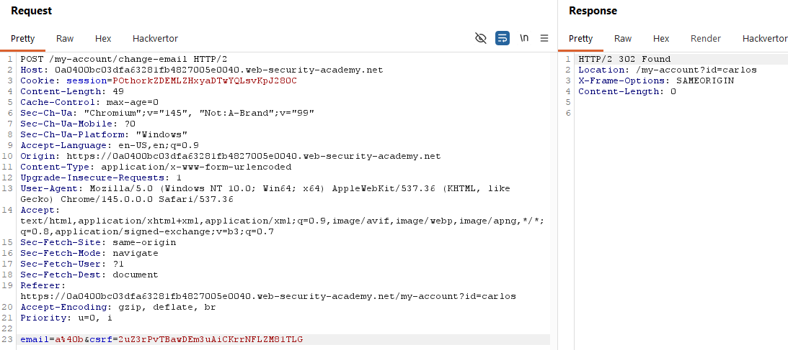

Khi này, ta có thay giá trị CSRF trong Request bằng một token hợp lệ, rồi exploit tới nạn nhân.


### Lab: CSRF where token is duplicated in cookie
Một lỗi khác trong việc xác thực CSRF là thiếu khả năng handle token. Cụ thể, để tránh việc phải liên tục tạo, lưu trữ, xoá token CSRF trên server, một số website sẽ chỉ tạo token một lần, đồng thời lưu trữ token đó ở cookie. 

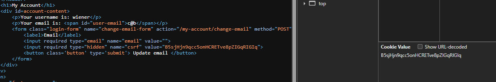

Khi gửi đến server, Request sẽ bao gồm cả cookie là token csrf và token csrf, server sẽ so sánh 2 giá trị để kiếm tra tính xác thực. Cách này có một lỗ hỏng là nếu ta có thể thay đổi giá trị cookie, thì token csrf sẽ không còn giá trị.

Ở lab này, ta có thể biết việc thay đổi cookie là khả thi khi ta có thể inject Header ở phần search bằng payload: `a%0d%0aSet-Cookie:%20csrf=c%3b%20SameSite=None`.`%0d%0a` hay `/r/n` đóng vai trò xuống dòng trong Request, khiến cho phần còn lại của payload trở thành Header hợp lệ.

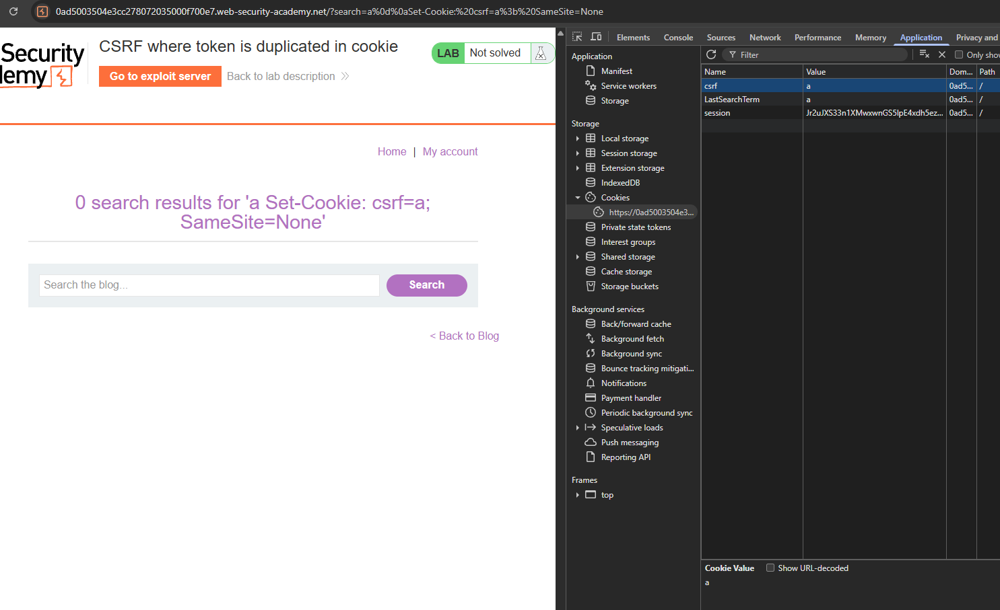

Để payload này có thể trigger ở phía nạn nhân, ta cần sửa vị trí tag `<script>` thành ``, cụ thể: `/?search=a%0d%0aSet-Cookie:%20csrf=c%3b%20SameSite=None' onerror="document.forms[0].submit()";/>`

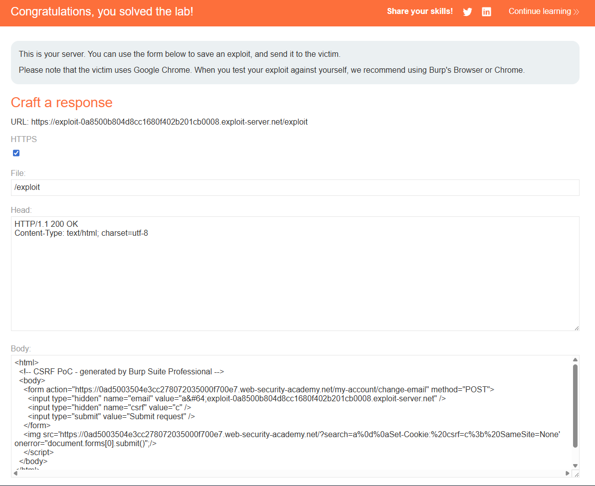

### Lab: CSRF where token is tied to non-session cookie
Một lỗi khác trong việc xác thực CSRF là sự thiếu đồng nhất giữa việc kiểm soát Sessions và tạo token CSRF. Trong trường hợp 1 website sử dụng 2 framework khác nhau để làm 2 công việc trên, như lab này, xung đột sẽ xảy ra khi token nằm ở 1 user này có thể sử dụng ở 1 user khá.

Đối với lab này, ta có thể nhận thấy điều này nếu thử gỡ lần lượt cookie của user. Nếu ta gỡ cookie `session`, user sẽ ngay lập tức đăng xuất, nhưng nếu ta gỡ cookie `csrfKey`, 1 cookie mới sẽ được thay thế sau khi ta reload. 

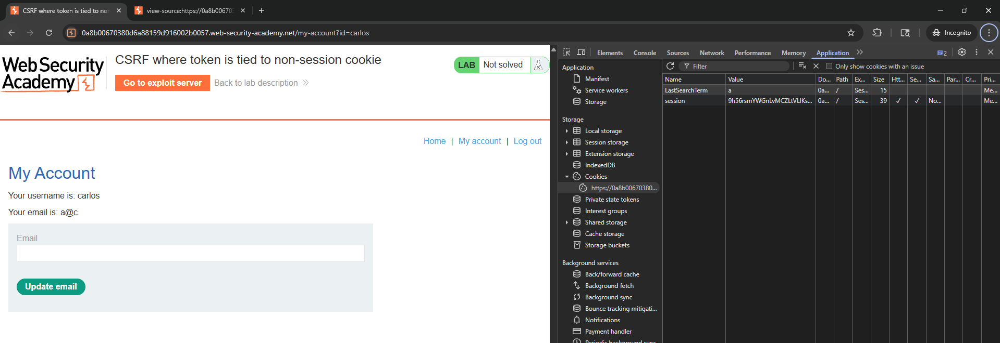

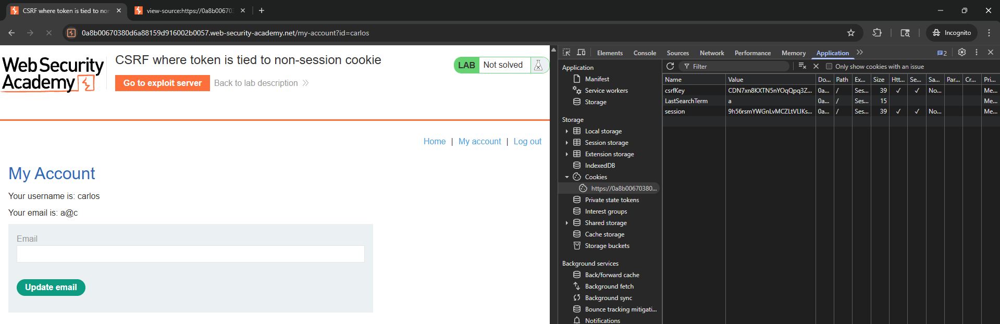

Còn nếu ta thay đổi email khi gỡ cookie `csrfKey`, thông báo `Invalid CSRF token` sẽ hiển thị, chứng tỏ rằng `session` và `csrfKey` không thực sự liên quan đến nhau:

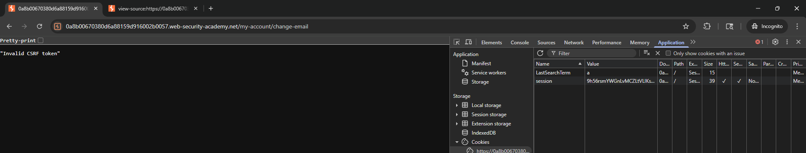

Nếu ta thay cặp csrf token và `csrfKey` của user `wiener` vào `carlos`, hệ thống vẫn chấp nhận dù khác `session`:

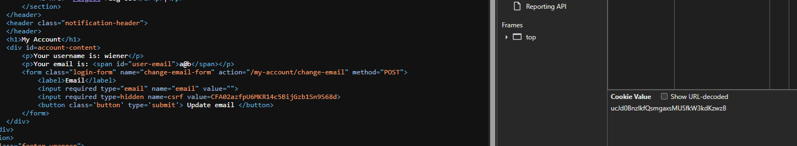

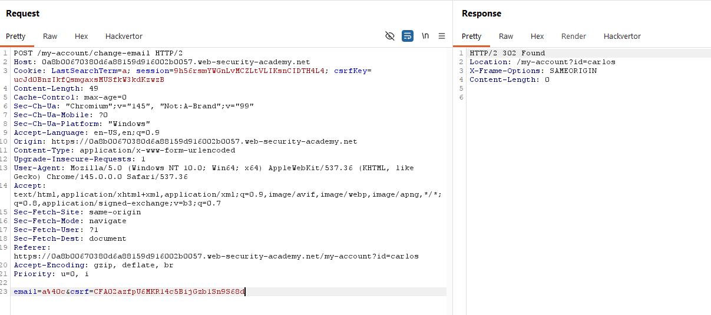

Bằng cách tái sử dụng phương pháp ở lab trước, ta có thể thay thế cookie của nạn nhân và đổi email thành công.

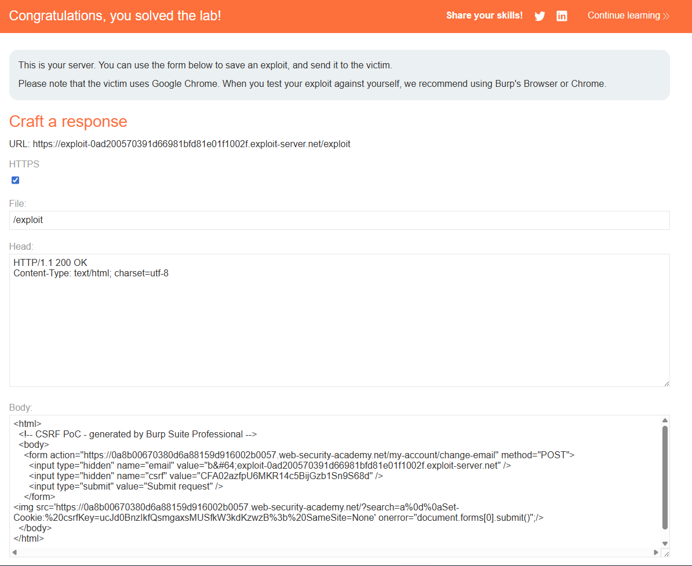

### SameSite

Để bảo vệ các website khỏi các cuộc tấn công liên quan tới CSRF, CORS,..., năm 2021, Chrome đã thêm cookie `SameSite`. Định nghĩa về "site" đối với cookie `SameSite` bao gồm 2 phần:
- scheme: phân biệt giữa http và https.
- TLD+1 (Top-Level Domain): bao gồm phần nằm sau dấu chấm cuối cùng, thường là `.com`, `.net`,... và phần trước dấu chấm đó (Ví dụ: `google.com` thì `google` là phần "+1").

Cookie `SameSite` bao gồm 2 mức độ chính:
- Strict: cookie sẽ không được gửi cùng với các request được bắt đầu bởi các trang web của bên thứ 3. Điều này có thể dẫn đến các trải nghiệm tiêu cực khi duyệt web. Đa phần các trang Web đều sẽ không muốn chứa Cookie này ở Request.
- Lax: cookie sẽ được gửi cùng với GET request được tạo bởi bên thứ 3. Ngoài GET, các method khác vẫn được chấp nhận tuỳ thuộc vào website. Lý do cho việc chỉ chấp nhận GET là vì để ngăn cản các cuộc tấn công CSRF vào method POST. 

### Lab: SameSite Lax bypass via method override
Kể từ khi cookie SameSite ra đời, việc tấn công bằng CSRF trở nên khó khăn hơn trước. Để có thể tấn công, ta sẽ cần phải lợi dụng các đặc tính của framework mà website đang sử dụng.

Đối với lab này, website đang sử dụng framework Symfony, trong đó có chứa param `_method` giúp viết đè lên method đang sử dụng.

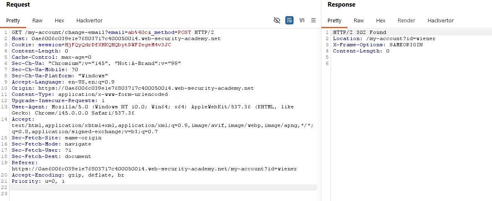

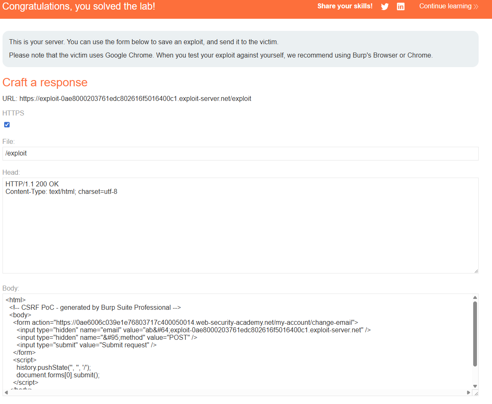

### Lab: SameSite Strict bypass via client-side redirect
Lab này đã tăng độ khó của việc tấn công CSRF thêm một bậc. Khi ta check Request `POST /login`, ta có thể thấy cookie `SameSite=Strict` xuất hiện ở Response:

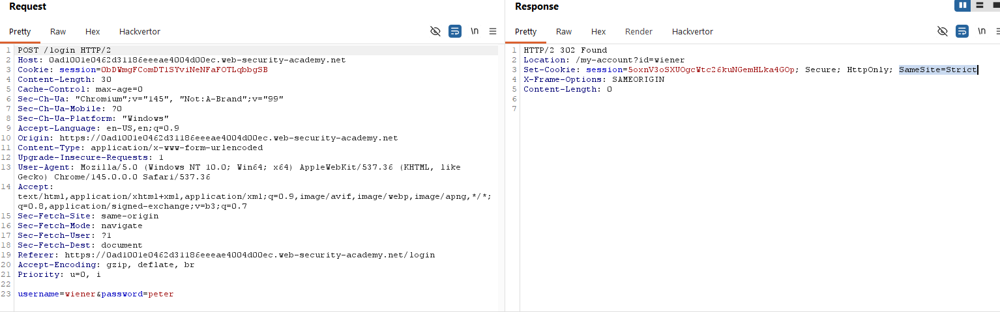

Điều này có nghĩa là ta sẽ không thể redirect từ bên thứ 3 để có thể thực hiện CSRF attack như các lab trước. Tuy nhiên, ta vẫn có thể tấn công bằng cách sử dụng các tính năng thuộc về website. 

Ở chức năng comment, sau khi ta comment, website sẽ hiện lên 1 trang redirect trong vài giây, sau đó quay về bài post:

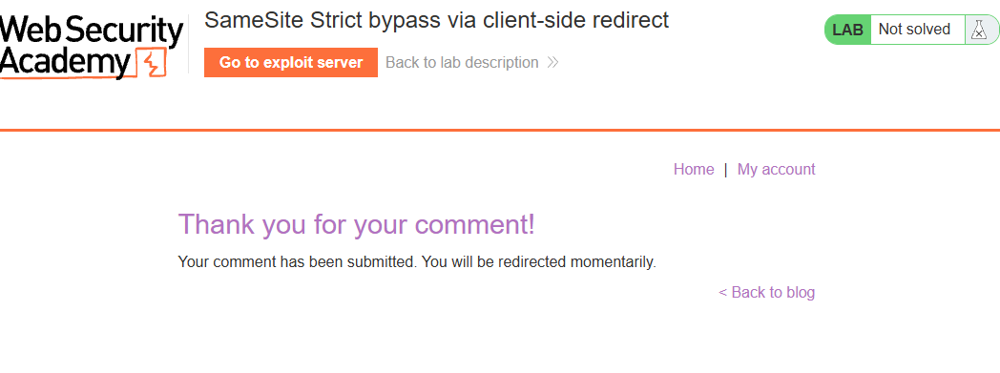

Kiểm tra source của trang redirect, ta phát hiện được trong đó chứa script thực thi việc redirect:

```HTML
<script>redirectOnConfirmation('/post');</script>
```

```JS
redirectOnConfirmation = (blogPath) => {
    setTimeout(() => {
        const url = new URL(window.location);
        const postId = url.searchParams.get("postId");
        window.location = blogPath + '/' + postId;
    }, 3000);
}
```

Hàm này lấy trực tiếp giá trị của `postId` để kết hợp vs blogPath tạo thành Path tới post. Vì là lấy trực tiếp, ta có thể sử dụng Path Traversal để trỏ tới chức năng `change-email`: `postId=../../my-account/change-email?email=a%40c%26submit=1`

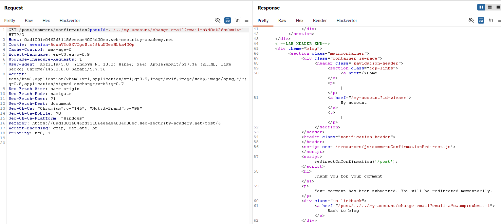

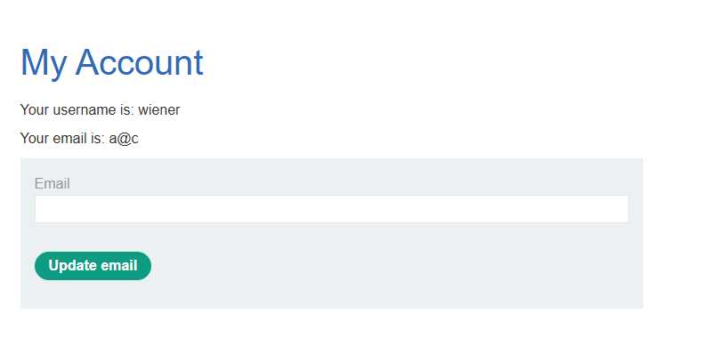
Vì trang này là Method GET, nên nó có thể bypass cookie `SameSite: Lax`, và đồng thời chức năng này thuộc về Website nên cũng bypass `SameSite: Strict`. Phần còn lại là tạo CSRF PoC rồi gửi tới nạn nhân.

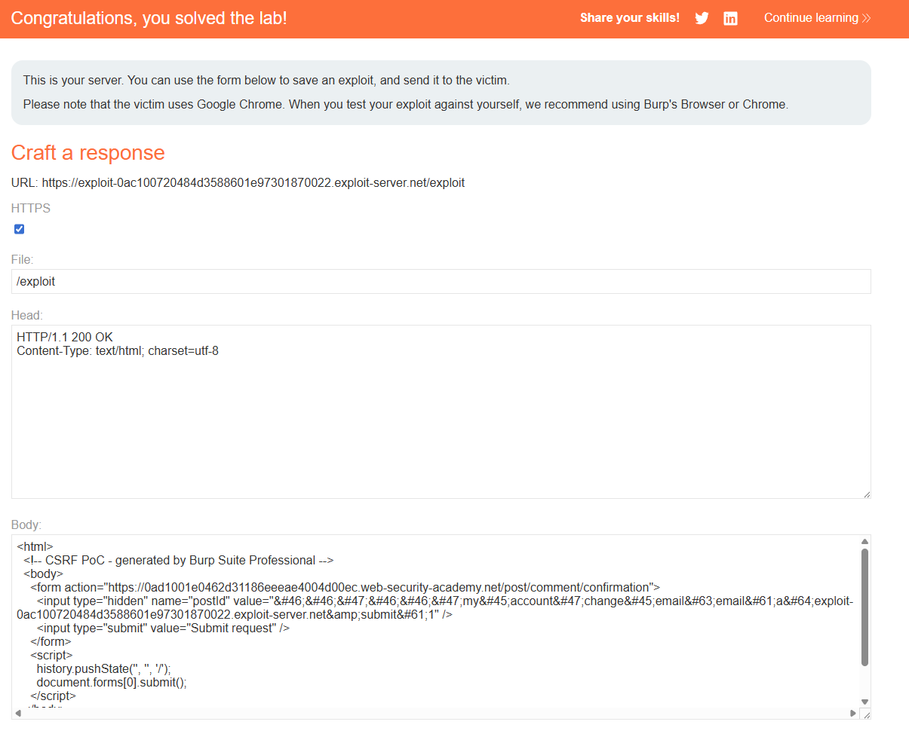

### Lab: SameSite Strict bypass via sibling domain
Lab này có format giống với [Cross-site WebSocket hijacking](https://portswigger.net/web-security/websockets/cross-site-websocket-hijacking/lab), tức là ta sẽ sử dụng cùng payload để gửi đến nạn nhân. Tuy nhiên, cách thức gửi đến nạn nhân sẽ phức tạp hơn.

Nếu ta chỉ đơn thuần gửi payload tới nạn nhân, thì ta sẽ chỉ biết được phần mở đầu của đoạn chat mà không biết đoạn còn lại.

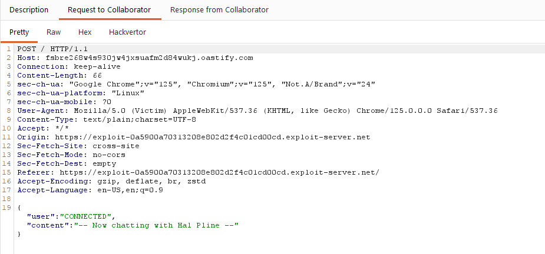

Khi ta kiểm tra khả năng hoạt động của payload, ta sẽ thấy cookie `SameSite=Strict` xuất hiện ở response, nghĩa là ta sẽ cần phải tìm URL khác thuộc trang web có chứa lỗ hỏng để inject payload:

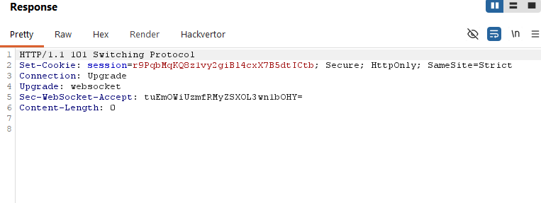

Kiểm tra toàn bộ Response của website, ta sẽ thấy có một số response có chứa Header `Access-control-allow-origin:
https://<Lab-ID>`. Header này cho phép domain có quyền truy cập vào tài nguyên server, tức là ta có thể khai thác lỗ hỏng từ domain này để có thể truy cập vào server.

Khi truy cập đường link trong Header trên, ta sẽ tới 1 trang đăng nhập đơn giản có chứa XSS vuln:

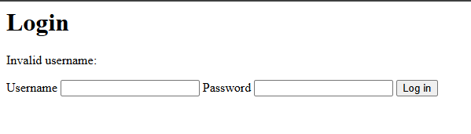

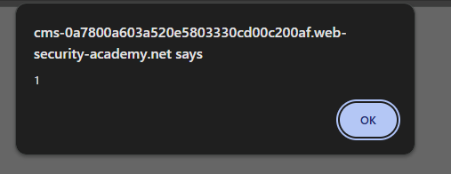

Nếu ta encode toàn bộ payload, rồi đẩy vào param `username` của trang web này, payload ta tạo sẽ thực thi hoàn toàn:

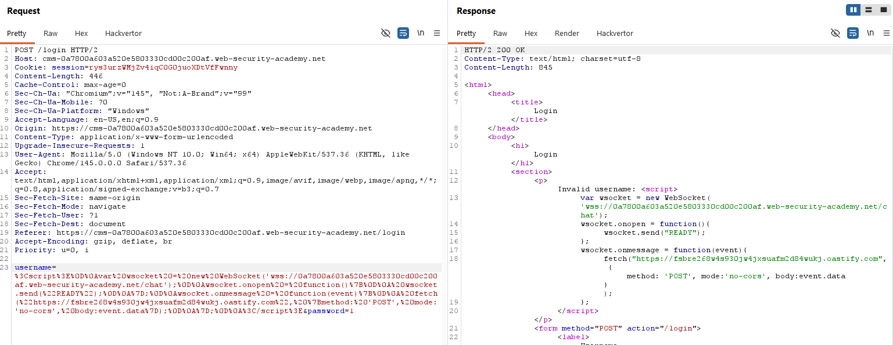

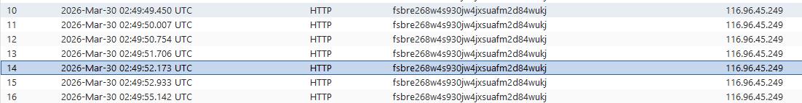

Ta có thể chuyển Method của Request trên sang `GET`, rồi copy URL để gửi nạn nhân là có thể lấy lịch sử trò chuyện thành công:

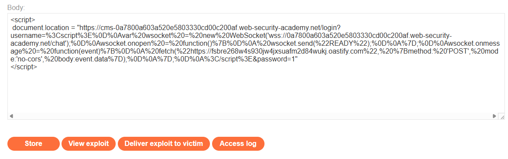

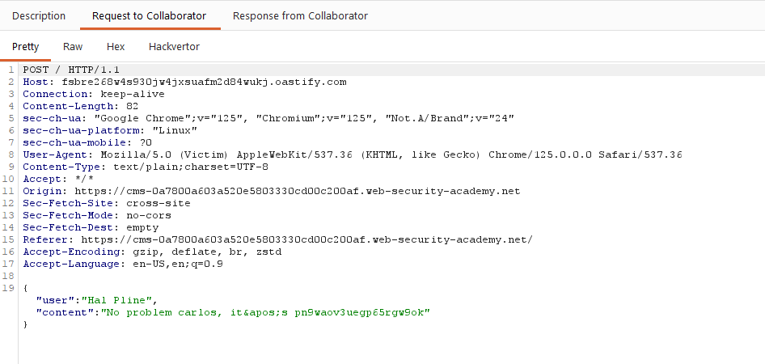

### Lab: SameSite Lax bypass via cookie refresh
### Lab: CSRF where Referer validation depends on header being present
Lab này xác thực request bằng cách kiểm tra header `Referer`, vậy nên khi ta gửi CSRF PoC thì nó sẽ hiển thị lỗi `"Invalid referer header"`

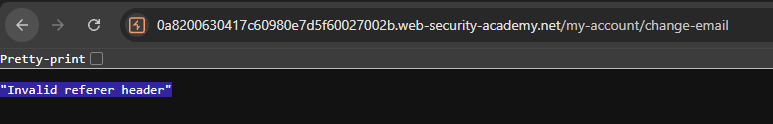

Tuy nhiên, việc sử dụng header `Referer` không phải một ý hay vì nó rất dễ bypass qua việc sử dụng tag `meta` để thêm header `Referer`
```HTML
<html>
  <!-- CSRF PoC - generated by Burp Suite Professional -->
  <body>
    <form action="https://<Lab-ID>/my-account/change-email" method="POST">
      <meta name="referrer" content="never">
      <input type="hidden" name="email" value="c&#64;<Server-ID>" />
      <input type="submit" value="Submit request" />
    </form>
    <script>
      history.pushState('', '', '/');
      document.forms[0].submit();
    </script>
  </body>
</html>
```

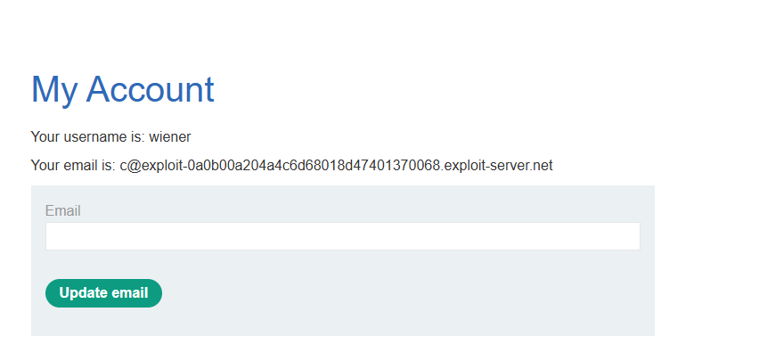

### Lab: CSRF with broken Referer validation
Cũng với kiểu xác thực bằng Referer, nhưng khi này hệ thống yêu cầu ở header `Referrer` phải có domain hợp lệ:

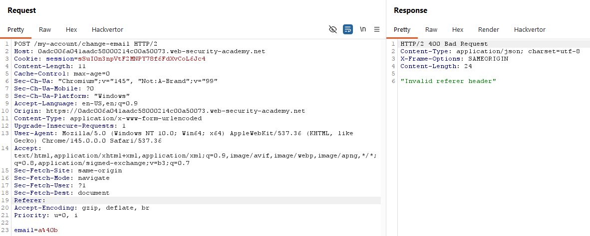

Tuy nhiên, hệ thống chỉ kiểm tra tên domain, chứ không kiểm tra chính xác vị trí của tên domain đó có trong header:

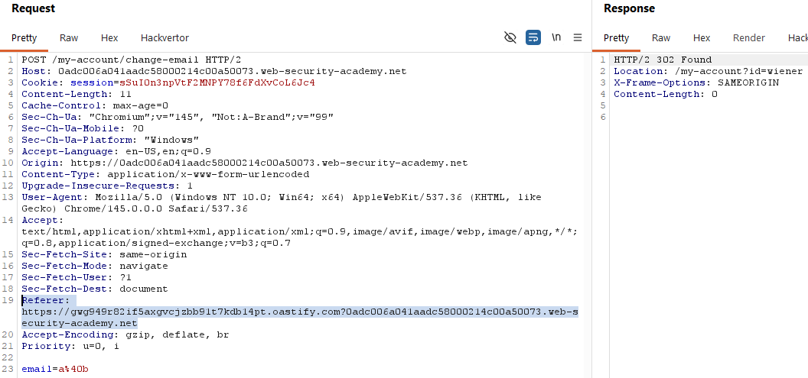

Khi này, ta có thể thêm Header này vào phần `Head` của exploit, đồng thời thay đổi `history.pushState('', '', '/?<Lab-ID>')` để mỗi lần truy cập thì đều giữ nguyên `referer` là `<Lab-ID>`

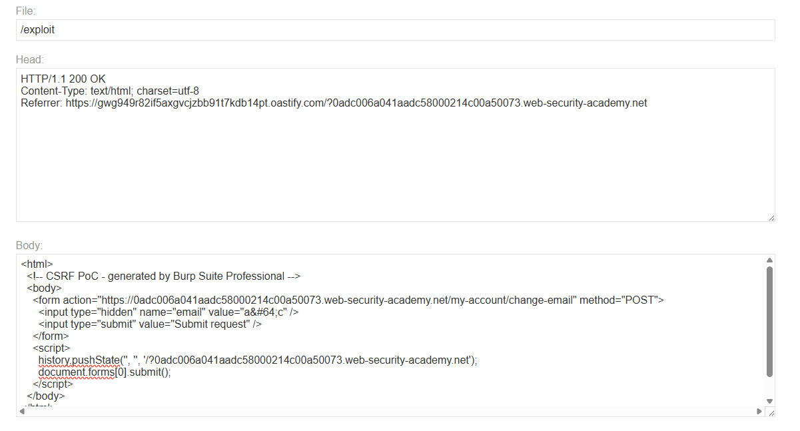

Nhưng khi này, thông báo `"Invalid referer header"` vẫn hiển thị. Đó là do browser tự động bỏ đi header `Referer` vì lý do bảo mật. Khi này ta cần thêm Header `Referrer-Policy: unsafe-url` và `Head` để thêm header `Referer` vào request.

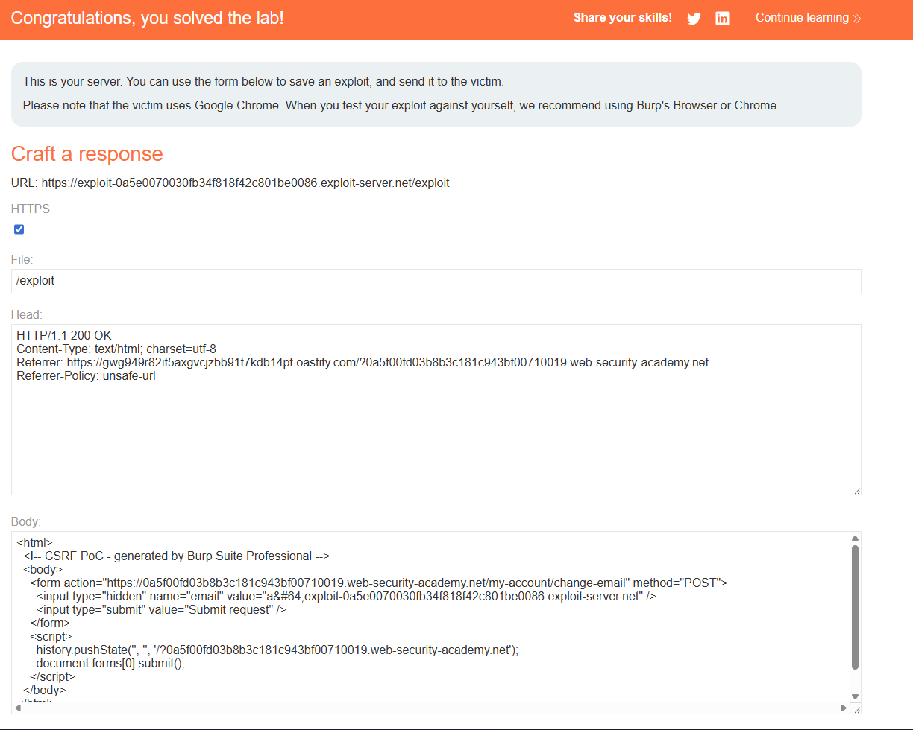

