# Infomation disclosure vulnerabilities
## Khái niệm
Infomation disclosure, hay "Rò rỉ thông tin", là khi website vô tình tiết lộ thông tin nhạy cảm, bao gồm: thông tin của users, kiến trúc của server hay dữ liệu quan trọng của công ty. Mặc dù việc rò rỉ thông tin này về bản chất là nguy hiểm, nhưng những thông tin này có thể tăng mức độ nguy hiểm thêm một bậc khi kẻ tấn công có thể khai thác sâu thêm vào kiến trúc hệ thống, từ đó khai thác và chiếm quyền kiểm soát.
## Lab
### Lab: Information disclosure in error messages
Lab này yêu cầu nhập phiên bản của framework đang sử dụng cho server, với lỗ hỏng nằm ở việc hiển thị thông báo lỗi cho người dùng. Để có thể trigger lỗi hệ thống, ta chỉ cần nhập dữ liệu sai cho `productid` là ra kết quả:

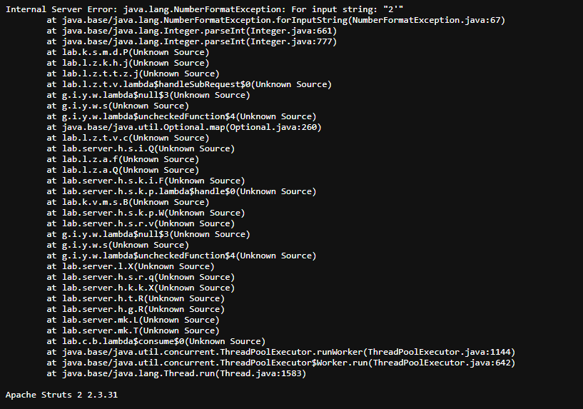

Framework đang sử dụng cho server là: **Apache Structs 2 2.3.31**

### Lab: Information disclosure on debug page
Lab này yêu cầu ta phải tìm `SECRET_KEY` nằm trong trang debug của server. Ta có thể tìm thấy trang này nằm trong HTML code ở phần cuối cùng:

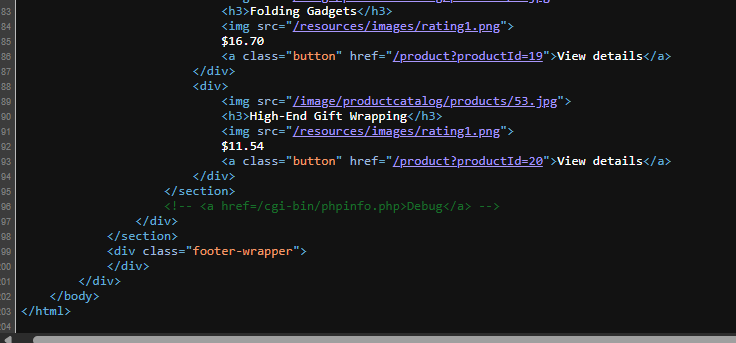

Truy cập vào trang đó ta có toàn bộ thông tin của server, bao gồm cả `SECRET_KEY` cần tìm:

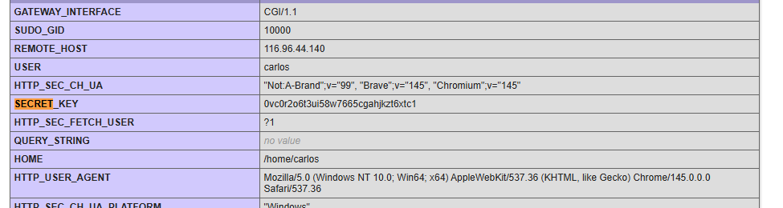

### Lab: Source code disclosure via backup files
Lab này yêu cầu lấy mật khẩu database được hardcode trong source code của web, và nó gợi ý source code nằm trong dữ liệu file backup nằm trong 1 thư mục nào đó. 

Để có thể hiển thị trên thanh tìm kiếm của Google, các công cụ hay bot của Google sẽ truy cập vào các trang web đó để lấy dữ liệu, sau đó phụ thuộc vào việc dữ liệu đấy đang nói tới cái gì để liên kết với những từ khoá trên thanh tìm kiếm. Tuy nhiên, sẽ luôn có những dữ liệu nhạy cảm mà ta không muốn để các công cụ thu thập, nên trong hướng dẫn của Google cho developers, họ được chỉ dẫn thêm `robots.txt` tại thư mục gốc như 1 cách "hướng dẫn" công cụ và các con bot tập trung vào những dữ liệu và bỏ qua những dữ liệu nào.

Khi truy cập vào `robots.txt`, ta thấy được chỉ dẫn của trang web cho các công cụ tìm kiếm:

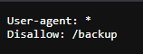

Truy cập vào thư mục `/backup`, ta tìm thấy file chứa source code của trang web, từ đó có được password ta cần:
```java
package data.productcatalog;

import common.db.JdbcConnectionBuilder;

import java.io.IOException;
import java.io.ObjectInputStream;
import java.io.Serializable;
import java.sql.Connection;
import java.sql.ResultSet;
import java.sql.SQLException;
import java.sql.Statement;

public class ProductTemplate implements Serializable
{
    static final long serialVersionUID = 1L;

    private final String id;
    private transient Product product;

    public ProductTemplate(String id)
    {
        this.id = id;
    }

    private void readObject(ObjectInputStream inputStream) throws IOException, ClassNotFoundException
    {
        inputStream.defaultReadObject();

        ConnectionBuilder connectionBuilder = ConnectionBuilder.from(
                "org.postgresql.Driver",
                "postgresql",
                "localhost",
                5432,
                "postgres",
                "postgres",
                "tidy7yroy57y2s7ldaadx25niofi7ii5"
        ).withAutoCommit();
        try
        {
            Connection connect = connectionBuilder.connect(30);
            String sql = String.format("SELECT * FROM products WHERE id = '%s' LIMIT 1", id);
            Statement statement = connect.createStatement();
            ResultSet resultSet = statement.executeQuery(sql);
            if (!resultSet.next())
            {
                return;
            }
            product = Product.from(resultSet);
        }
        catch (SQLException e)
        {
            throw new IOException(e);
        }
    }

    public String getId()
    {
        return id;
    }

    public Product getProduct()
    {
        return product;
    }
}
```

### Lab: Authentication bypass via information disclosure
Lỗ hỏng của lab này được đặt ở phần xác thực người dùng, với yêu cầu được đặt ra là khai thác lỗ hỏng để xoá đi user `carlos`.

Khi tạo ra 1 trang web, các devs sẽ muốn kiểm tra phía client khi gửi request đến server sẽ bao gồm những headers nào, hay là liệu các công cụ trung gian như Proxy hay Firewall có thêm những headers nào khác hay không. Một trong các công cụ để kiểm tra việc đó là `TRACE` request khi mà nó sẽ gửi trả về nguyên vẹn thông tin mà phía client gửi nằm trong phần thân của response.

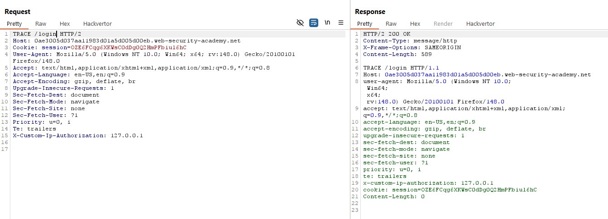

Đối với các trang web thông thường, admin interface thường sẽ nằm ở tại vị trị thư mục gốc:

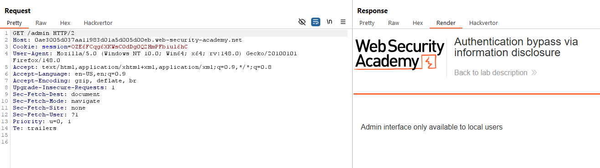

Nếu ta sử dụng `TRACE` request để kiếm tra request khi gửi tới `/admin` ta thấy ngoài các Headers đã có trong request còn có thêm Header IP nằm trong đó:

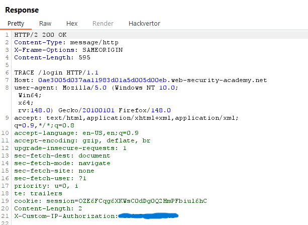

Địa chỉ IP xuất hiện trong đó là địa chỉ IP Public của thiết bị mạng ta đang sử dụng, tức là nếu ta thay thế địa chỉ IP này thành `127.0.0.1` hay localhost sẽ tương đương việc ta đang sử dụng cùng dải mạng với server:

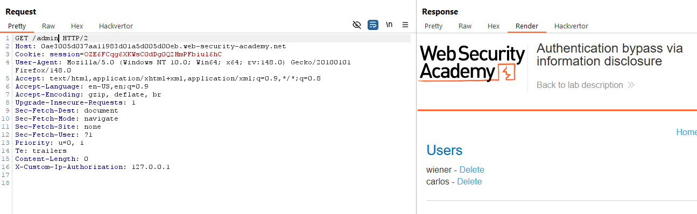

Việc còn lại chỉ là xoá user `carlos` để hoàn thành lab.

### Lab: Information disclosure in version control history
Lab này yêu cầu ta khai thác lỗ hỏng nằm ở lịch sử phiên bản của website. Mà nói đến lịch sử phiên bản thì sẽ thường là `git commit`, nên ta sẽ thử truy cập vào `./git` của website mặc dù trên thực tế lỗ hỏng này thường không tồn tại.

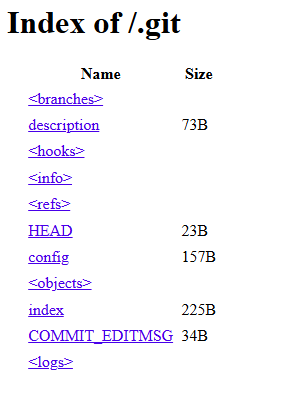

Để có thể xem lịch sử commit, ta cần phải sử dụng `git` mới có thể kiểm tra, nên ta cần download toàn bộ thư mục này về máy. Ở đây, mình sử dụng `wget` của Linux để tải.

Sau khi có được thư mục `/.git`, sử dụng `git show` để biết website đã thay đổi những gì:

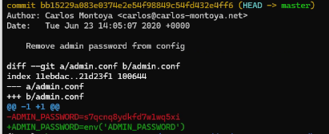

Sử dụng password đã bị hardcode trước khi xoá, ta có thể truy cập vào tài khoản administrator để xoá user `carlos`.

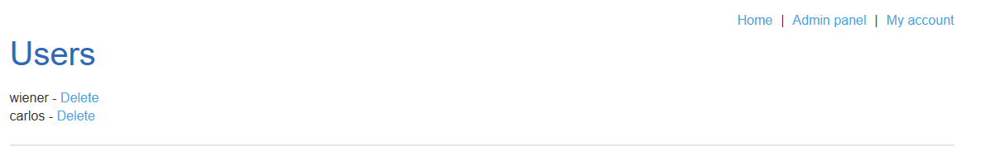