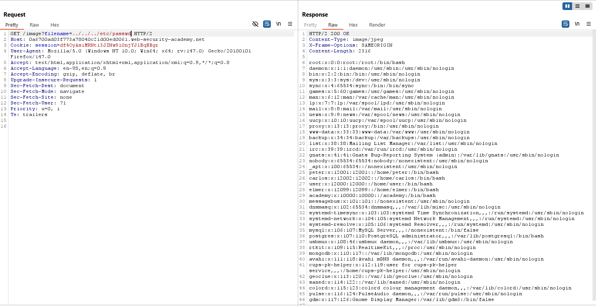

# Path Traversal
## Khái niệm:
Path Traversal là một lỗ hỏng cho phép kẻ tấn công tuỳ ý đọc được các file và thông tin trên server.
## Giải thích một số câu lệnh:
- `./`: Di chuyển đến thư mục hiện tại.
- `../`: Di chuyển đến thư mục cha của thư mục hiện tại.
## Lab:
Toàn bộ các Lab đều tập trung vào việc đọc được thông tin nằm trong /etc/passwd
### Lab: File path traversal, simple case
Giả sử vị trí ảnh của server được lưu ở đường dẫn: `/var/www/images/1.png`, để đến `/etc/passwd`, ta sẽ cần phải lùi con trỏ thư mục đi 3 lần để về thư mục gốc rồi mới tới `/etc/passwd`.
