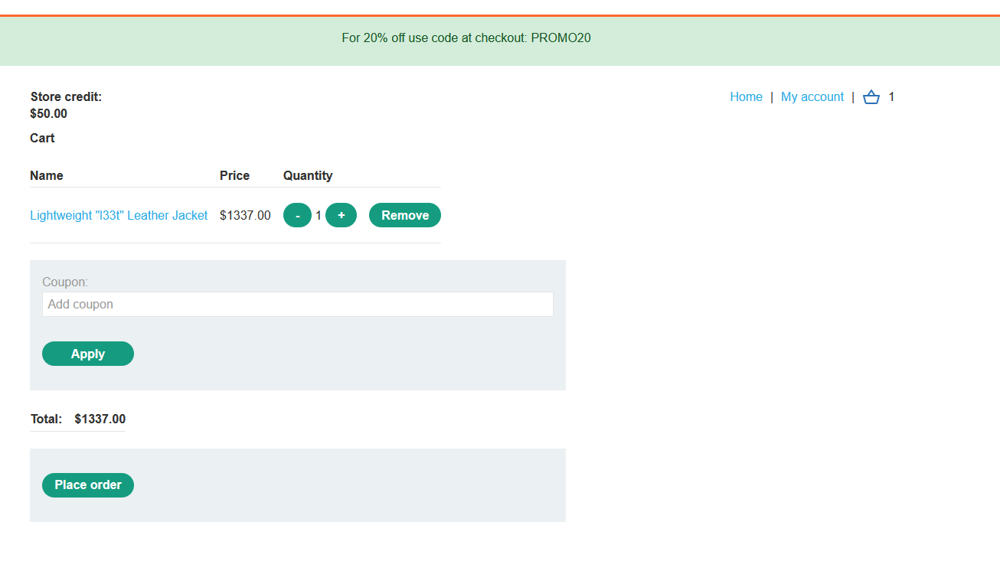

# Race Condition
## Khái niệm:
Có thể tóm gọn khái niệm của Race Condition trong 1 ví dụ: Nếu 1 coupon giảm giá chỉ dành 1 khách hàng nhưng 1 khách hàng khác có thể sử dụng đồng thời với khách hàng gốc nếu sử dụng coupon đó tại cùng 1 thời điểm, thì race condition đã xảy ra.
## Lab
### Lab: Limit overrun race conditions
Để có thể sử dụng race conditions, các request gần như phải gửi cùng một lúc để tạo ra collision. Để làm được việc này, ta sẽ sử dụng công cụ Repeater của BurpSuite. Từ sau phiên bản 2023.9, Burp Repeater có khả năng gửi hàng loạt requests cùng 1 lúc với độ trể giữa các request được giảm thiểu 1 cách tối đa. 

Lab này yêu cầu phải áp code giảm giá nhiều lần để có thể mua với mức giá tối thiểu

Sử dụng Project scripts có sẵn của BurpSuite có tên "Trigger race condition", ta có thể làm được việc ở trên:

### Lab: Bypassing rate limits via race conditions
Để có thể vượt qua Lab này, ta sẽ sử dụng Turbo Intruder. Đây là extension do chính tác giả của BurpSuite - James Kettle tạo nên do ông nhận thấy hiệu năng của Burp Intruder không được tốt trong việc tấn công phức tạp.

Ta sẽ sử dụng `race-single-packet-attack.py` cho lab này.

Ta cũng cần phải đặt username là `carlos` và password là payload cần bruteforce:

Khi thực hiện tấn công, không phải lúc nào cũng thành công ngay lần đầu tiên vì rate limit. Nên là trước khi bắt đầu lần tấn công tiếp theo nên xoá bớt những mật khẩu nào đã báo sai trước đó.

Mật khẩu tìm ra sẽ có status 302, tức là chuyển tiếp tới 1 trang khác. Mục đích của status được tạo ra có chủ ý để phân biệt với các status 200 báo rate limit.

Khi tìm ra mật khẩu, việc cuối cùng là xoá user `carlos` để kết thúc lab.

