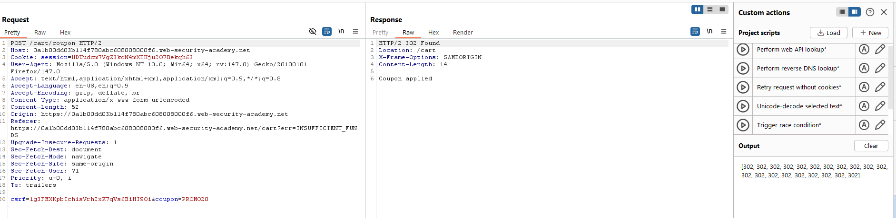
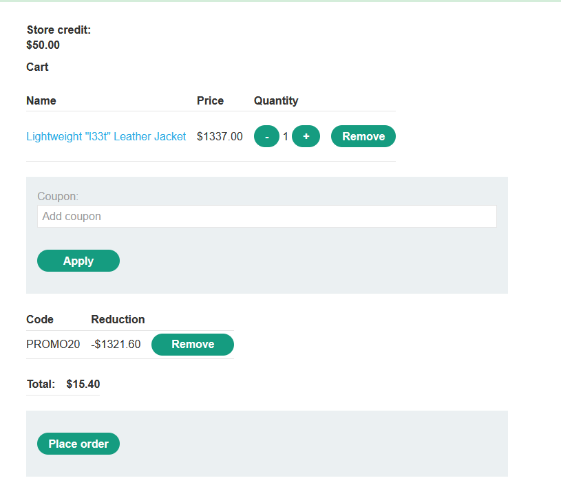

# Race Condition
## Khái niệm:
Có thể tóm gọn khái niệm của Race Condition trong 1 ví dụ: Nếu 1 coupon giảm giá chỉ dành 1 khách hàng nhưng 1 khách hàng khác có thể sử dụng đồng thời với khách hàng gốc nếu sử dụng coupon đó tại cùng 1 thời điểm, thì race condition đã xảy ra.
## Lab
### Lab: Limit overrun race conditions
Để có thể sử dụng race conditions, các request gần như phải gửi cùng một lúc để tạo ra collision. Để làm được việc này, ta sẽ sử dụng công cụ Repeater của BurpSuite. Từ sau phiên bản 2023.9, Burp Repeater có khả năng gửi hàng loạt requests cùng 1 lúc với độ trể giữa các request được giảm thiểu 1 cách tối đa. 

Lab này yêu cầu phải áp code giảm giá nhiều lần để có thể mua với mức giá tối thiểu

Sử dụng Project scripts có sẵn của BurpSuite có tên "Trigger race condition", ta có thể làm được việc ở trên:

