# Race Condition
## Khái niệm:
Có thể tóm gọn khái niệm của Race Condition trong 1 ví dụ: Nếu 1 coupon giảm giá chỉ dành 1 khách hàng nhưng 1 khách hàng khác có thể sử dụng đồng thời với khách hàng gốc nếu sử dụng coupon đó tại cùng 1 thời điểm, thì race condition đã xảy ra.
## Lab
### Lab: Limit overrun race conditions
Để có thể sử dụng race conditions, các request gần như phải gửi cùng một lúc để tạo ra collision. Để làm được việc này, ta sẽ sử dụng công cụ Repeater của BurpSuite. Từ sau phiên bản 2023.9, Burp Repeater có khả năng gửi hàng loạt requests cùng 1 lúc với độ trể giữa các request được giảm thiểu 1 cách tối đa. 

Lab này yêu cầu phải áp code giảm giá nhiều lần để có thể mua với mức giá tối thiểu

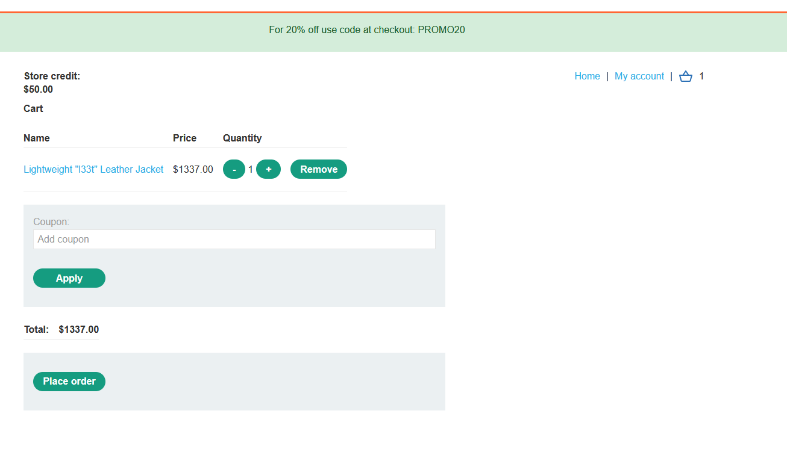

Sử dụng Project scripts có sẵn của BurpSuite có tên "Trigger race condition", ta có thể làm được việc ở trên:

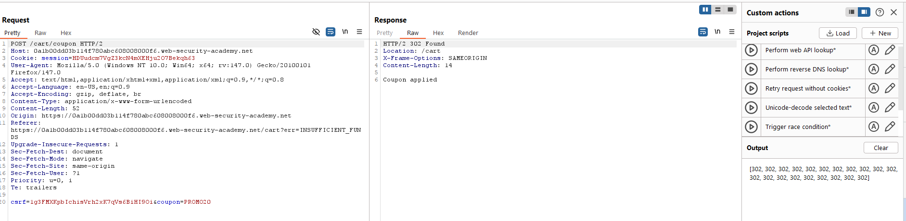

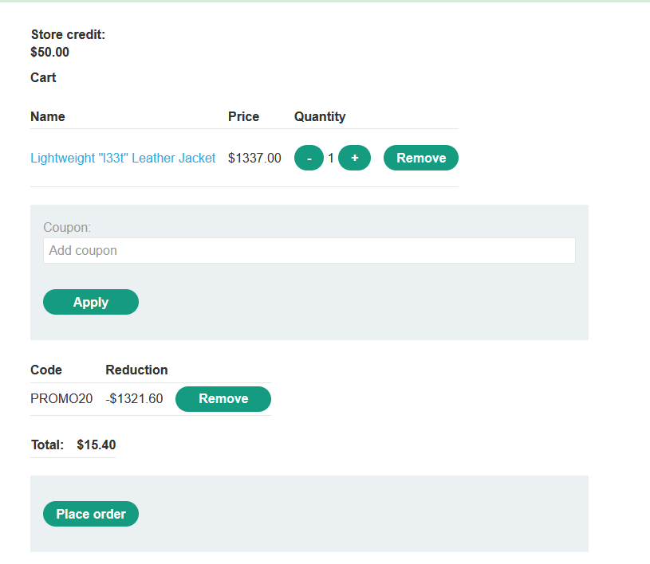

### Lab: Bypassing rate limits via race conditions
Để có thể vượt qua Lab này, ta sẽ sử dụng Turbo Intruder. Đây là extension do chính tác giả của BurpSuite - James Kettle tạo nên do ông nhận thấy hiệu năng của Burp Intruder không được tốt trong việc tấn công phức tạp.

Ta sẽ sử dụng `race-single-packet-attack.py` cho lab này.

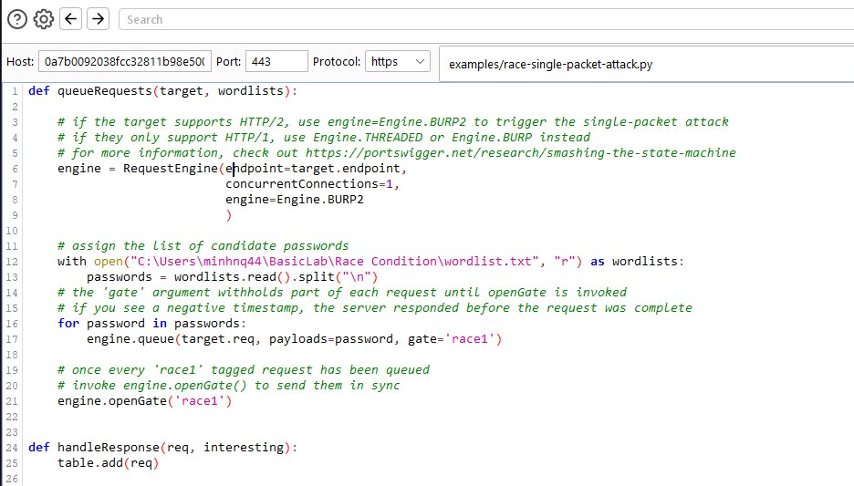

Ta cũng cần phải đặt username là `carlos` và password là payload cần bruteforce:

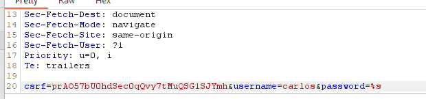

Khi thực hiện tấn công, không phải lúc nào cũng thành công ngay lần đầu tiên vì rate limit. Nên là trước khi bắt đầu lần tấn công tiếp theo nên xoá bớt những mật khẩu nào đã báo sai trước đó.

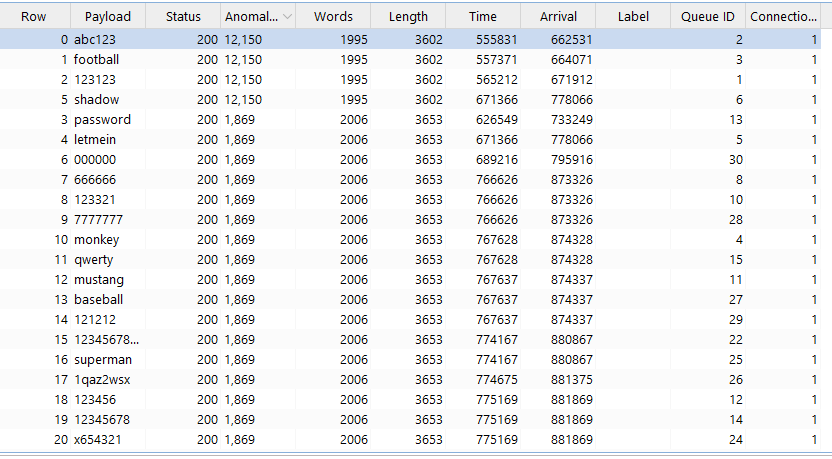

Mật khẩu tìm ra sẽ có status 302, tức là chuyển tiếp tới 1 trang khác. Mục đích của status được tạo ra có chủ ý để phân biệt với các status 200 báo rate limit.

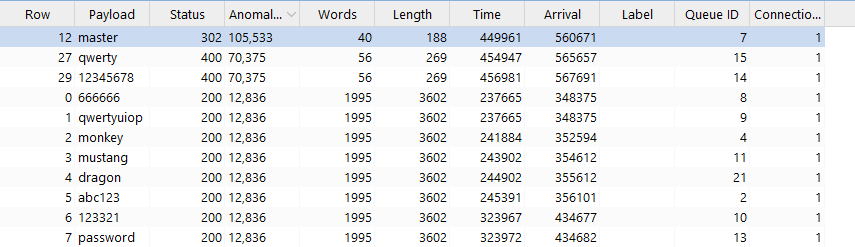

Khi tìm ra mật khẩu, việc cuối cùng là xoá user `carlos` để kết thúc lab.

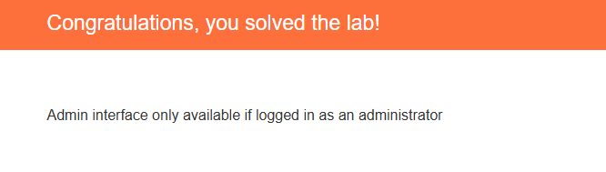

### Lab: Multi-endpoint race conditions
Như tiêu đề của lab, lần này ta cần tấn công vào endpoint của server. 

Dù có login vào server hay không, ta vẫn có quyền thêm đồ vào giỏ hàng. Tuy nhiên, khi ta đăng nhập vào tài khoản, dù cho giỏ hàng hiển thị trống nhưng số lượng sản phầm hiển thị thì của giỏ hàng trước khi đăng nhập.

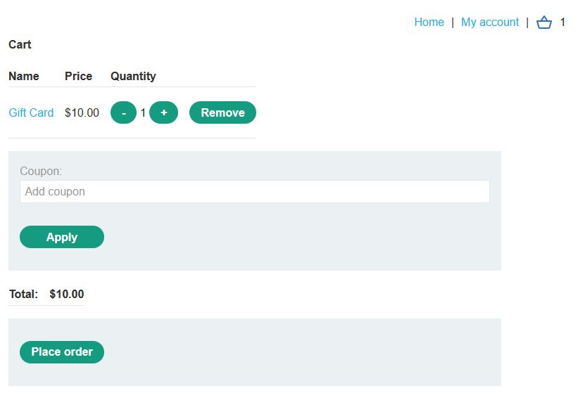

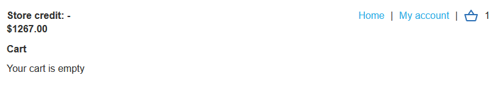

Tạm thời ta sẽ giả định trạng thái của giỏ hàng sẽ phụ thuộc vào phía server, tức là phụ thuộc vào `Session` cookie, còn trạng thái tạm thời hiện vẫn đang được lưu phía client. Vậy, nếu mà ta gửi đồng thời request thêm sản phẩm và mua sản phẩm đó, thì sẽ có xác suất giỏ hàng khi checkout đang là trạng thái của client, và ngay thời điểm thanh toán thì sản phẩm ta thêm vào xuất hiện thì sẽ vô tình thanh toán đồng thời sản phẩm đó.

Để minh hoạ dễ hiểu, ta sẽ lấy 2 request `POST /cart/checkout` và `POST /cart`. Trạng thái của giỏ hàng khi này có 1 cái `gift card`, còn `POST /cart` là thêm áo Jacket.  Khi này sẽ có 2 trường hợp xảy ra:
- Request `POST /cart` sẽ xử lý trước, thì thông báo không đủ tiền sẽ hiển thị.
- Request `POST /cart/checkout` sẽ xử lý trước, thì thông báo mua hàng thành công sẽ hiển thị.

Ta sẽ sử dụng `Send group in parallel` của Burp Intruder để thực thi. Điều này sẽ khiển 2 request thực thi cùng 1 lúc và xảy ra lỗi:

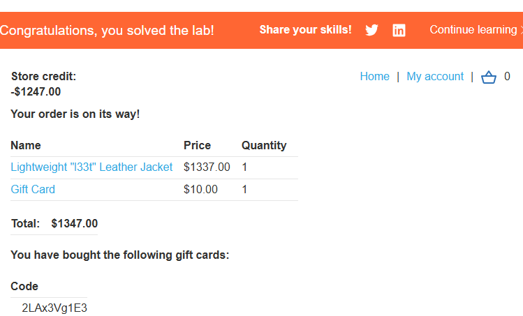

Điều này xảy ra vì `POST /cart/checkout` đã được xử lý trước, và trong quá trình xử lý thì đồng thời `POST /cart` thêm áo Jacket, bypass được chức năng check tổng tài khoản.

### Lab: Single-endpoint race conditions
Lab này yêu cầu ta đổi địa chỉ email sang `carlos@ginandjuice.shop` để có quyền truy cập admin.

Vì đây là Race Condition lab, nên ta sẽ test bằng việc thử các request `POST /my-account/change-email` với email có cấu trúc: `<something>@exploit-<ID-domain>.exploit-server.net`. Như ở đây, mình sử dụng 4 request từ test1 -> test4, sử dụng chức năng `Send group in parallel` của Burp Intruder để thực thi.

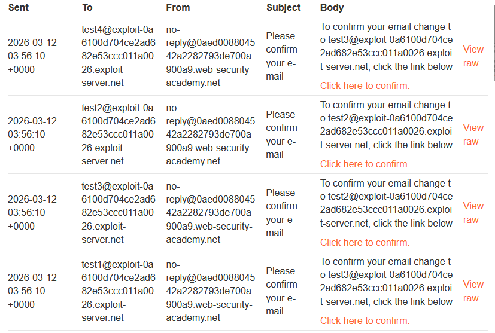

Như có thể thấy, việc gửi các email cùng lúc gây ra sự xung đột trong việc gửi, từ đó response của mail này bị lẫn vào mail khác. Khi này, ta thay thêm request chứa mail `carlos@ginandjuice.shop` vào trong group rồi gửi 1 lần nữa.

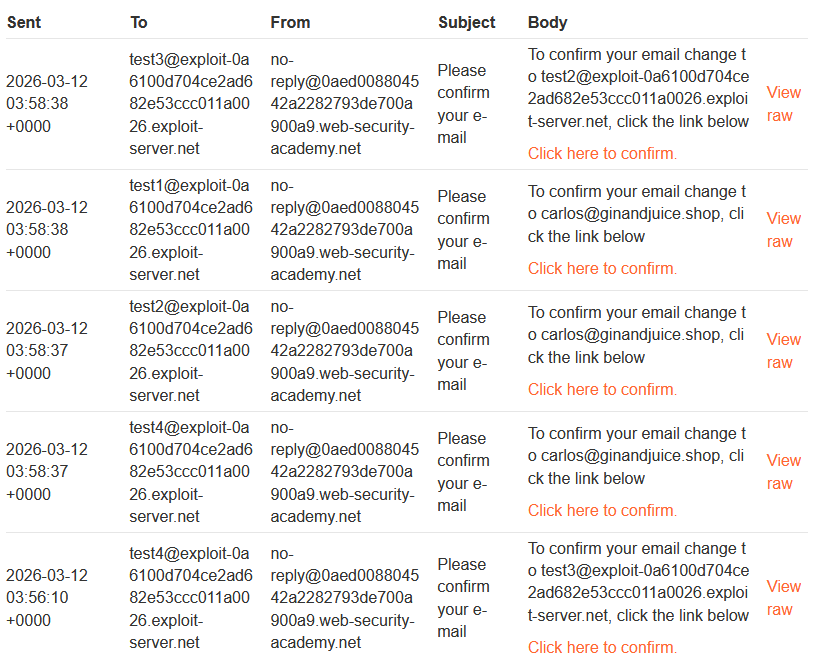

Khi này user `wiener` có quyền thay đổi account thành `carlos@ginandjuice.shop`, còn lại là hoàn thành lab.

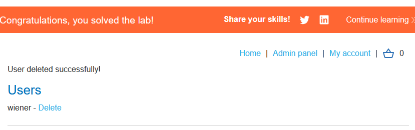

### Lab: Exploiting time-sensitive vulnerabilities
Lab này khai thác vào cơ chế tạo token reset password.

Khi gửi 2 request cùng lúc với cùng 1 `session` cookie và `csrf` token, ta sẽ nhận thấy khoảng delay trong việc nhận response thứ 2, đồng thời tokenID của 2 response này khác nhau.

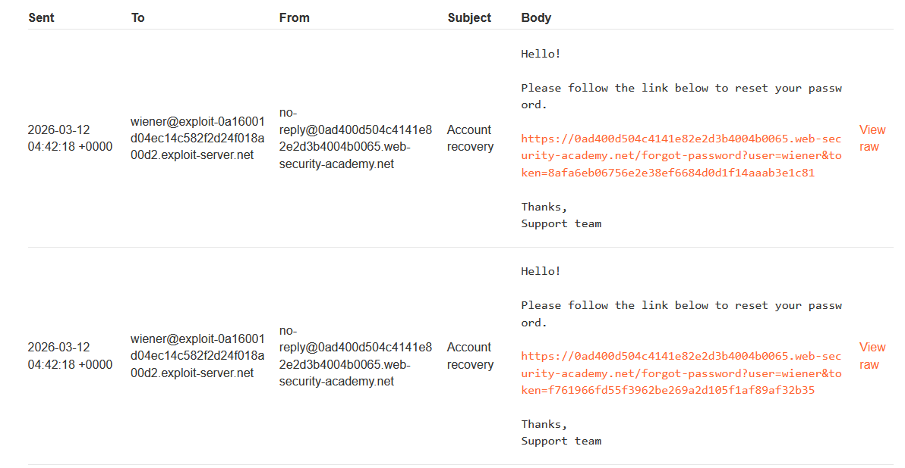

Tuy nhiên, nếu ta thay đổi cặp `session` cookie và `csrf` token sang 1 cặp hợp lệ khác, kết quả trả về là 2 token reset giống hệt nhau.

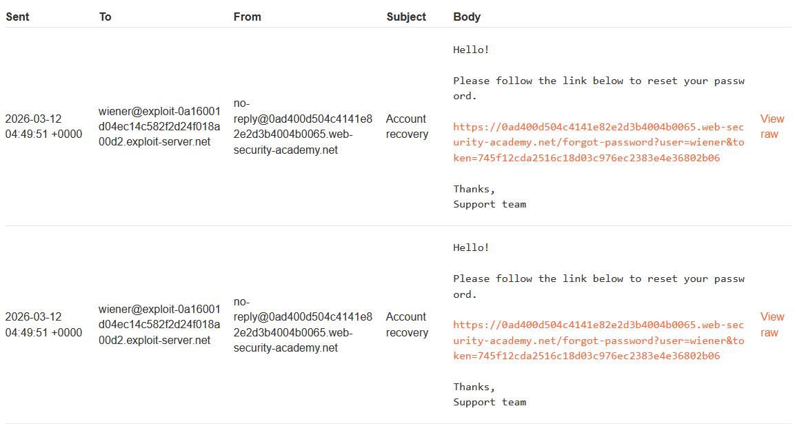

Điều này cho khả năng về việc cơ chế tạo token phụ thuộc vào cookie và token, tức là cùng một cookie và token thì hệ thống sẽ tạo lần lượt từng token reset cho từng request, trong khi khác token và cookie thì hệ thống sẽ tạo cùng lúc cho cả 2.

Khai thác lỗ hỏng này, ta thay username trong request thành `carlos`, sau đó truy cập vào link reset, thay đổi `user=carlos`, rồi thay mật khẩu và làm nốt phần việc còn lại.

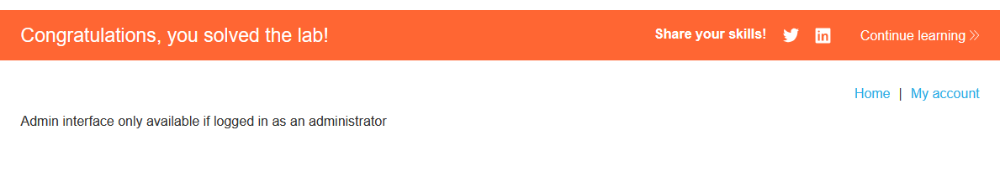

