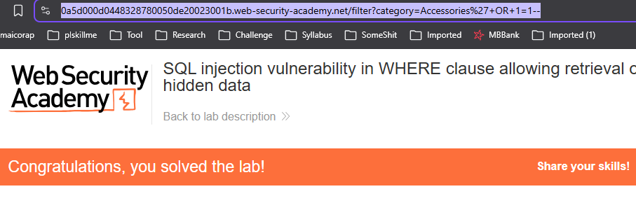
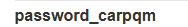
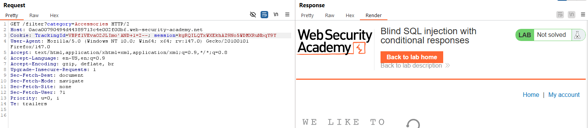
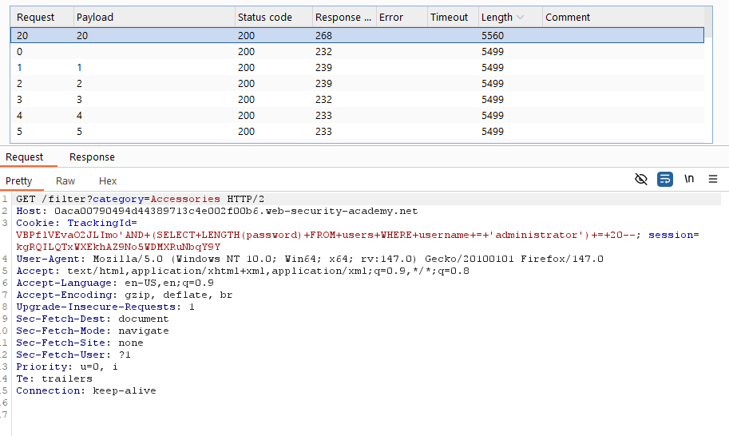
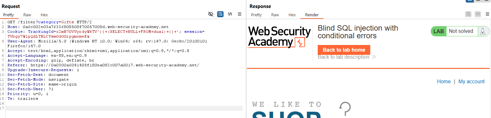

# SQL Injection
## Khái niệm
Để truy vấn dữ liệu nằm trong cơ sở dữ liệu, chúng ta đều hay sử dụng SQL để tương tác với dữ liệu nằm trong hệ thống quản lý. Tuy nhiên, nếu các câu truy vấn không được xử lý đúng cách, kẻ tấn công có thể lợi dụng để tìm ra những thông tin mà đáng lẽ không nên được để lộ.
## Lab
### Lab: SQL injection vulnerability in WHERE clause allowing retrieval of hidden data
Lab này cho ta biết Query dùng để chọn Category là: `SELECT * FROM products WHERE category = 'Gifts' AND released = 1`. Vì không có filter cho phần nhập category, ta sẽ chèn payload vào phần `category = 'Gifts'` thành `category=Gifts%27+OR+1=1--`. Ở đây, ta sử dụng `'OR 1=1` để đóng phần chọn category, sau đó là vì `1=1` luôn đúng nên hệ thống sẽ chọn tất cả từ bảng products. 2 dấu `--` trong SQL mang chức năng đánh dấu comment, ở đây nó được sử dụng để vô hiệu hoá khả năng của `' AND released = 1` để có thể truy vấn các sản phẩm chưa được release.

Cụ thể, câu truy vấn để giải quyết bài lab này là: `https://0a5d000d0448328780050de20023001b.web-security-academy.net/filter?category=Accessories%27+OR+1=1--`

### Lab: SQL injection vulnerability allowing login bypass
Lỗ hỏng ở lab này được đặt vào phần đăng nhập khi nó sử dụng query: `SELECT * FROM users WHERE username = '$username' AND password = '$password'`. Vì không có filter, ta sẽ vô hiệu hoá query `' AND password = '$password'` để có thể đăng nhập username `administrator` mà không cần mật khẩu.

### Lab: SQL injection UNION attack, determining the number of columns returned by the query
Lỗ hỏng ở lab này nằm ở query truy vấn Category, khi mà kết quả của việc query có thể được xem trực tiếp qua phản hồi. Lab này chỉ cần yêu cầu ta tìm xem có bao nhiêu cột mà query này trả về bằng việc inject UNION. Ta sẽ sử dụng `SELECT NULL,...` vì NULL có thể được chuyển đổi thành nhiều kiểu dữ liệu, mà ta lại không biết chính xác kiểu dữ liệu của các cột.

Cụ thể, payload để giải quyết lab này là: `category=Accessories%27+UNION+SELECT+NULL,NULL,NULL--`

### Lab: SQL injection UNION attack, finding a column containing text
Lab này yêu cầu ta phải hiển thị String `o8kKQU` ở màn hình hiển thị sản phẩm. Đầu tiên, ta cần phải biết kết quả của việc query sẽ trả về bao nhiêu cột, thì chưa cần phải mò, ta có thể thấy kết quả chỉ hiển thị 3 cột, vậy nên payload sẽ là `%27+UNION+SELECT+NULL,NULL,NULL--`

Sau đó ta sẽ thử xem trong 3 cột, cột nào mới là cột chịu trách nhiệm cho việc hiển thị tên sản phẩm. Kết quả ta có được là: `%27+UNION+SELECT+NULL,%27o8kKQU%27,NULL--`

### Lab: SQL injection UNION attack, retrieving data from other tables
Để tăng độ phức tạp, lab này yêu cầu ta phải tìm ra username và password nằm trong bảng users bằng việc sử dụng UNION. Thì trước tiên, ta cần phải biết có bao nhiêu cột đang hiển thị ở response:

Sau khi biết được số lượng cột là 2, ta sẽ cho hiển thị username và password của bảng users bằng payload: `%27UNION+SELECT+username,password+FROM+users--`

Có được tài khoản admin, ta đăng nhập để hoàn thành lab:

### Lab: SQL injection UNION attack, retrieving multiple values in a single column
Lab này yêu cầu ta phải hiển thị username và password chỉ trong một cột duy nhất. Việc đầu tiên ta cần làm là biết xem có bao nhiều cột đang hiển thị ở đây

Mặc dù có tới 2 cột hiển thị, nhưng ta không thể sử dụng payload `%27UNION+SELECT+username,password+FROM+users--`

Vì thế, ta sẽ phải đoán xem cột nào có thể hiển thị được username và password.
Cuối cùng, ta có được payload: `%27UNION+SELECT+NULL,username+||+%27~%27+||+password+FROM+users--`

Còn lại là việc đăng nhập để hoàn thành lab.
### Lab: SQL injection attack, querying the database type and version on MySQL and Microsoft
Lab này yêu cầu ta phải hiện thị được loại database và version server trên MySQL và Microsoft. Thì trước hết, ta phải biết có bao nhiêu cột đang hiển thị.

Mặc dù màn hình hiển thị 2 cột, tuy nhiên payload này lại không trả về kết quả mong muốn, có thể lỗi nằm ở phần đánh dấu comment. Mở cheatsheet lên ta thấy rằng ở MySQL sử dụng `#` hoặc `-- `để đánh dấu comment. Vậy nên ta có 2 payload sau để hiện thị kết quả ta cần:
- `%27UNION+SELECT+NULL,NULL--%20`

- `%27UNION+SELECT+NULL,NULL%23`

### Lab: SQL injection attack, listing the database contents on non-Oracle databases
Lab này yêu cầu ta phải đăng nhập được tài khoản `administrator`, nhưng ta lại không biết tài khoản và mật khẩu đang nằm ở bảng nào. Thì việc đầu tiên ta cần làm là kiểm tra có bao nhiêu cột đang hiển thị ở phần response.

Sau đó, ta sẽ hiện thị tên của tất cả các table đang có trong database quả bảng `information_schema.tables` bằng payload: `%27UNION+SELECT+table_name,NULL+FROM+information_schema.tables--`

Trong số những bảng đang hiển thị, chỉ có duy nhất bảng `users_ceekno` là trông khả nghi nhất, nên ta sẽ truy cập vào đó bằng payload: `%27UNION+SELECT+column_name,NULL+FROM+information_schema.columns+WHERE+table_name+=+%27users_ceekno%27--`

Biết được 2 cột chứa username và password, ta dùng payload `%27UNION+SELECT+password_carpqm,username_ihcrve+FROM+users_ceekno--` để tìm tài khoản administrator

### Lab: Blind SQL injection with conditional responses
Lỗ hỏng ở lab này được đặt tại cookie với với query: `SELECT TrackingId FROM TrackedUsers WHERE TrackingId = '.........'`. Kết quả của query này chỉ có 2 trường hợp: Nếu TrackingID là hợp lệ, response sẽ có dòng chữ `Welcome back` ở góc

Nếu không, response sẽ không còn dòng chữ `Welcome back`

Dựa vào đó, ta có thể đoán được mật khẩu của `administrator`. Đầu tiên ta sẽ kiểm chứng 2 payload: `'AND+1=2--` và `'AND+1=1--`. Nếu payload đầu tiên không chứa dòng chữ `Welcome back` còn payload thứ 2 có `Welcome back`, vậy thì ta có thể chèn payload để tìm mật khẩu.

Vậy là việc chèn payload là khả thi, việc tiếp theo cần làm là đoán độ dài của mật khẩu bằng payload: `'AND+(SELECT+LENGTH(password)+FROM+users+WHERE+username+=+'administrator')+=$length+--` bằng Burp Intruder

Sau khi biết được độ dài, ta sẽ sử dụng chế độ "Cluster bomb attack" với payload: `'AND+SUBSTRING((SELECT+password+FROM+users+WHERE+username+=+'administrator'),$position,1)+=+'$character` với `$position` là dạng Numbers từ 1 đến 20, $character là dạng Brute forcer với `length min = 1`, `length max = 1`.

Ghép các kí tự vào ta có được mật khẩu đăng nhập vào username `administrator`
### Lab: Blind SQL injection with conditional errors
Lab này yêu cầu ta cần sử dụng phản hồi lỗi để đoán được mật khẩu của `administrator`. Ta biết trước lỗi nằm ở phần xử lý cookie.

Đầu tiên kiểm tra lỗi có nằm ở syntax hay không bằng việc thêm dấu `'` ở cuối TrackingID.

Lỗi có xảy ra, có nghĩa là có lỗ hỏng để ta có thể chèn payload vào. Nếu ta thêm 1 dấu `'` thì chắc chắn sẽ không còn lỗi xảy ra:

Ta sẽ sử dụng dấu `||` để chèn payload ở giữa. Việc tiếp theo cần làm sẽ là kiểm tra xem database đang sử dụng ngôn ngữ gì để tương tác bằng payload `'||+(SELECT+NULL+FROM+dual)+||+'`:
