<<<<<<< HEAD
# Access control vulnerabilities and privilege escalation
## Khái niệm:
Access control, hay kiểm soát truy cập là chỉ hành động chỉ định những ai có quyền tương tác với chức năng, tài nguyên hệ thống. Quyền kiểm soát truy cập đối với quản lý web thường dựa vào 2 yếu tố để xác định user: 
- Tính xác thực: Dựa vào username, password,... để quyết định user này là ai.
- Session (phiên): Nhận diện user có đang ở cùng 1 lượt truy cập hay không.

Khi quyền kiểm soát này không được thiết lập rõ ràng, kẻ tấn công có thể lợi dụng để leo thang quyền hạn. 

## Lab:
### Lab: Unprotected admin functionality
Đối với những người mới, khi tạo một trang web họ sẽ muốn mở quyền truy cập từ bên ngoài để kiểm tra trang web của mình nếu tìm kiếm từ các công cụ sẽ như thế nào. Họ không muốn các bot hay công cụ khi truy cập đến trang web sẽ vô tình tìm kiếm những thứ nhạy cảm, nên họ sẽ thêm file `robots.txt` để ngăn chặn điều đó.

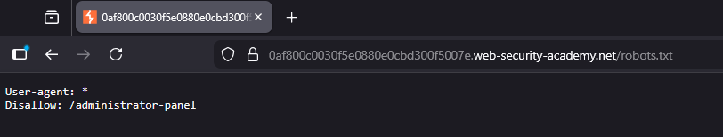

Đôi khi, việc ngăn chặn này sẽ phản tác dụng vì chúng có thể vô tính tiết lộ các API nhạy cảm, giúp kẻ tấn công tiết kiệm thời gian và công sức.

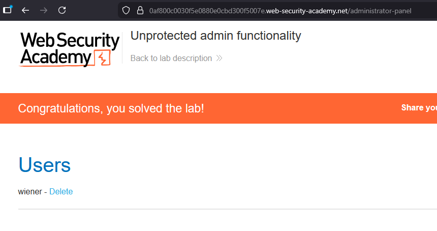

### Lab: Unprotected admin functionality with unpredictable URL
Một trong các sai lầm khác của việc thiết kế trang web là gộp file `.js` vào chung file `.html`. Điều này rất dễ phát hiện chỉ qua việc nhìn vào source page:

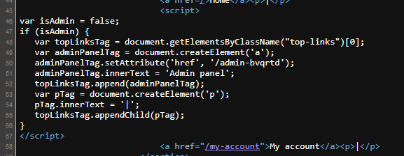

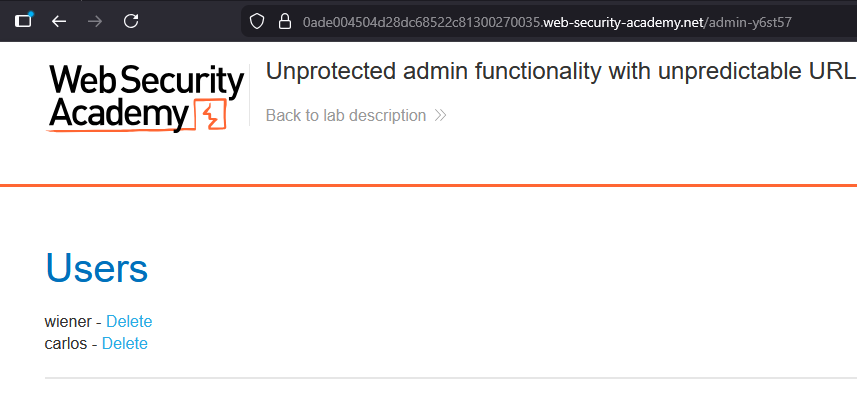

### Lab: User role controlled by request parameter
Một trong các lỗi khác trong việc thiết kế web là sử dụng cookie không hợp lý. Cookie dưới bất kì hình thức nào không được để user dễ dàng đoán cách thức tạo ra cookie, nếu không kẻ tấn công sẽ dễ dàng tạo cookie để bypass hệ thống.

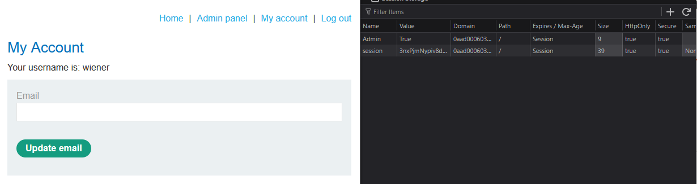

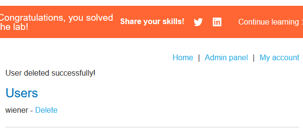

### Lab: User role can be modified in user profile
Một lỗi khác ở lab này là để người dùng có quyền thay đổi giá trị param. Khi sử dụng chức năng `Change email`, ta sẽ thấy ở Response sẽ hiện thị nhiều thông tin, trong đó bao gồm cả roleid:

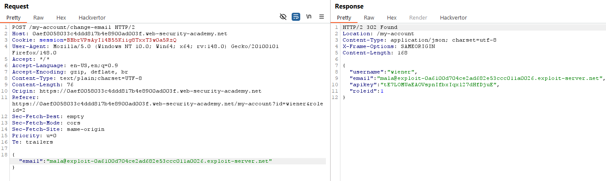

Bằng cách gửi lại Request đó nhưng với `"roleid":2`, ta sẽ có quyền truy cập admin.

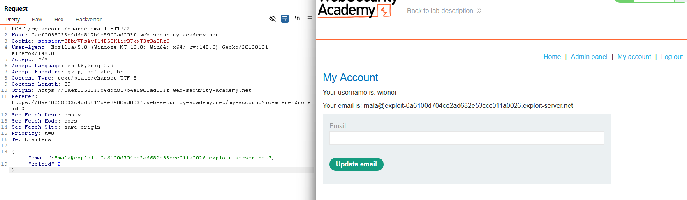

### Lab: URL-based access control can be circumvented
Một trong các cách đơn giản chặn user truy cập vào những URL nhạy cảm là block thẳng URL đó, ví dụ như: `DENY /admin, /managers,...` Tuy nhiên, cách này có thể khá nguy hiểm vì `X-Original-URL` và `X-Rewrite-URL` có thể bypass filter này.

Bằng cách sử dụng Header `X-Original-URL: /admin`, còn URL chỉ tới trang gốc, ta đang điều hướng request tới `/admin` mà không phải truy cập bằng URL:

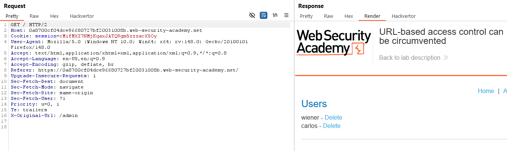

Ta sẽ chỉnh `X-Original-URL: /admin/delete`, rồi ở đầu Request truy cập tới `GET /?username=carlos` là hoàn thành lab.

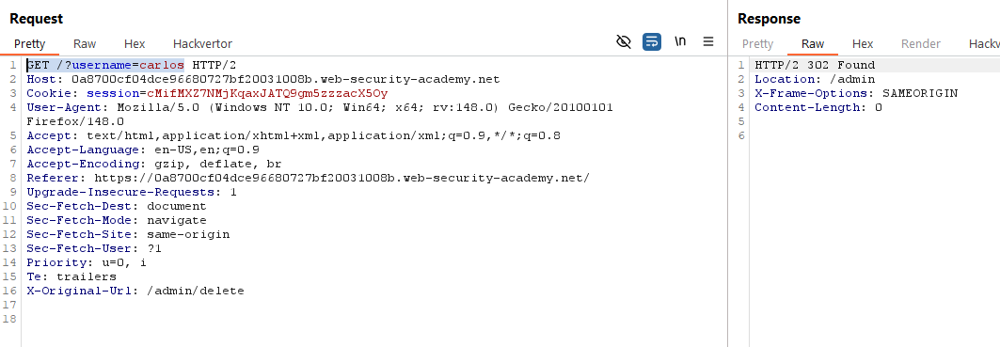

### Lab: Method-based access control can be circumvented
Cũng với điều kiền như lab trên, nhưng thay vì ta sử dụng Header thì sẽ sử dụng Method. 

Lab này cho ta biết trước các API của administrator, trong đó bao gồm cả API cho phép thăng quyền hạn user:

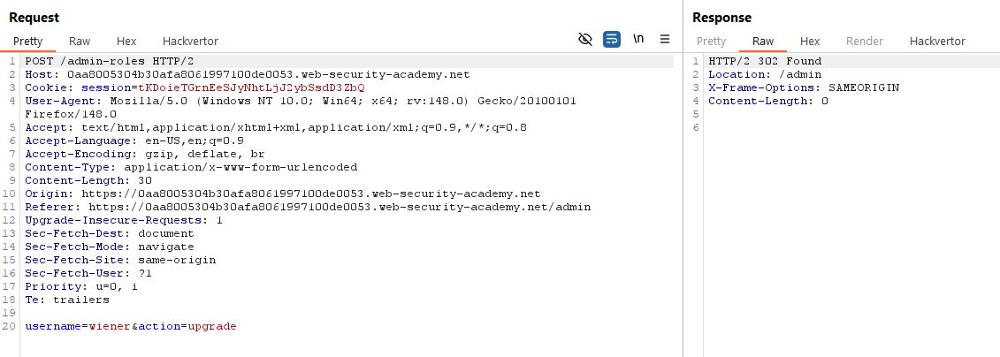

Sử dụng Request này, ta quay về user `wiener` để gửi lại request thì bị hệ thống chặn lại:

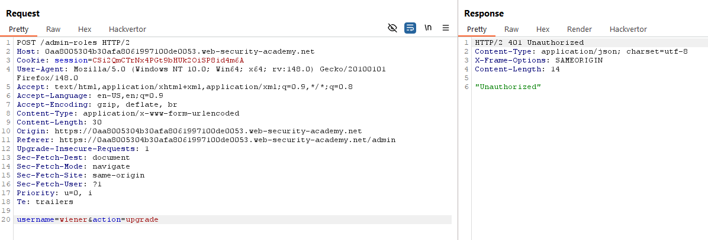

Tuy nhiên, ta có thể bypass filter bằng cách sử dụng Method `GET` với param là payload của Method `POST`:

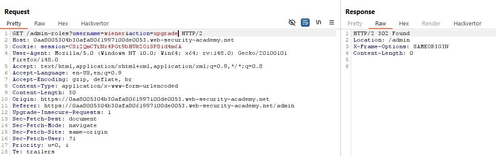

Như vậy là dã hoàn thành lab.

### Lab: User ID controlled by request parameter
Bên cạnh cách vượt quyền theo chiều dọc như trên (tức thăng quyền hạn từ user -> admin), còn một cách vượt quyền khác là vượt quyền theo chiều ngang, tức ta có thể truy cập vào các user khác mà không cần xác thực.

Như ở lab này, ta có thể truy cập vào user `carlos` chỉ qua việc thay đổi param `id=`:

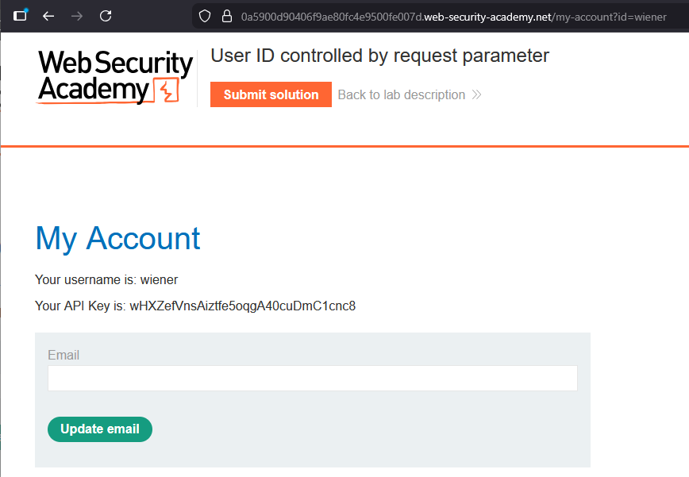

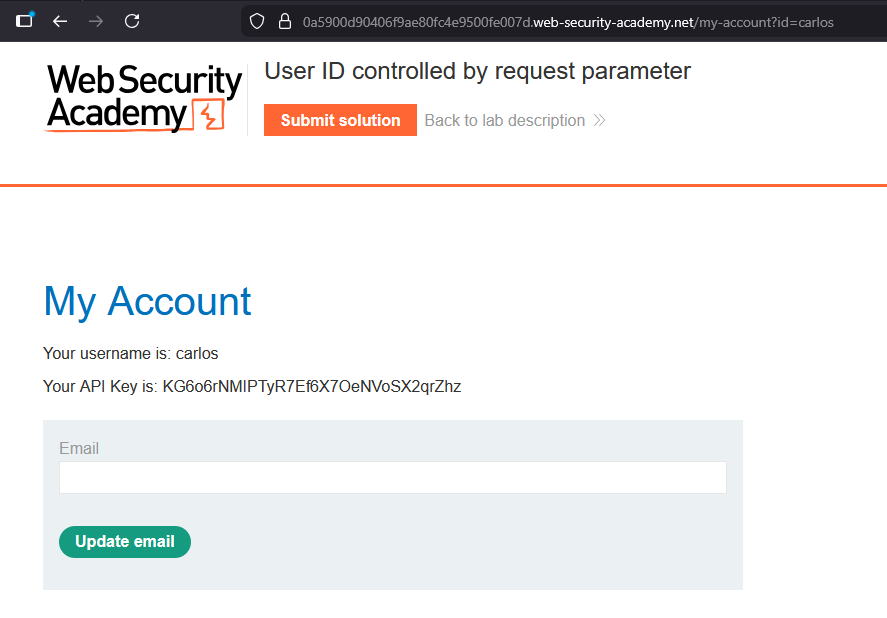

### Lab: User ID controlled by request parameter, with unpredictable user IDs
Mặc dù không còn khả năng truy cập vào user khác bằng tên user vì cơ chế lab đã được thay đổi để mỗi GUID đại diện cho 1 user khác nhau. Tuy nhiên, lab này lại để lộ 1 lỗ hỏng khác là GUID có thể được xem bởi user khác chỉ bằng cách truy cập vào profile của họ:

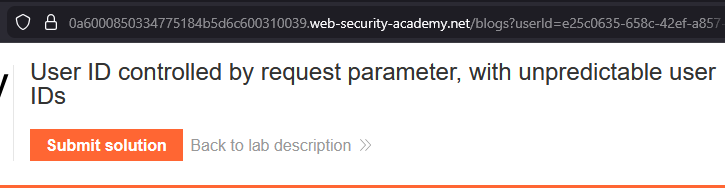

Sử dụng GUID này, ta có thể truy cập vào account của user `carlos` và hoàn thành lab.

### Lab: User ID controlled by request parameter with data leakage in redirect
Không có bài học nào rút ra từ lab này. Nếu ta thay đổi `id=carlos`, thì khi check Proxy, ta sẽ thấy 1 trang Redirect có chứa full UI Profile:

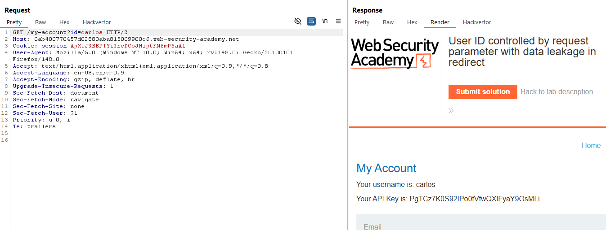

### Lab: User ID controlled by request parameter with password disclosure
Cũng với yêu cầu như các lab trên, ở lab này, ta sẽ thăng quyền hạn bằng cách sử dụng query URL. Cụ thể, ta có thể truy cập vào các tài khoản qua việc đổi `id=$username`:

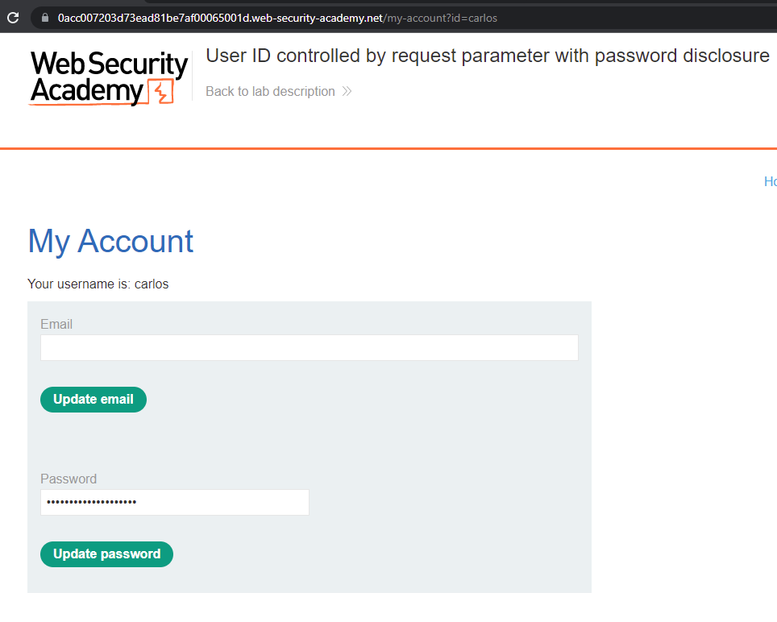

Ta có thể biết được password của username này bằng việc check source code:

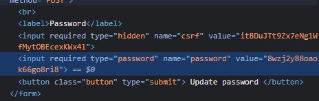

Với cách này, ta có thể áp dụng để truy cập vào tài khoản `administrator`

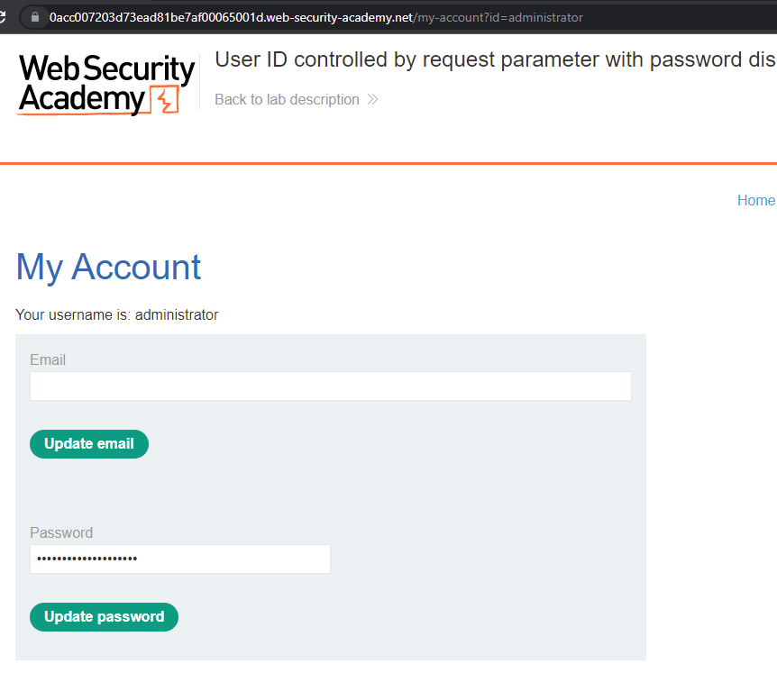

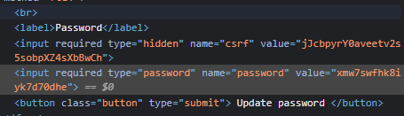

Sau khi biết mật khẩu, ta đăng nhập vào tài khoản `administrator`, xoá user `carlos` để hoàn thành lab.

### Lab: Insecure direct object references
IDOR, hay "Tham chiếu đối tượng trực tiếp không an toàn", là lỗ hỏng cơ bản và nguy hiểm cho bật cứ website nào. Lỗ hỏng này xảy ra khi user có quyền truy cập vào tài nguyên hệ thống một cách trực tiếp thông qua backend mà không phải qua tính xác thực.

Ở Lab này, lỗi IDOR xuất hiện khi ta tải dữ liệu hội thoại chatbox về:

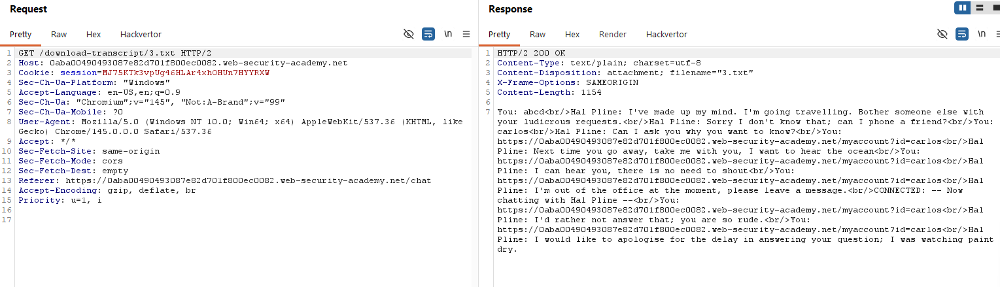

Ở Header, ta thấy URL query tới backdoor để lộ ID transcript, và nó luôn bắt đầu từ số 2, vậy nếu ta query tới transcript `1.txt` thì sao?

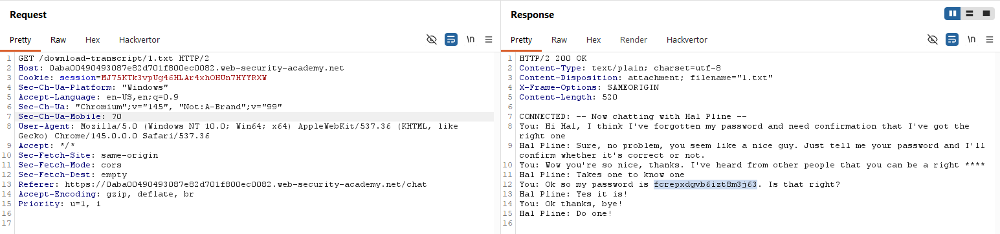

Trích xuất mật khẩu có trong transcript là ta đăng nhập được tài khoản` Carlos`.

### Lab: Multi-step process with no access control on one step
Lab này yêu cầu ta bypass hệ thống xác thực nhiều bước chỉ bằng 1 bước duy nhất.

Đầu tiên, ta sẽ cần đăng nhập tài khoản `administrator` để kiểm tra các API. Ở phần thăng cấp user, có API cần chú ý là `POST /admin-roles`. Tuỳ thuộc vào payload, nếu trong payload không có param `confirmed=true`, thì hệ thống sẽ hỏi thêm 1 lần nữa để xác thực:

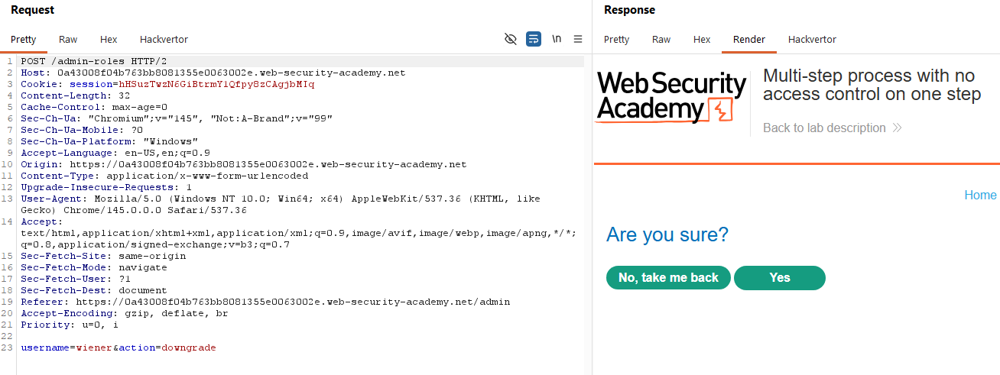

Ta sẽ sử dụng API chứa param `confirmed=true` để gửi lên server với tài khoản của user `wiener` để thăng quyền hạn lên admin:

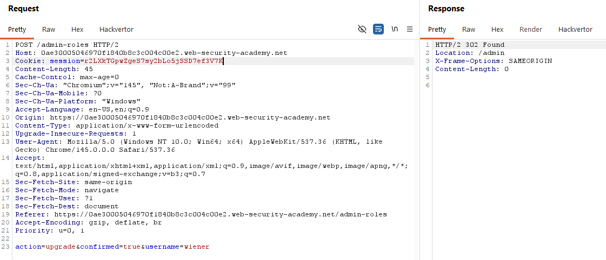

### Lab: Referer-based access control
Như tên gọi của Lab, khi ta kiểm tra API thăng quyền hạn user `/admin-roles?username=wiener&action=upgrade`, nếu ta xoá đi `/admin` ở Referer, thì dù là tài khoản admin vẫn sẽ bị báo là `"Unauthorized"`

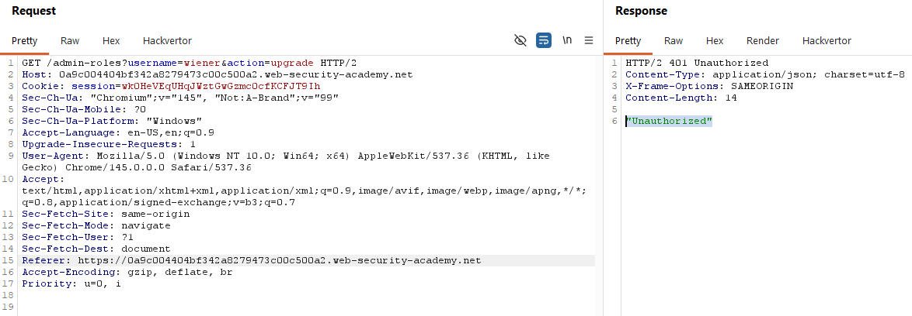

Sử dụng lỗ hỏng này, ta đăng nhập vào user `wiener`, dán cookie `Session` vào Request trên để thăng quyền hạn.

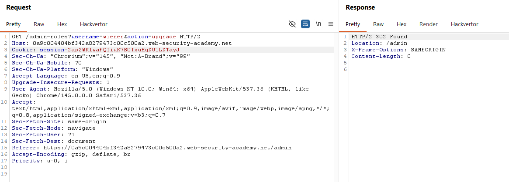

=======
# Access control vulnerabilities and privilege escalation
## Khái niệm:
Access control, hay kiểm soát truy cập là chỉ hành động chỉ định những ai có quyền tương tác với chức năng, tài nguyên hệ thống. Quyền kiểm soát truy cập đối với quản lý web thường dựa vào 2 yếu tố để xác định user: 
- Tính xác thực: Dựa vào username, password,... để quyết định user này là ai.
- Session (phiên): Nhận diện user có đang ở cùng 1 lượt truy cập hay không.

Khi quyền kiểm soát này không được thiết lập rõ ràng, kẻ tấn công có thể lợi dụng để leo thang quyền hạn. 

## Lab:
### Lab: Unprotected admin functionality
Đối với những người mới, khi tạo một trang web họ sẽ muốn mở quyền truy cập từ bên ngoài để kiểm tra trang web của mình nếu tìm kiếm từ các công cụ sẽ như thế nào. Họ không muốn các bot hay công cụ khi truy cập đến trang web sẽ vô tình tìm kiếm những thứ nhạy cảm, nên họ sẽ thêm file `robots.txt` để ngăn chặn điều đó.

Đôi khi, việc ngăn chặn này sẽ phản tác dụng vì chúng có thể vô tính tiết lộ các API nhạy cảm, giúp kẻ tấn công tiết kiệm thời gian và công sức.

### Lab: Unprotected admin functionality with unpredictable URL
Một trong các sai lầm khác của việc thiết kế trang web là gộp file `.js` vào chung file `.html`. Điều này rất dễ phát hiện chỉ qua việc nhìn vào source page:

### Lab: User role controlled by request parameter
Một trong các lỗi khác trong việc thiết kế web là sử dụng cookie không hợp lý. Cookie dưới bất kì hình thức nào không được để user dễ dàng đoán cách thức tạo ra cookie, nếu không kẻ tấn công sẽ dễ dàng tạo cookie để bypass hệ thống.

### Lab: User role can be modified in user profile
Một lỗi khác ở lab này là để người dùng có quyền thay đổi giá trị param. Khi sử dụng chức năng `Change email`, ta sẽ thấy ở Response sẽ hiện thị nhiều thông tin, trong đó bao gồm cả roleid:

Bằng cách gửi lại Request đó nhưng với `"roleid":2`, ta sẽ có quyền truy cập admin.

### Lab: URL-based access control can be circumvented
Một trong các cách đơn giản chặn user truy cập vào những URL nhạy cảm là block thẳng URL đó, ví dụ như: `DENY /admin, /managers,...` Tuy nhiên, cách này có thể khá nguy hiểm vì `X-Original-URL` và `X-Rewrite-URL` có thể bypass filter này.

Bằng cách sử dụng Header `X-Original-URL: /admin`, còn URL chỉ tới trang gốc, ta đang điều hướng request tới `/admin` mà không phải truy cập bằng URL:

Ta sẽ chỉnh `X-Original-URL: /admin/delete`, rồi ở đầu Request truy cập tới `GET /?username=carlos` là hoàn thành lab.

### Lab: Method-based access control can be circumvented
Cũng với điều kiền như lab trên, nhưng thay vì ta sử dụng Header thì sẽ sử dụng Method. 

Lab này cho ta biết trước các API của administrator, trong đó bao gồm cả API cho phép thăng quyền hạn user:

Sử dụng Request này, ta quay về user `wiener` để gửi lại request thì bị hệ thống chặn lại:

Tuy nhiên, ta có thể bypass filter bằng cách sử dụng Method `GET` với param là payload của Method `POST`:

Như vậy là dã hoàn thành lab.

### Lab: User ID controlled by request parameter
Bên cạnh cách vượt quyền theo chiều dọc như trên (tức thăng quyền hạn từ user -> admin), còn một cách vượt quyền khác là vượt quyền theo chiều ngang, tức ta có thể truy cập vào các user khác mà không cần xác thực.

Như ở lab này, ta có thể truy cập vào user `carlos` chỉ qua việc thay đổi param `id=`:

### Lab: User ID controlled by request parameter, with unpredictable user IDs
Mặc dù không còn khả năng truy cập vào user khác bằng tên user vì cơ chế lab đã được thay đổi để mỗi GUID đại diện cho 1 user khác nhau. Tuy nhiên, lab này lại để lộ 1 lỗ hỏng khác là GUID có thể được xem bởi user khác chỉ bằng cách truy cập vào profile của họ:

Sử dụng GUID này, ta có thể truy cập vào account của user `carlos` và hoàn thành lab.

### Lab: User ID controlled by request parameter with data leakage in redirect
Không có bài học nào rút ra từ lab này. Nếu ta thay đổi `id=carlos`, thì khi check Proxy, ta sẽ thấy 1 trang Redirect có chứa full UI Profile:

### Lab: User ID controlled by request parameter with password disclosure
Cũng với yêu cầu như các lab trên, ở lab này, ta sẽ thăng quyền hạn bằng cách sử dụng query URL. Cụ thể, ta có thể truy cập vào các tài khoản qua việc đổi `id=$username`:

Ta có thể biết được password của username này bằng việc check source code:

Với cách này, ta có thể áp dụng để truy cập vào tài khoản `administrator`

Sau khi biết mật khẩu, ta đăng nhập vào tài khoản `administrator`, xoá user `carlos` để hoàn thành lab.

### Lab: Insecure direct object references
IDOR, hay "Tham chiếu đối tượng trực tiếp không an toàn", là lỗ hỏng cơ bản và nguy hiểm cho bật cứ website nào. Lỗ hỏng này xảy ra khi user có quyền truy cập vào tài nguyên hệ thống một cách trực tiếp thông qua backend mà không phải qua tính xác thực.

Ở Lab này, lỗi IDOR xuất hiện khi ta tải dữ liệu hội thoại chatbox về:

Ở Header, ta thấy URL query tới backdoor để lộ ID transcript, và nó luôn bắt đầu từ số 2, vậy nếu ta query tới transcript `1.txt` thì sao?

Trích xuất mật khẩu có trong transcript là ta đăng nhập được tài khoản` Carlos`.

### Lab: Multi-step process with no access control on one step
Lab này yêu cầu ta bypass hệ thống xác thực nhiều bước chỉ bằng 1 bước duy nhất.

Đầu tiên, ta sẽ cần đăng nhập tài khoản `administrator` để kiểm tra các API. Ở phần thăng cấp user, có API cần chú ý là `POST /admin-roles`. Tuỳ thuộc vào payload, nếu trong payload không có param `confirmed=true`, thì hệ thống sẽ hỏi thêm 1 lần nữa để xác thực:

Ta sẽ sử dụng API chứa param `confirmed=true` để gửi lên server với tài khoản của user `wiener` để thăng quyền hạn lên admin:

### Lab: Referer-based access control
Như tên gọi của Lab, khi ta kiểm tra API thăng quyền hạn user `/admin-roles?username=wiener&action=upgrade`, nếu ta xoá đi `/admin` ở Referer, thì dù là tài khoản admin vẫn sẽ bị báo là `"Unauthorized"`

Sử dụng lỗ hỏng này, ta đăng nhập vào user `wiener`, dán cookie `Session` vào Request trên để thăng quyền hạn.

>>>>>>> ae5bd4f (init commit)
