# Business logic vulnerabilities
## Khái niệm:
Đối với các website bán hàng lớn như: Alibaba, Amazon, Shopee,... ngoài chức năng chính là bán các sản phẩm, họ còn phải thêm nhiều chức năng kích thích tiêu dùng như thêm voucher, áp mã giảm giá, tích luỹ điểm,... Nếu những chức năng đó không được xử lý cẩn thận, người dùng có thể vô tình hay hữu ý khiến cho phía server xảy ra lỗi logic, tạo ra lỗ hỏng có thể khai thác.

## Lab:
### Lab: Excessive trust in client-side controls
Lab này yêu cầu ta cần mua một món hàng với mức giá rẻ hơn so với mức giá gốc của nó, với lỗ hỏng ở đây là phía server sẽ không xác thực input của user mà trực tiếp "tin tưởng". Dựa vào gợi ý trên, ta có thể tìm thấy lỗ hỏng đó khi thêm sản phầm vào giỏ hàng:

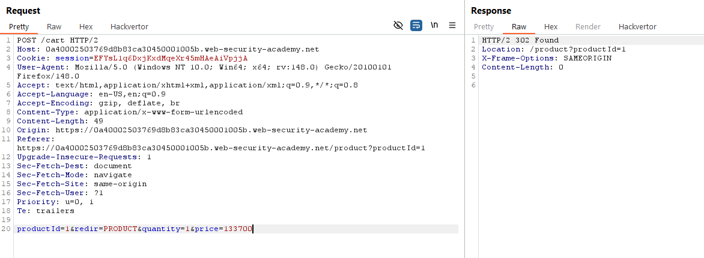

Bằng việc thay thế `price=1`, ta có thể mua sản phẩm này với mức giá rẻ hơn so với mức giá gốc:

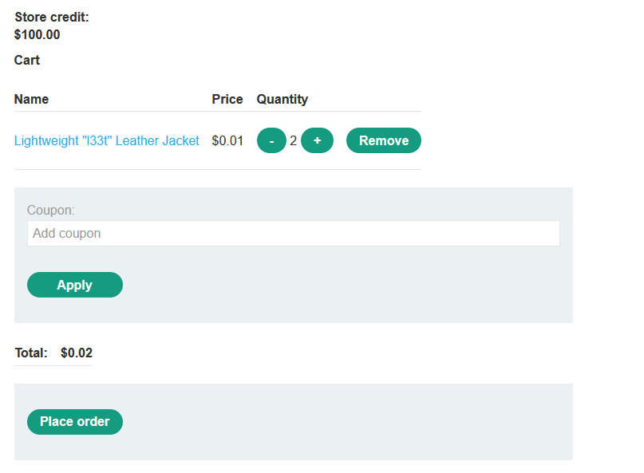

### Lab: 2FA broken logic
Lab này chứa lỗ hỏng nằm ở xác thực 2FA, với mục tiêu ở đây là đăng nhập được vào tài khoản của user `carlos`

Kiểm tra luống đăng nhập của tài khoản được cấp `wiener`, ta thấy request 2FA gửi tới server có lỗ hỏng. Cụ thể, việc xác thực chỉ được quyết định qua `Cookie: verify=$username`, tức là nếu ta thay `$username` thành `carlos`, ta vẫn có quyền truy cập để nhập code 2FA

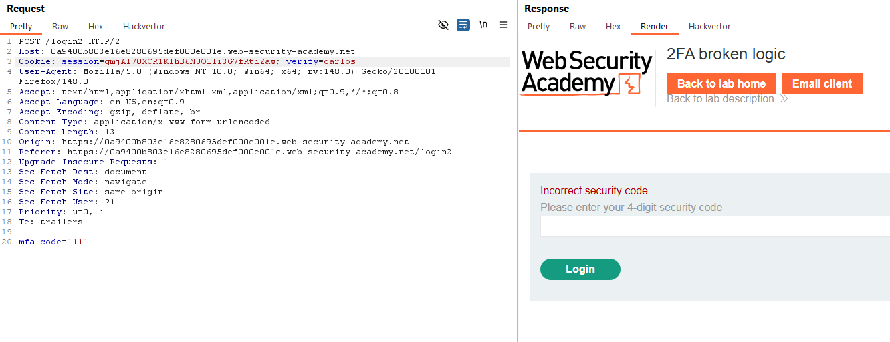

Gửi request này tới Burp Intruder, brutefore mfa-code từ 0000 -> 9999, ta có được code 2FA. 

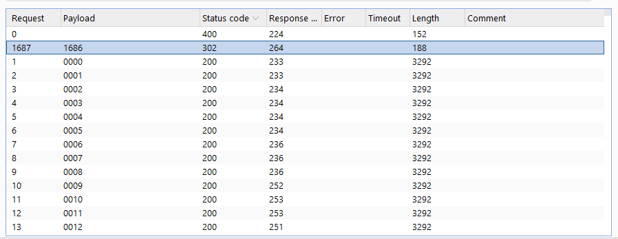

Sau khi có được code, ta sẽ quay về bước nhập 2FA, sử dụng Burp Intercept để chặn request gửi mã 2FA đi, thay số đó thành mã code ta tìm được với username là `carlos`, ta sẽ truy cập được tài khoản của `carlos`.

### Lab: High-level logic vulnerability
Tương tự với Lab `Excessive trust in client-side controls` với user input không được validate, nhưng khi này payload không còn chứa giá sản phẩm:

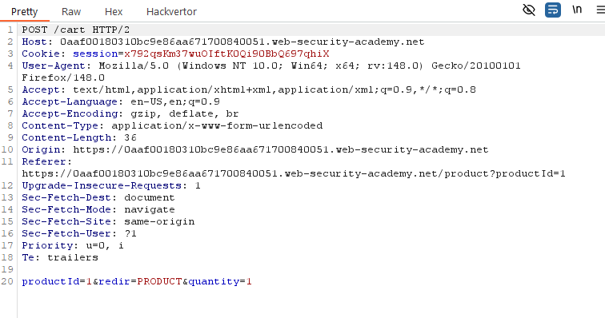

Khi kiểm tra chức năng giảm số lượng sản phẩm thêm vào giỏ hàng, ta sẽ nhận ra rằng nếu số lượng hàng bị bớt đi vượt quá số lượng đang tồn tại trong giỏ hàng, mặt hàng sẽ vẫn tồn tại trong giỏ hàng với giá trị âm.

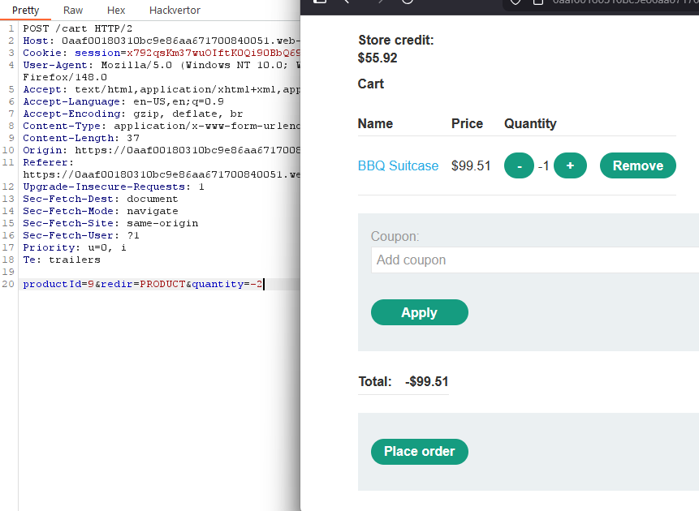

Và nếu lúc này ta bấm nút `Place Order`, hệ thống chỉ hiện thông báo `Cart total price cannot be less than zero`.

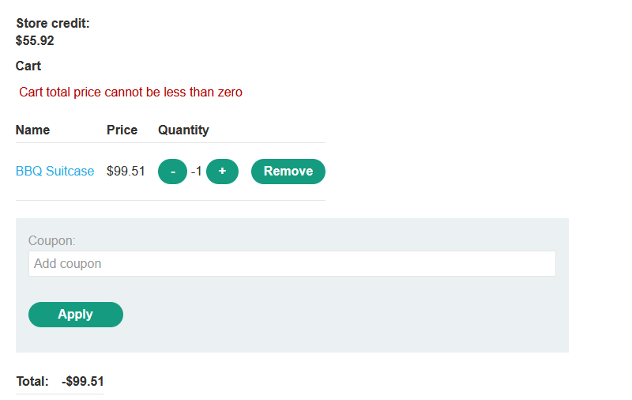

Điều này có nghĩa là ta có thể thêm sản phầm cần mua, sau đó thêm vô hạn sản phầm có quantity âm để trừ giá tổng giá trị sản phẩm để có thể mua. 

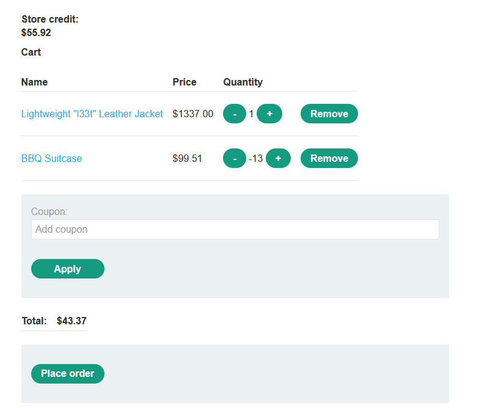

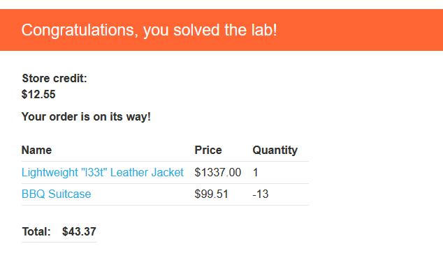

### Lab: Low-level logic flaw
Với tiêu đề là `Low-Level`, vậy thì lỗ hỏng ở lab này có thể nằm ở giới hạn số. Cụ thể, giới hạn của Int trong C từ -2,147,483,648 đến 2,147,483,647. Trên lý thuyết, nếu giá trị vượt quá MAX_INT, giá trị sẽ lộn vòng về MIN_INT, từ là 2,147,483,647 + 1 = -2,147,483,648. Vậy đối với lab này, nếu ta đẩy giá tiền vượt ngưỡng này thì sao?

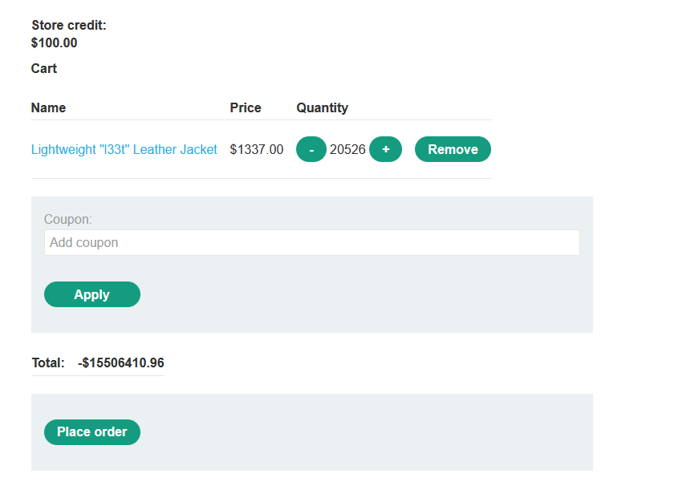

Để tăng tốc độ vượt mức, ta sẽ sử dụng Turbo Intruder, với request là 1 sản phẩm khác đắt nhất với Quantity=99, rồi gửi hàng loạt để đẩy tổng giá trị sản phẩm vượt qua MAX_INT, sau đó tiếp tục thêm để giá trị cuối dưới $100

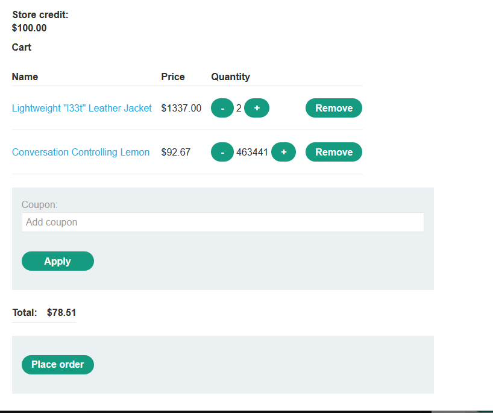

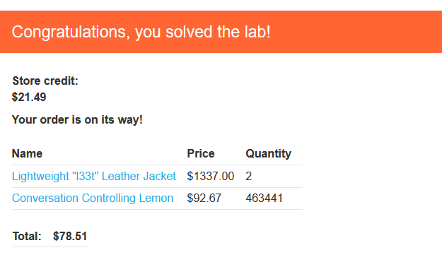

### Lab: Inconsistent handling of exceptional input
Lỗ hỏng lần này được đặt ở trong phần đăng ký tài khoản, yêu cầu được đặt ra là đăng nhập được admin interface.

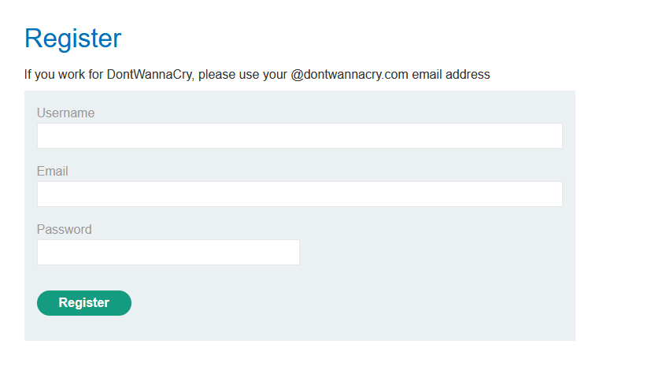

Với việc cả Username và Password đều không thể nhập kí tự đặc biệt, nên lựa chọn còn lại chỉ còn là khai thác email. Lab này cung cấp cho ta 1 domain để nhận xác thực từ phía server, và 1 gợi ý về việc sử dụng domain `@dontwannacry.com`. Nếu ta truy cập `\admin`, ta sẽ nhận được thông báo:

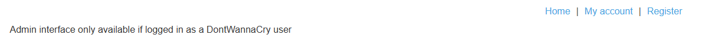

Vậy tức là ta cần phải đăng ký username có email chứa domain `@dontwannacry.com`, đồng thời cũng phải xác thực được tài khoản. Nói cách khác, ta cần phải ghép 2 domain thành `@dontwannacry.com.exploit-$ID$.exploit-server.net` với `dontwannacry` ở đây được coi như 1 subdomain, mà hệ thống vẫn coi đây là của Dontwannacry. 

Đối với các biến `$username` hay `$email`, thường thì chúng sẽ được giới hạn số lượng kí tự có thể có nhằm tiết kiệm dữ liệu lưu trữ. Ta có thể dựa vào ý tưởng này để khai thác bằng cách thử gửi 1 email có `$name` siêu dài, ví dụ: `aaaaaaaaaaaaaaaaaaaaaaaaaaaaaaaaaaaaaaaaaaaaaaaaaaaaaaaaaaaaaaaaaaaaaaaaaaaaaaaaaaaaaaaaaaaaaaaaaaaaaaaaaaaaaaaaaaaaaaaaaaaaaaaaaaaaaaaaaaaaaaaaaaaaaaaaaaaaaaaaaaaaaaaaaaaaaaaaaaaaaaaaaaaaaaaaaaaaaaaaaaaaaaaaaaaaaaaaaaaaaaaaaaaaaaaaaaaaaaa@exploit-$ID.exploit-server.net`. Khi này, sau khi xác thực và đăng nhập vào tài khoản, ta sẽ thấy tổng số lượng kí tự của email bị giới hạn ở mức 255:

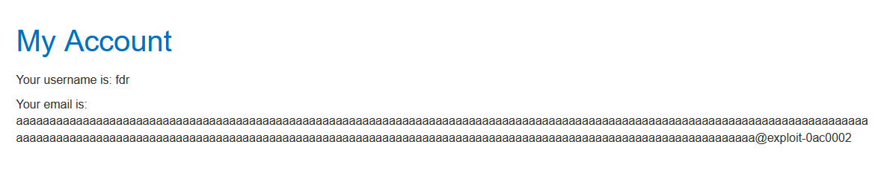

Ta có thể khai thác lỗ hỏng này bằng cách thêm số lượng kí tự `$name` sao cho `@dontwannacry.com` sẽ xuất hiện ở những kí tự cuối cùng, còn `exploit-$ID$.exploit-server.net` sẽ bị che đi.

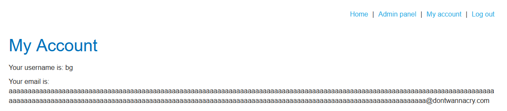

Việc còn lại là truy cập `Admin panel` để xoá user `Carlos`

### Lab: Inconsistent security controls
Cùng yêu cầu như lab ở trên, nhưng khi này vuln dễ dàng khai thác hơn nhiều khi nó nằm ở phần update email.

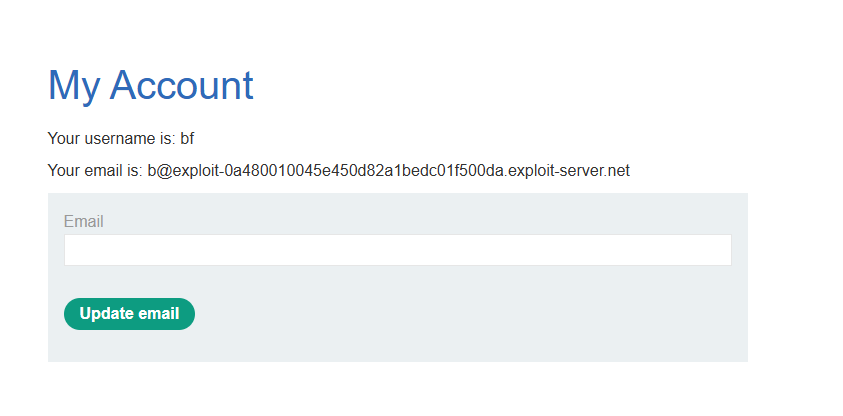

Nếu ta thay đổi domain thành `@dontwannacry.com`, hệ thống vẫn sẽ chấp nhận thay đổi và ta có quyền truy cập vào `Admin panel`:

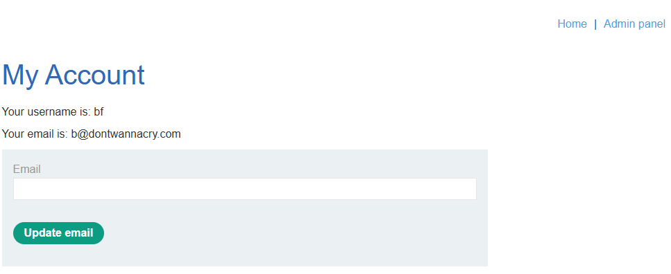

### Lab: Weak isolation on dual-use endpoint
Lab này đặt giả định rằng user có thể leo thang đặc quyền dựa trên input nhập vào. Môi trường để leo thang này được đặt ở phần thay đổi mật khẩu của username.

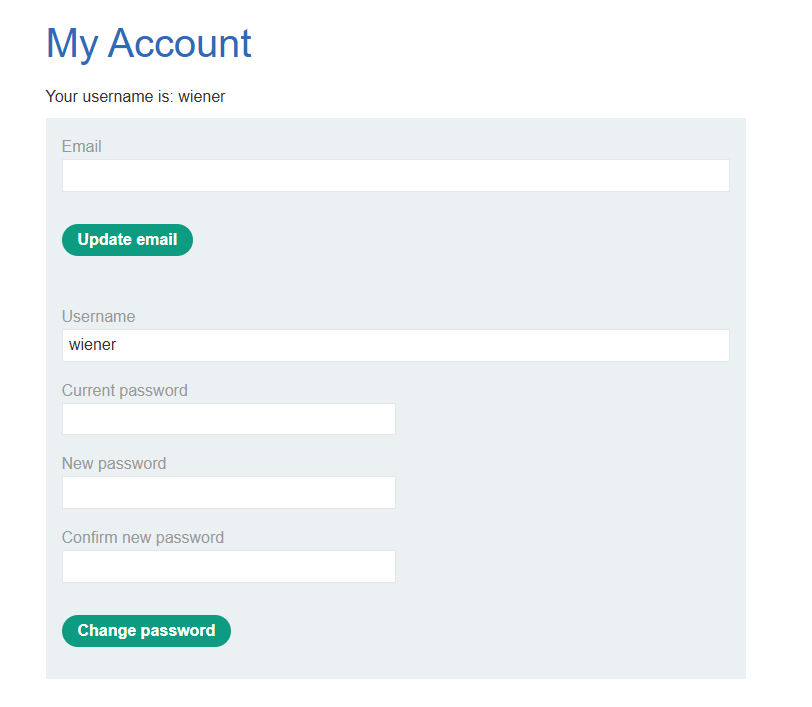

Khi kiểm tra payload được gửi đến server, ta thấy đều payload đều chứa đủ cả 4 phần.

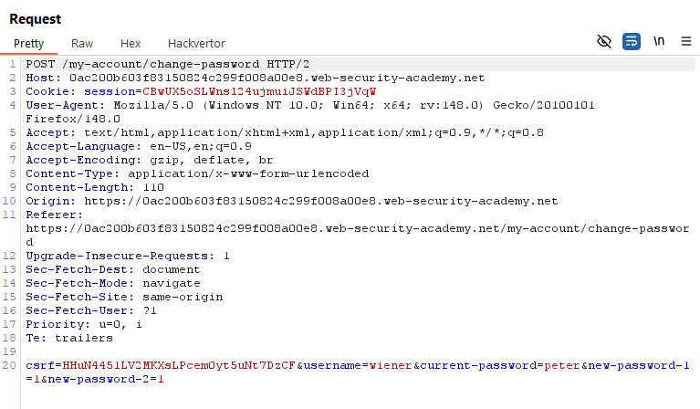

Nhưng nếu ta xoá bỏ đi param `Current password`, hệ thống vẫn chấp nhận request và thay đổi mật khẩu hiện tại:

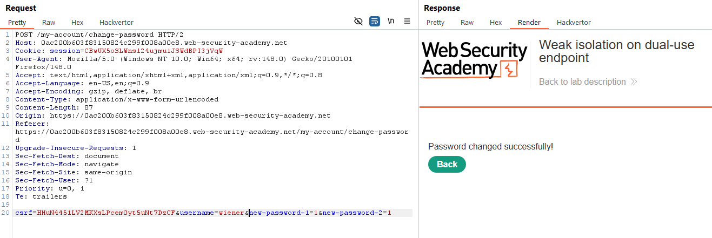

Vậy ta chỉ cần thay đổi username thành `administrator`, xoá bỏ đi param `Current password` là có thể thay đổi mật khẩu tài khoản admin thành mật khẩu mình muốn.

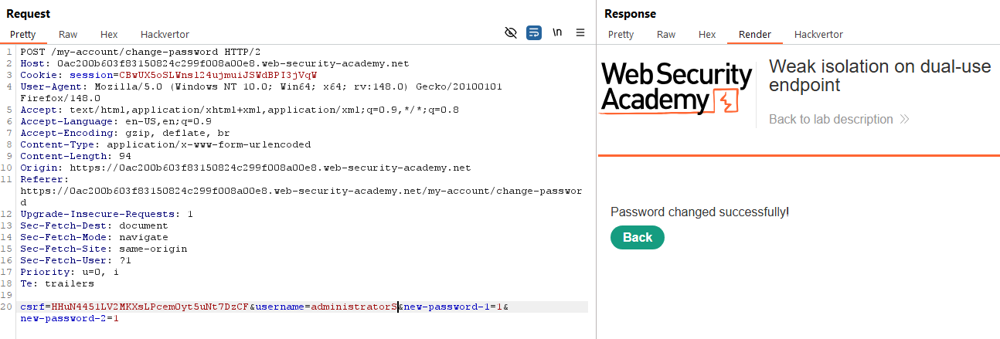

Việc còn lại là đăng nhập rồi xoá người dùng `Carlos` để hoàn thành Lab.

### Lab: Password reset broken logic
Lỗ hỏng ở Lab này được đặt ở phần reset password. Cụ thể khi reset password cho 1 username, hệ thống sẽ gửi mail tới email của username đó, trong đó chứa token làm param để reset password.

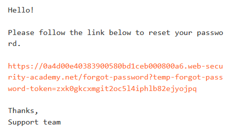

Vấn đề là token này không tự động huỷ khi đã sử dụng, hoặc kiểm tra xem user này có phải là người yêu cầu token hay không. Từ đó, ta có thể sử dụng token này để reset mật khẩu của Carlos:

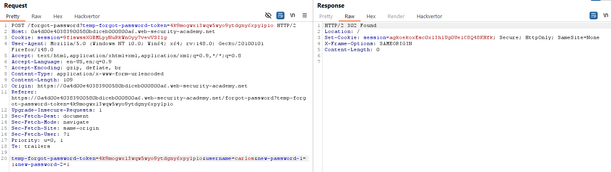

Còn lại là truy cập vào user `Carlos` để hoàn thành Lab.

### Lab: 2FA simple bypass
Lab này tạo cơ chế 2FA với lỗ hỏng khá là đơn giản. Ở `/login` khi ta đăng nhập tài khoản và mật khẩu của user, nếu ở `/login2` đến bước nhập 2FA, ta đổi URL thành `my-accout?id=$user`, ta vẫn có quyền truy cập bình thường mà không cần 2FA


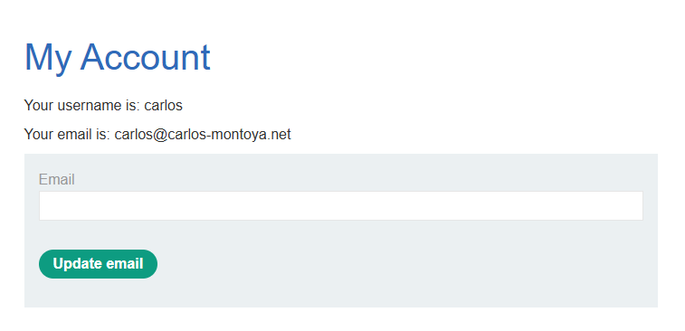

### Lab: Insufficient workflow validation
Lỗ hỏng ở lab này khá là kì cục. Với một hệ thống bán hàng, nó sẽ luôn cần đối chiếu lượng tiền nằm trong ví với tổng giá trị sản phầm mà ta mua.

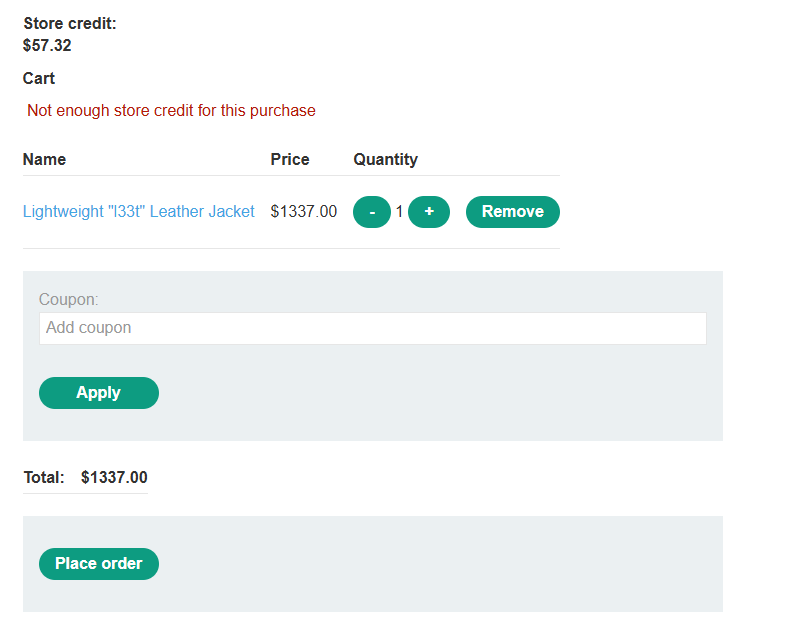

Tuy nhiên, hệ thống của lab này lại cho phép mua hàng vượt mức tiền cho phép bằng việc chạy API khi đã qua bước kiếm tra tiền, việc gần như không nên và không thể xảy ra khi lập trình 1 hệ thống bán hàng:

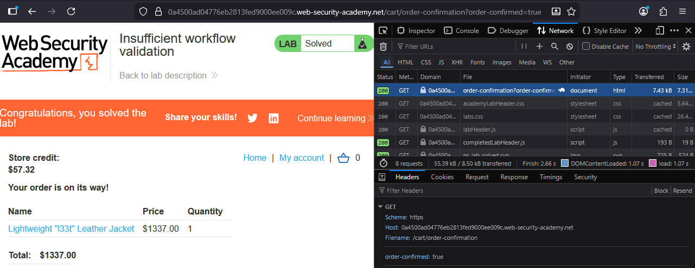

### Lab: Authentication bypass via flawed state machine
Lab này đưa ra giả định về trình tự sai trong quá trình đăng nhập. Khi ta đăng nhập bằng tài khoản được cấp, hệ thống sẽ yêu cầu ta chọn vài trò là `user` hay `content author`:

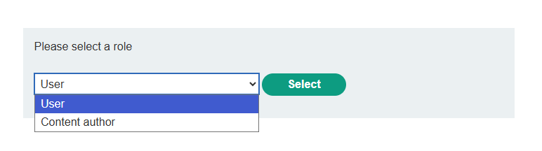

Giả định rằng vài trò ẩn là `admin`, vậy tức là ta cần đổi role của user thành admin. Nếu ta thử đổi param `role` nằm trong `POST /role-selector` thành admin, thì không có gì xảy ra cả:

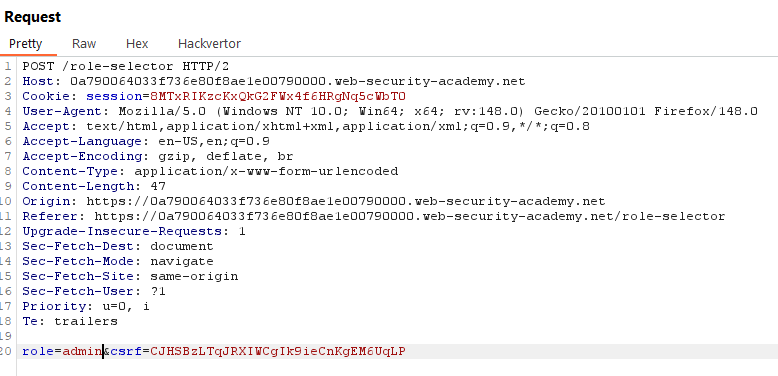

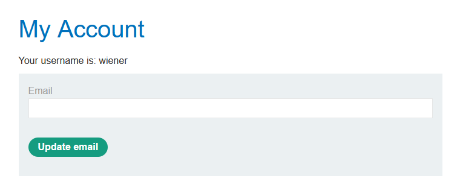

Điều này có nghĩa là để quyền admin có thể sẽ gắn cho user trước khi `/role-selector` xuất hiện, vậy thì việc tiếp theo nên làm hiện tại là chặn `GET /role-selector` để kiểm tra giả thuyết bằng cách sử dụng Burp Intercept, drop response `GET /role-slector`:

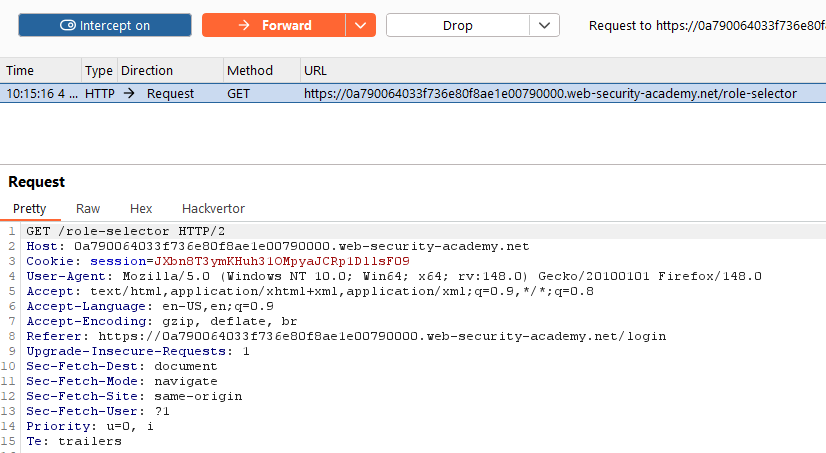

Nếu mà ta làm vậy, thì khi quay lại màn hình chính, ta sẽ có thể truy cập vào `Admin panel`, tức là về mặt flow đăng nhập thì hệ thống sẽ luôn mặc định user là `admin` trước khi chọn role.

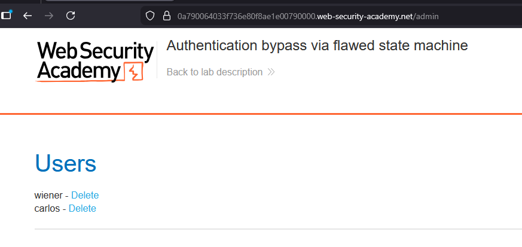

### Lab: Flawed enforcement of business rules
Lỗ hỏng lần này nằm ở phần nhập coupon. Ở phần đầu trang ta được coupon `NEWCUST5`, còn khi kéo xuống cuối trang, khi làm theo chỉ dẫn ta được coupon `SIGNUP30`. Nếu nhập 2 lần liên tiếp cùng 1 coupon, hệ thống sẽ không chấp nhận.

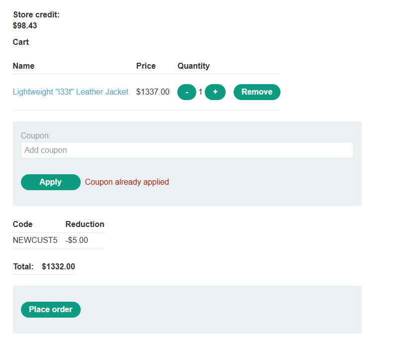

Nhưng nếu ta nhập cả 2 coupon, sau đó nhập lại coupon đầu tiên, hệ thống lại chấp nhận việc này.

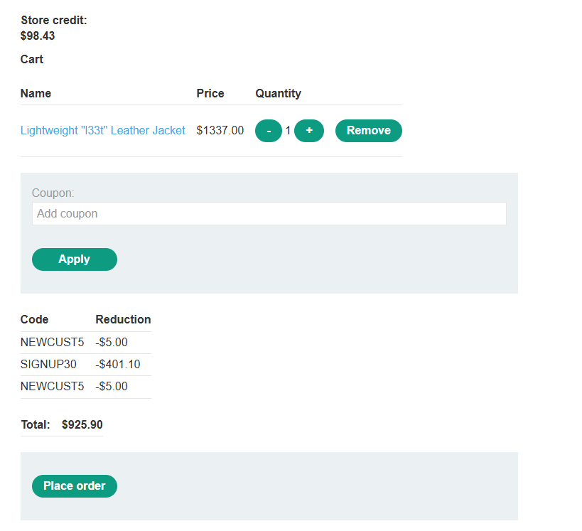

Từ lỗ hỏng này ta có thể đẩy tổng mức giá trong giỏ hàng xuống $0

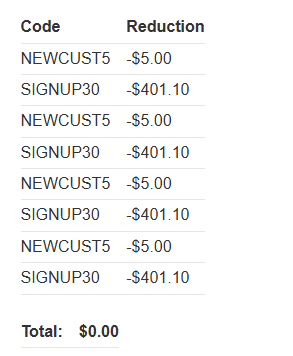

### Lab: Infinite money logic flaw
Lỗ hỏng lab này cũng tương tự như trên, với code `SIGNUP30` khi nhập email có thể tái sử dụng liên tục qua các phiên mua. Lần này trong kho hàng xuất hiện mặt hàng `Gift Card` có giá \$10, khi nhập code nhận được sẽ cho mình \$10.

Nếu ta áp coupon `SIGNUP30` vào `Gift Card`, ta có thể mua với giá \$7, tức là ta lãi 3$ cho mỗi lần mua và nhập code. 

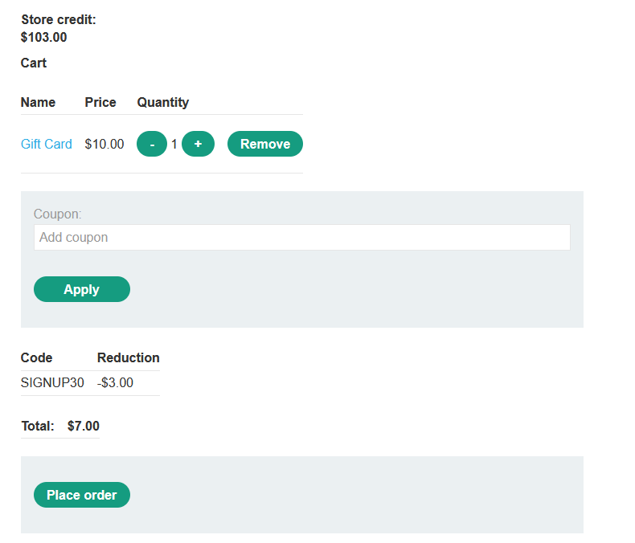

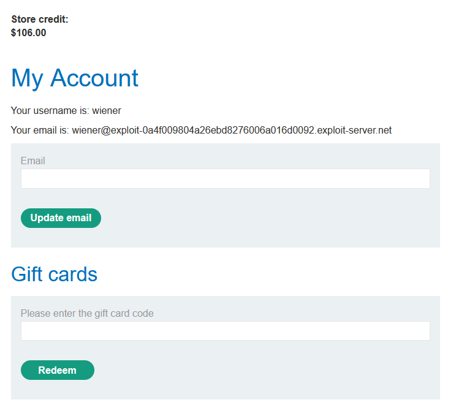

Để khai thác lỗ hỏng này, ta có thể làm theo hướng dẫn của BurpSuite. Tuy nhiên vì hướng dẫn mình thấy hơi rắc rối nên đã tự viết 1 script tự động hoá công việc trên:

```python
import requests
import re

DOMAIN = "0a51009a04cbeaaf80e8e55c001900c7.web-security-academy.net"
URL = f"https://{DOMAIN}"

HEADERS = {
    "User-Agent": "Mozilla/5.0 (Windows NT 10.0; Win64; x64; rv:148.0) Gecko/20100101",
    "Accept": "text/html,application/xhtml+xml,application/xml;q=0.9,*/*;q=0.8"
}

class infinite_money:
    def __init__(self, csrf, cookies):
        self.session = requests.Session()
        self.csrf = csrf
        self.cookiejar = requests.cookies.RequestsCookieJar()
        self.cookiejar.set('session', session_cookie, domain=DOMAIN, path='/')

    def add_gift_card(self):
        data = "productId=2&redir=PRODUCT&quantity=1"
        self.session.post(f"{URL}/cart", headers=HEADERS,cookies=self.cookiejar, data=data)

    def add_coupon(self):
        data=f"csrf={self.csrf}&coupon=SIGNUP30"
        self.session.post(f"{URL}/cart/coupon", headers=HEADERS,cookies=self.cookiejar, data=data)

    def checkout_and_take_coupon(self):
        data=f"csrf={self.csrf}"
        res = self.session.post(f"{URL}/cart/checkout", headers=HEADERS,cookies=self.cookiejar, data=data)

        pattern = r'<td>([a-zA-Z0-9]+)</td>'
        matches_iterator = re.finditer(pattern, res.content.decode())
        next(matches_iterator, None)
        return next(matches_iterator, None).group(0).replace("<td>", "").replace("</td>", "")

    def add_money(self, gift_card_id):
        data=f"csrf={self.csrf}&gift-card={gift_card_id}"
        self.session.post(f"{URL}/gift-card", headers=HEADERS,cookies=self.cookiejar, data=data)

if __name__ == "__main__":
    # Change csrf, cookies and domain
    csrf= "vLGKH9gprGAXCqR5iRSa6wRiCZpFL83C"
    session_cookie = 'FssJjNrdGhE7Ff7yiGqVJoHqKz2olmOA'
    infi = infinite_money(csrf=csrf, cookies=session_cookie)
    for i in range(300):
        print(i+1)                       
        infi.add_gift_card()
        infi.add_coupon()
        coupon_id = infi.checkout_and_take_coupon()
        infi.add_money(coupon_id)
```

Sau khi chạy, ta sẽ được kết quả:
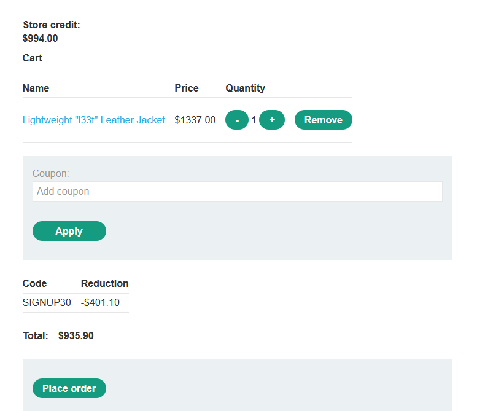

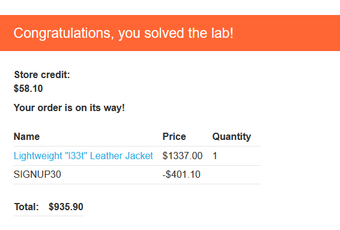

### Lab: Authentication bypass via encryption oracle
Lab này chứa lỗ hỏng làm lộ công cụ mã hoá của chính server. Khi ta đăng nhập vào website với `stay-logged-in` bật, trong phần request sẽ xuất hiện thêm 1 cookie bị mã hoá.

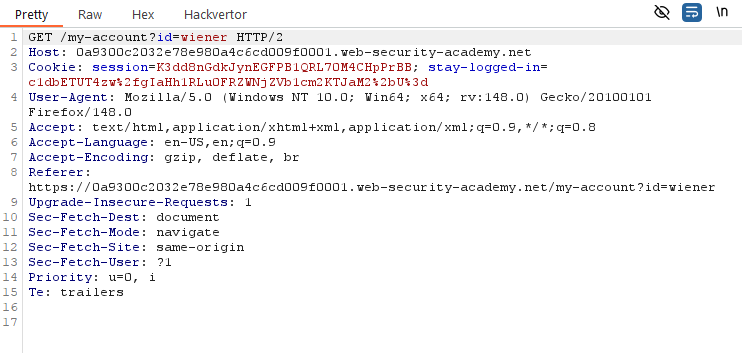

Ngoài ra, nếu ta nhập comment với email lỗi, thì trong phần header cookie sẽ xuất hiện cookie `notification` chứa thông tin bị mã hoá:

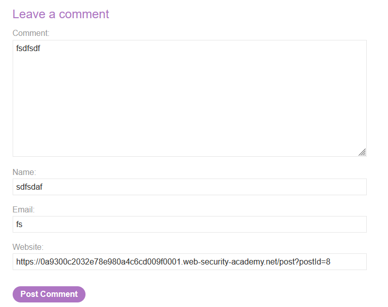

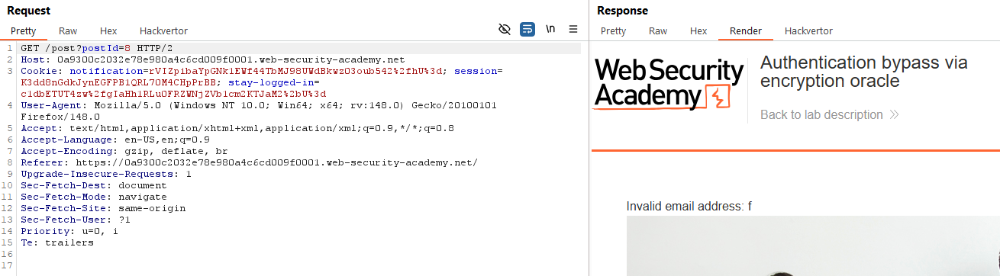

Sử dụng Burp Repeater để kiếm tra các param, ta thấy chỉ có param `email` mới khiến cho đoạn mã hoá đấy thay đổi, từ đó thông báo `Invalid email address: $email` cũng thay đổi. Vì format mã hoá của `notification` và `stay-logged-in` khá giống nhau, nên nếu ta đặt đoạn mã hoá của `stay-logged-in` vào `notification`, ta có thể giải được đoạn mã:

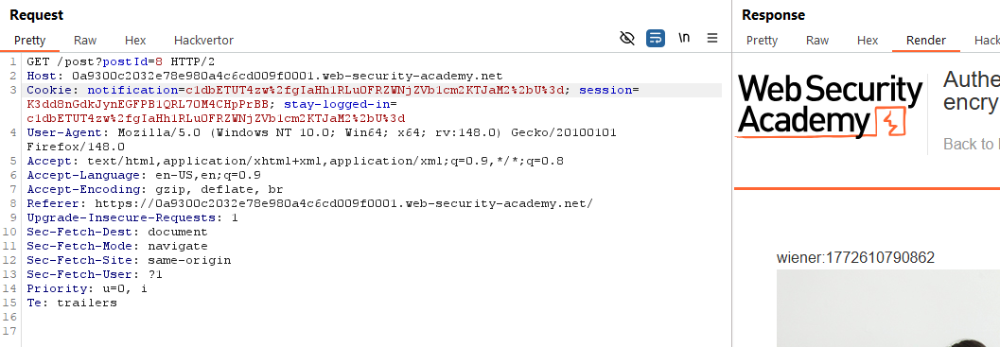

Đoạn số được giải mã là timestamp theo chuẩn UNIX, với thời gian chỉ thời điểm hiện tại. Ta có thể giả thuyết đoạn mã hoá của `stay-logged-in` chịu trách nhiệm làm token xác thực người dùng, nói cách khác nếu ta ghép `administrator` vào timestamp này, ta có thể bypass xác thực của hệ thống.

Nếu ta chú ý kĩ cookie `notification`, ta sẽ thấy dù cho email thay đổi, thì các byte đầu tiên vẫn luôn giữ nguyên, tương ứng với việc luôn xuất hiện "Invalid email address: " ở phần thông báo. Bên cạnh đó, độ dài của cookie này khi base64-decode luôn là bội của 16, có nghĩa là công cụ mã hoá này padding plaintext trước khi mã hoá. Nếu ta xoá đi 16 byte đầu, đoạn mã vẫn sẽ được giải mã bình thường mà không dính lỗi:

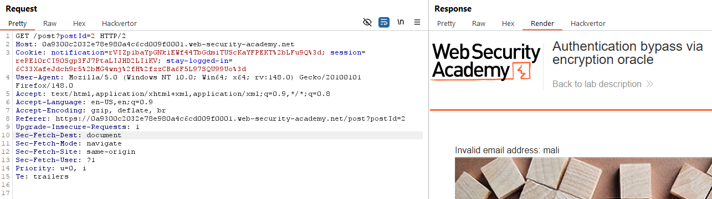

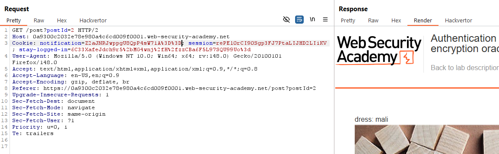

Cụm `Invalid email address: ` chứa 23 kí tự, ta sẽ thêm 9 kí tự rác để đủ số lượng là 32, sau đó thêm `administrator:$timestamp` vào cuối. Đưa đoạn này vào trong phần email comment để hệ thống mã hoá:

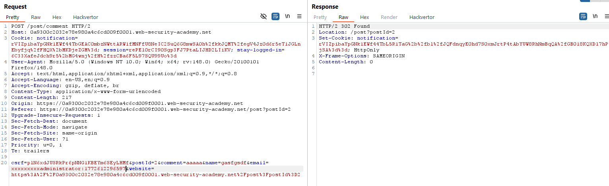

Sử dụng base64-decode để dịch đoạn mã, chuyển sang format hex, rồi xoá đi 64 kí tự đầu tiên là có được đoạn mã dùng cho stay-logged-in:


Sử dụng Burp Intercept, truy cập vào `/admin`, xoá đi cookie `session`, thay thế cookie `stay-logged-in` thành đoạn mã vừa tạo được ta sẽ có quyền truy cập vào admin:

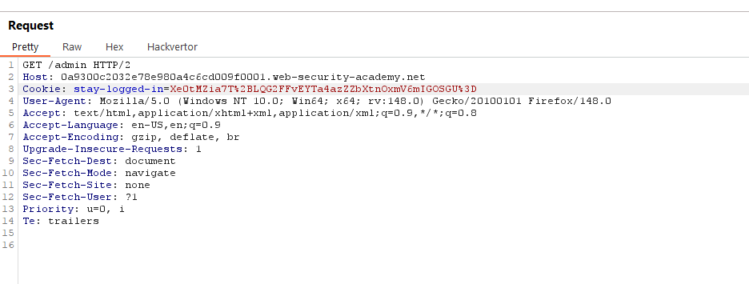

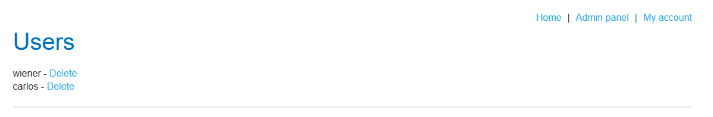

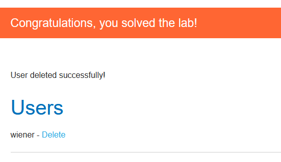

