<<<<<<< HEAD
# File upload vulnerabilities
## Khái niệm:
Upload file chưa bao giờ chỉ là upload 1 file ảnh lên avatar, gửi bài tập lên hệ thống,... Nếu không được config đúng cách, kẻ tấn công có thể gửi các file thực thi lên server, sau đó chạy file đó thông qua API. Một khi việc gửi file và thực thi thành công, server coi như nằm dưới quyền kiểm soát của kẻ tấn công.

## Lab:
### Lab: Remote code execution via web shell upload
Lab này là 1 ví dụ đơn giản cho việc không kiểm soát chặt chẽ file upload lên server sẽ dẫn đến hậu quả như thế nào. Sau khi đăng nhập vào hệ thống, ta sẽ thấy ở chỗ avatar có chức năng upload hình ảnh từ user:

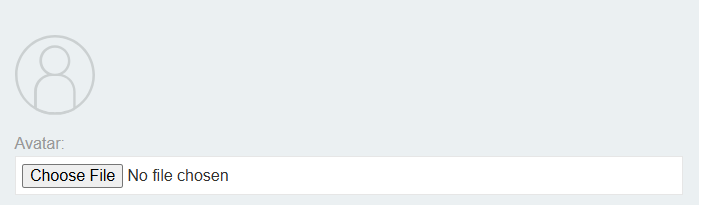

Sử dụng payload đơn giản bằng ngôn ngữ php: `<?php echo system($_GET['command']); ?>`, ta upload file này lên hệ thống và hệ thống vẫn chấp thuận.

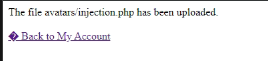

Nhưng, do file ta upload lên không phải file ảnh nên ta không biết file đó đã được upload đi đâu, nên ta sẽ upload 1 file ảnh khác để biết đường dẫn chứa file webshell.

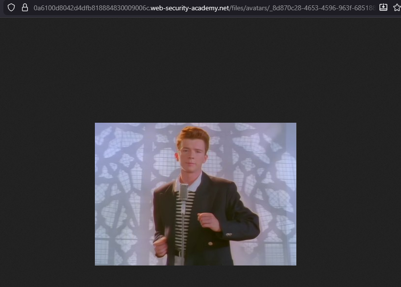

Khi đã biết được đường dẫn chứa file webshell, ta có thể truy cập vào file thông qua request:

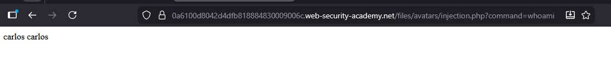

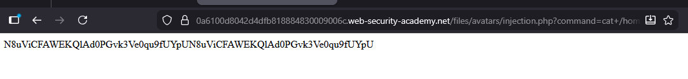

### Lab: Web shell upload via Content-Type restriction bypass
Để kiểm tra xem 1 file upload lên có phải là file ảnh hay không có nhiều cách thức, một trong số những cách thức đó là kiểm tra Content-Type của file có phải là `image/jpeg` hay `image/png` hay không:

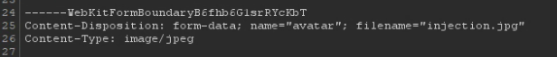

Nếu server chỉ dựa vào đó để xác thực, attacker có thể dễ dàng chỉnh sửa Content-Type, khiến cho bất cứ file nào gửi đến server cũng mang Content-Type của hình ảnh:

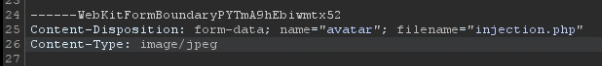

Và như thế, hệ thống xác thực đã bị bypass:

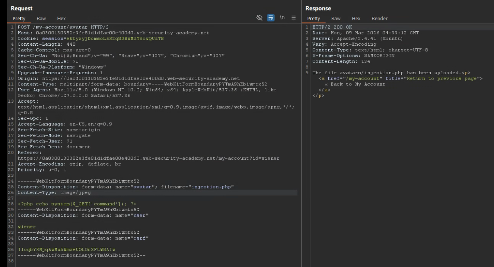

### Lab: Web shell upload via path traversal
Lab này yêu cầu ta upload file webshell, nhưng khi này tại folder chứa avatar đã bị chặn quyền hạn thực thi file và chỉ hiển thị dạng text thông thường.

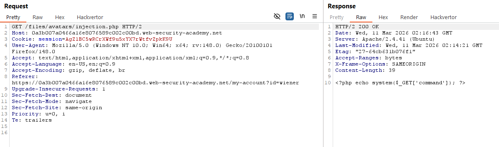

Khi này, ta có thể sử dụng 1 lỗ hỏng khác là Path Traversal để chuyển file php này sang folder khác có thể thực thi được. Trong các param ở Request, ta thấy param `filename` là nơi chứa tên file:

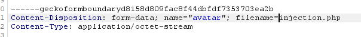

Nếu ta thử sử dụng Path Traversal lên param này, ta nhận thấy rằng các kí tự đã bị server filter, tức là vẫn có thể có cách sử dụng cách này.

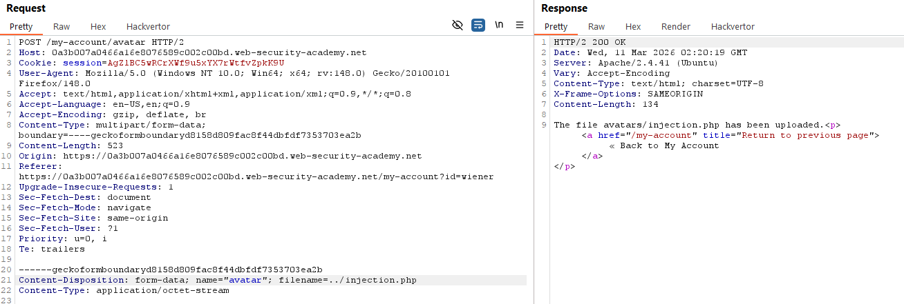

Chuyển đổi kí tự `/` URL encode thành `%2F`, ta sẽ bypass được filter.

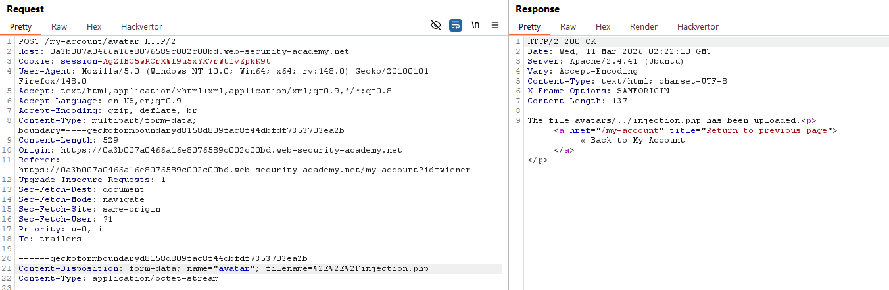

Khi này, nếu chạy file `injection.php` đang nằm ở folder `files`, thì sẽ không có bất cứ filter nào ngăn cản webshell khởi động:

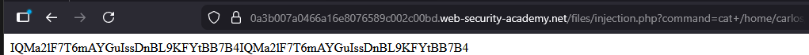

### Lab: Web shell upload via extension blacklist bypass
Lab này yêu cầu ta upload webshell và thực thi nó, đồng thời cũng phải bypass filter chặn việc upload. 

Cụ thể, nếu ta upload 1 file `.php`, hệ thống sẽ chặn request và từ chối file upload:

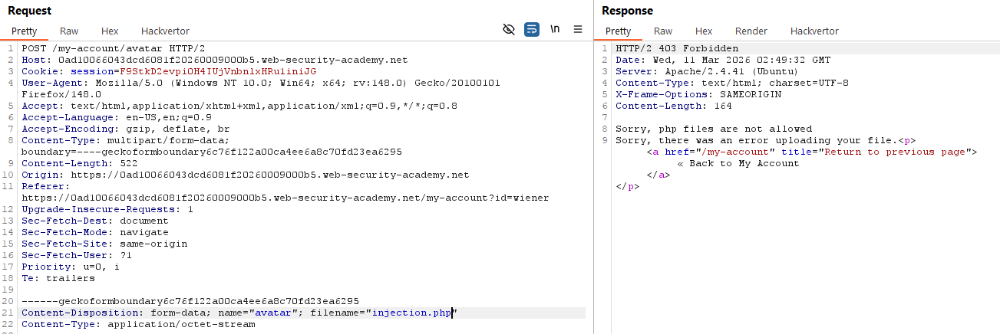

Nhưng ta vẫn có thể upload các file định dạng khác ngoài file `.php`, tức là ta có thể upload 1 file định dạng khác rồi yêu cầu server thực thi file đó như file `.php`. Ta có thể làm vậy bằng cách upload file `.htaccess`. 

Đối với Apache Server, file `.htaccess` có chức năng thay đổi config của server dù cho dev không có quyền hạn truy cập vào config chính của server. Vì ta có thể upload bất cứ file nào ngoài `.php`, nên ta có thể ghi đè file này để yêu cầu server thực thi định dạng file ta yêu cầu. 

Mở lại request upload file, ta thay đổi `filename=.htaccess`, `Content-Type: text/plain` và nội dung file là: `AddType application/x-httpd-php .xyz`. Nội dung file này có ý nghĩa là yêu cầu server coi extension `.xyz` thực thi như file `.php`. 

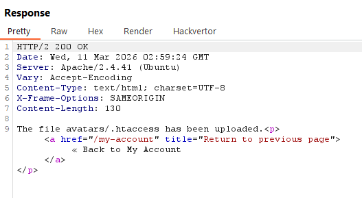

Khi này ta upload file `injection.xyz` sẽ thành công và có thể thực thi được:

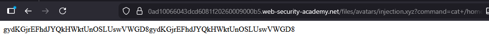

### Lab: Web shell upload via obfuscated file extension
Cùng với vuln tương tự lab trên, nhưng khi này hệ thống sẽ chỉ chấp nhận file có đuôi `.jpg` và `.png`

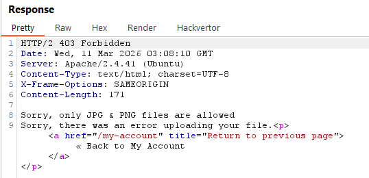

Đối với filter như này, ta có thể thư tên file `injection.php%00.jpg`, với `%00` đóng vai trò làm Null byte. Khi hệ thống đọc tên file, nó sẽ thấy đuôi `.jpg` và chấp nhận, nhưng khi thực thi file thì `%00` sẽ khiến hệ thống chỉ đọc tới `.php` và thực thi file này như file `.php`.

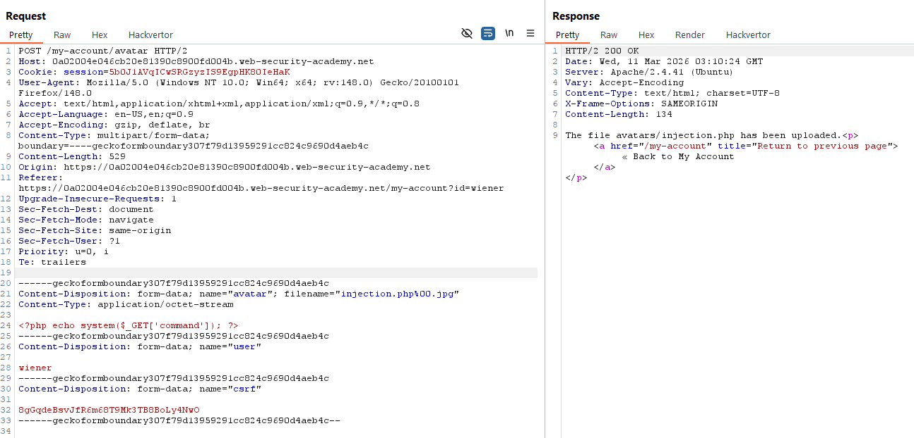

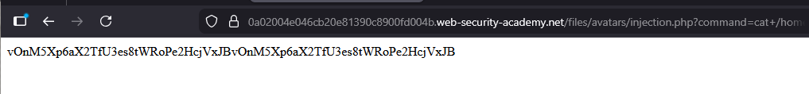

### Lab: Remote code execution via polyglot web shell upload
Cũng với vuln như các lab trên, nhưng khi này phía server không còn dựa vào `Content-Type` để xác thực mà dựa vào nội dung file hiển thị. Nếu 1 file được định dạng hình ảnh như `.jpg` hay `.png` mà không có yếu tố chứng mính đó là file hình ảnh ví dụ như: signature, header, footer, dimension,... thì server sẽ từ chối hiển thị file đó. 

Đối với dạng kiểu như này, ta có thể sử dụng `Polyglot file`, là một dạng file tương thích với nhiều kiểu file format khác nhau, ví dụ GIFAR file là kết hợp của `.gif` + `.rar`. 

Đối với lab này, ta sẽ kết hợp script PHP vào trong file `.jpg`. Có nhiều tool hỗ trợ việc này, nhưng nối tiếng nhất `Exiftool`. Về cách thức hoạt động, ta sẽ cài script PHP vào phần comment của file `.jpg`, khi mà đây là phần duy nhất không ảnh hưởng đến cấu trúc của file. 

Script để sử dụng Exiftool: `exiftool -Comment="<?php echo 'START' . file_get_contents('/home/carlos/secret'); ?>" .\<image_name>.jpg -o polyglot.php`

Upload file này lên server, ta sẽ bypass được filter và webshell sẽ được thực thi.

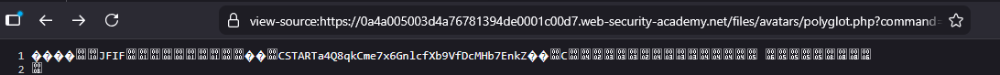

### Lab: Web shell upload via race condition
Lab này yêu cầu ta khai thác vuln bằng cách sử dụng Race Condition.

Trước khi hiểu tại sao phái sử dụng Race Condition, ta cần nhìn vào đoạn code chứa lỗ hỏng trong server:
```php
<?php
$target_dir = "avatars/";
$target_file = $target_dir . $_FILES["avatar"]["name"];

// temporary move
move_uploaded_file($_FILES["avatar"]["tmp_name"], $target_file);

if (checkViruses($target_file) && checkFileType($target_file)) {
    echo "The file ". htmlspecialchars( $target_file). " has been uploaded.";
} else {
    unlink($target_file);
    echo "Sorry, there was an error uploading your file.";
    http_response_code(403);
}

function checkViruses($fileName) {
    // checking for viruses
    ...
}

function checkFileType($fileName) {
    $imageFileType = strtolower(pathinfo($fileName,PATHINFO_EXTENSION));
    if($imageFileType != "jpg" && $imageFileType != "png") {
        echo "Sorry, only JPG & PNG files are allowed\n";
        return false;
    } else {
        return true;
    }
}
?>
```

File khi được upload vào server sẽ được lưu tạm thời vào folder, sau đó mới được xử lý như check virus hay check file type. Vì nó được lưu tạm thời, nên ta có thể truy cập vào file nếu đủ nhanh trong khi hệ thống đang check file type hay virus, vì thế đó là lý do sinh ra lỗi Race Condition.

Để khai thác, ta sẽ sử dụng Burp Repeater. Cụ thể, ta sẽ tạo 1 group chứa 1 tab gửi `POST /my-account/avatar` upload file php, và 5 tab gửi request `GET /files/avatars/<file.php>`. Rồi gửi đồng loạt bằng `Send group (parallel)`.

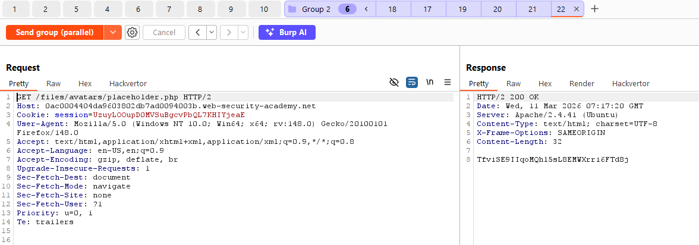

Lý do cho việc sử dụng mode `Parallel` là vì trong khi request upload file `.php` đang được xử lý, ta cần đồng thời truy cập vào file đó để có thể trigger webshell trước khi hệ thống hoàn tất việc kiếm tra và xoá file đó.
=======
# File upload vulnerabilities
## Khái niệm:
Upload file chưa bao giờ chỉ là upload 1 file ảnh lên avatar, gửi bài tập lên hệ thống,... Nếu không được config đúng cách, kẻ tấn công có thể gửi các file thực thi lên server, sau đó chạy file đó thông qua API. Một khi việc gửi file và thực thi thành công, server coi như nằm dưới quyền kiểm soát của kẻ tấn công.

## Lab:
### Lab: Remote code execution via web shell upload
Lab này là 1 ví dụ đơn giản cho việc không kiểm soát chặt chẽ file upload lên server sẽ dẫn đến hậu quả như thế nào. Sau khi đăng nhập vào hệ thống, ta sẽ thấy ở chỗ avatar có chức năng upload hình ảnh từ user:


Sử dụng payload đơn giản bằng ngôn ngữ php: `<?php echo system($_GET['command']); ?>`, ta upload file này lên hệ thống và hệ thống vẫn chấp thuận.


Nhưng, do file ta upload lên không phải file ảnh nên ta không biết file đó đã được upload đi đâu, nên ta sẽ upload 1 file ảnh khác để biết đường dẫn chứa file webshell.


Khi đã biết được đường dẫn chứa file webshell, ta có thể truy cập vào file thông qua request:


### Lab: Web shell upload via Content-Type restriction bypass
Để kiểm tra xem 1 file upload lên có phải là file ảnh hay không có nhiều cách thức, một trong số những cách thức đó là kiểm tra Content-Type của file có phải là `image/jpeg` hay `image/png` hay không:


Nếu server chỉ dựa vào đó để xác thực, attacker có thể dễ dàng chỉnh sửa Content-Type, khiến cho bất cứ file nào gửi đến server cũng mang Content-Type của hình ảnh:


Và như thế, hệ thống xác thực đã bị bypass:


### Lab: Web shell upload via path traversal
Lab này yêu cầu ta upload file webshell, nhưng khi này tại folder chứa avatar đã bị chặn quyền hạn thực thi file và chỉ hiển thị dạng text thông thường.


Khi này, ta có thể sử dụng 1 lỗ hỏng khác là Path Traversal để chuyển file php này sang folder khác có thể thực thi được. Trong các param ở Request, ta thấy param `filename` là nơi chứa tên file:


Nếu ta thử sử dụng Path Traversal lên param này, ta nhận thấy rằng các kí tự đã bị server filter, tức là vẫn có thể có cách sử dụng cách này.


Chuyển đổi kí tự `/` URL encode thành `%2F`, ta sẽ bypass được filter.


Khi này, nếu chạy file `injection.php` đang nằm ở folder `files`, thì sẽ không có bất cứ filter nào ngăn cản webshell khởi động:


### Lab: Web shell upload via extension blacklist bypass
Lab này yêu cầu ta upload webshell và thực thi nó, đồng thời cũng phải bypass filter chặn việc upload. 

Cụ thể, nếu ta upload 1 file `.php`, hệ thống sẽ chặn request và từ chối file upload:


Nhưng ta vẫn có thể upload các file định dạng khác ngoài file `.php`, tức là ta có thể upload 1 file định dạng khác rồi yêu cầu server thực thi file đó như file `.php`. Ta có thể làm vậy bằng cách upload file `.htaccess`. 

Đối với Apache Server, file `.htaccess` có chức năng thay đổi config của server dù cho dev không có quyền hạn truy cập vào config chính của server. Vì ta có thể upload bất cứ file nào ngoài `.php`, nên ta có thể ghi đè file này để yêu cầu server thực thi định dạng file ta yêu cầu. 

Mở lại request upload file, ta thay đổi `filename=.htaccess`, `Content-Type: text/plain` và nội dung file là: `AddType application/x-httpd-php .xyz`. Nội dung file này có ý nghĩa là yêu cầu server coi extension `.xyz` thực thi như file `.php`. 


Khi này ta upload file `injection.xyz` sẽ thành công và có thể thực thi được:


### Lab: Web shell upload via obfuscated file extension
Cùng với vuln tương tự lab trên, nhưng khi này hệ thống sẽ chỉ chấp nhận file có đuôi `.jpg` và `.png`


Đối với filter như này, ta có thể thư tên file `injection.php%00.jpg`, với `%00` đóng vai trò làm Null byte. Khi hệ thống đọc tên file, nó sẽ thấy đuôi `.jpg` và chấp nhận, nhưng khi thực thi file thì `%00` sẽ khiến hệ thống chỉ đọc tới `.php` và thực thi file này như file `.php`.


### Lab: Remote code execution via polyglot web shell upload
Cũng với vuln như các lab trên, nhưng khi này phía server không còn dựa vào `Content-Type` để xác thực mà dựa vào nội dung file hiển thị. Nếu 1 file được định dạng hình ảnh như `.jpg` hay `.png` mà không có yếu tố chứng mính đó là file hình ảnh ví dụ như: signature, header, footer, dimension,... thì server sẽ từ chối hiển thị file đó. 

Đối với dạng kiểu như này, ta có thể sử dụng `Polyglot file`, là một dạng file tương thích với nhiều kiểu file format khác nhau, ví dụ GIFAR file là kết hợp của `.gif` + `.rar`. 

Đối với lab này, ta sẽ kết hợp script PHP vào trong file `.jpg`. Có nhiều tool hỗ trợ việc này, nhưng nối tiếng nhất `Exiftool`. Về cách thức hoạt động, ta sẽ cài script PHP vào phần comment của file `.jpg`, khi mà đây là phần duy nhất không ảnh hưởng đến cấu trúc của file. 

Script để sử dụng Exiftool: `exiftool -Comment="<?php echo 'START' . file_get_contents('/home/carlos/secret'); ?>" .\<image_name>.jpg -o polyglot.php`

Upload file này lên server, ta sẽ bypass được filter và webshell sẽ được thực thi.


### Lab: Web shell upload via race condition
Lab này yêu cầu ta khai thác vuln bằng cách sử dụng Race Condition.

Trước khi hiểu tại sao phái sử dụng Race Condition, ta cần nhìn vào đoạn code chứa lỗ hỏng trong server:
```php
<?php
$target_dir = "avatars/";
$target_file = $target_dir . $_FILES["avatar"]["name"];

// temporary move
move_uploaded_file($_FILES["avatar"]["tmp_name"], $target_file);

if (checkViruses($target_file) && checkFileType($target_file)) {
    echo "The file ". htmlspecialchars( $target_file). " has been uploaded.";
} else {
    unlink($target_file);
    echo "Sorry, there was an error uploading your file.";
    http_response_code(403);
}

function checkViruses($fileName) {
    // checking for viruses
    ...
}

function checkFileType($fileName) {
    $imageFileType = strtolower(pathinfo($fileName,PATHINFO_EXTENSION));
    if($imageFileType != "jpg" && $imageFileType != "png") {
        echo "Sorry, only JPG & PNG files are allowed\n";
        return false;
    } else {
        return true;
    }
}
?>
```

File khi được upload vào server sẽ được lưu tạm thời vào folder, sau đó mới được xử lý như check virus hay check file type. Vì nó được lưu tạm thời, nên ta có thể truy cập vào file nếu đủ nhanh trong khi hệ thống đang check file type hay virus, vì thế đó là lý do sinh ra lỗi Race Condition.

Để khai thác, ta sẽ sử dụng Burp Repeater. Cụ thể, ta sẽ tạo 1 group chứa 1 tab gửi `POST /my-account/avatar` upload file php, và 5 tab gửi request `GET /files/avatars/<file.php>`. Rồi gửi đồng loạt bằng `Send group (parallel)`.


Lý do cho việc sử dụng mode `Parallel` là vì trong khi request upload file `.php` đang được xử lý, ta cần đồng thời truy cập vào file đó để có thể trigger webshell trước khi hệ thống hoàn tất việc kiếm tra và xoá file đó.
>>>>>>> ae5bd4f (init commit)
