# NoSQL injection
## Khái niệm
NoSQL là một dạng database khác biệt không sử dụng ngôn ngữ SQL như các database như SQLServer, MySQL,... Database của NoSQL có khả năng lưu trữ và truy vấn dữ liệu với tốc độ cao mà không đòi hỏi quá cao về phần cứng, thứ mà các relational database như PostgreSQL, OracleSQL,... đang mắc phải. Tuy nhiên, vì bản chất NoSQL vẫn là database và vẫn cần truy vấn dữ liệu, nên vẫn sẽ tồn tại những lỗ hỏng dữ liệu liên quan tới query và syntax. Từ những lỗ hỏng đó đã khai sinh thuật ngữ: NoSQL Injection, với bản chất cũng tương tự với SQL Injection.

## Lab:
### Lab: Detecting NoSQL injection
Lab này yêu cầu hiển thị những sản phẩm đang bị ẩn đi. Thì cũng tương tự với SQL Injection khi ta sử dụng điều kiện luôn đúng như `1==1`, ở đây ta sẽ áp dụng tương tự, nhưng sẽ khác một tí về syntax do Lab này sử dụng JavaScript tương tác với MongoDB, nên syntax sẽ theo format như JS.

Sử dụng payload `'||'1=='1` để ép query trở thành đại loại như `category='Pets'||'1=='1'&&released=1`, khi này vì `'1'=='1'` luôn đúng nên server sẽ hiển thị tất cả sản phẩm.
### Lab: Exploiting NoSQL operator injection to bypass authentication
Lab này yêu cầu ta cần đăng nhập vào server bằng tài khoản admin với account được cho trước. 

Sử dụng Burp Proxy để truy cập vào `POST /login`, ta thấy được payload gửi thông tin đăng nhập tới server:

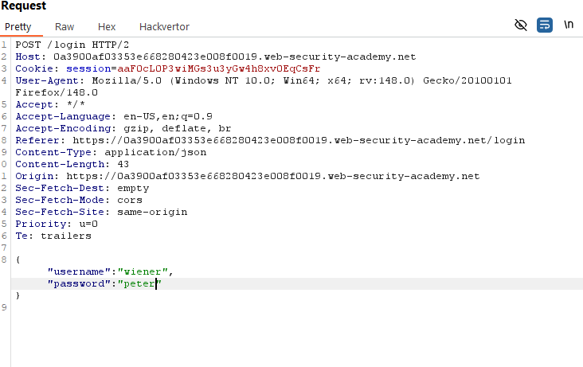

Đối với MongoDB, database này sử dụng toán tử truy vấn để chỉ định dữ liệu cụ thể. Một số loại toán tử được sử dụng như:
- $where: Tìm dữ liệu trùng khớp với dòng code yêu cầu từ JavaScript.
- $ne: Tìm tất cả dữ liệu không trùng với dữ liệu được chỉ định.
- $in: Tìm tất cả giá trị được chỉ định bên trong 1 array
- $regex: Chọn dữ liệu trùng khớp với Regex chỉ định.

Ở Lab này, khi đổi password thành `"password":{"$ne":"invalid"}`, hệ thống vẫn chấp nhận đăng nhập:

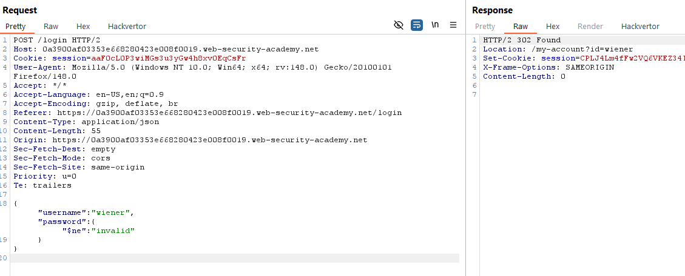

Điều này nghĩa là tài khoản admin có thể được truy cập mà không nhất thiết phải biết mật khẩu. Tuy nhiên, khi đăng nhập user `administrator`, hệ thống lại thông báo không đăng nhập vì sai tài khoản hoặc mật khẩu:

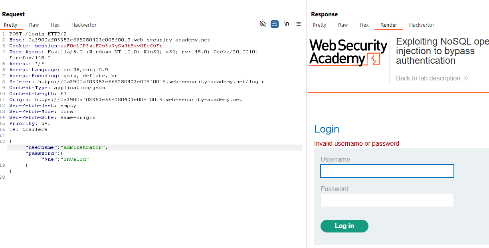

Vậy tức là tài khoản admin có thể sẽ chứa các kí tự khác với dự tính, nhưng từ "admin" vẫn sẽ tồn tại trong username của `administrator`, nên ta sẽ sử dụng Regex để capture tài khoản bắt đầu bằng `admin`:

Sử dụng Burp Intercept để bắt `POST /login`, rồi thay payload đăng nhập như trên, ta sẽ truy cập được tài khoản admin và hoàn thành lab:

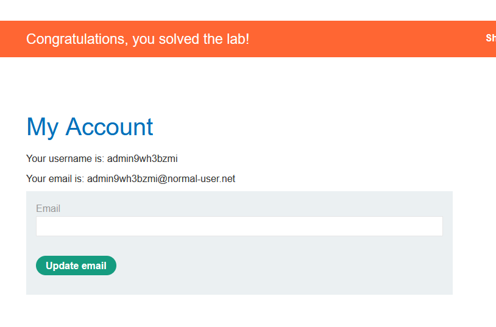

### Lab: Exploiting NoSQL injection to extract data
Yêu cầu tương tự như trên, tuy nhiên khi này ta sẽ không thể khai thác lỗ hỏng nằm ở phần login được do Content-Type bị đổi thành `application/x-www-form-urlencoded` thay vì `application/json`, và payload giờ chứa token CSRF sẽ tự động huỷ nếu đăng nhập thành công lần đầu tiên.

Khi này, ta cần đăng nhập vào server tài khoản được cấp. Sau đó, mở Proxy lên ta sẽ thấy request `GET /user/lookup?user=wiener`:

Do API không chứa token verify việc truy cập, nên ta có thể truy cập vào `GET /user/lookup?user=administrator`

Bên cạnh đó, ta có thể suy đoán rằng username đang được query thẳng với format giả dụ như: `"$where":"this.username == 'administrator'"`. Ta sẽ kiểm chứng bằng cách thử payload: `administrator'%26%26'1'=='1` và `administrator'%26%26'1'=='2`:

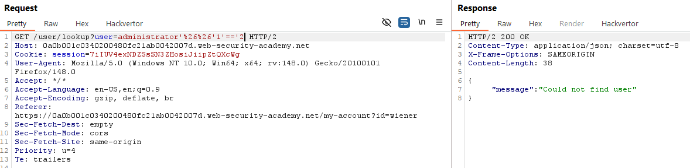

Như có thể thấy, có sự khác biệt trong kết quả giữa 2 payload, tức là ta có thể chèn payload dò mật khẩu. Trước tiền thì ta cần kiểm tra mật khẩu gồm những kí tự như thế nào bằng payload `administrator'%26%26this.password.match(/$regex/)||'1'=='2`. Ta tìm được mật khẩu chỉ chứa kí tự lowercase. Từ đó, ta bruteforce mật khẩu bằng payload `administrator'%26%26this.password[$numbers$]=='$letter$'||'1'=='2`:

### Lab: Exploiting NoSQL operator injection to extract unknown fields
Cũng với yêu cầu như trên, nhưng khi này, nếu ta nhập toán tử truy vấn thay thế cho password, server sẽ chặn lại:

Nhưng nếu ta nhập sai tài khoản, yêu cầu hiển thị sẽ chỉ bảo lỗi sai tài khoản hoặc mặt khẩu:

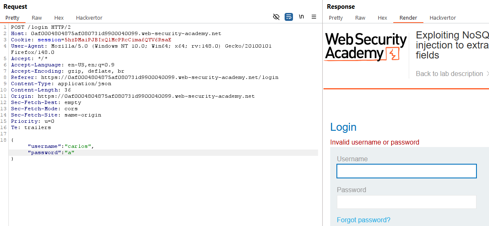

Nhưng, khi ta thêm 1 param là "$where", thì khi ghi giá trị là 0 hoặc 1 sẽ hiển thị 2 kết quả khác nhau:

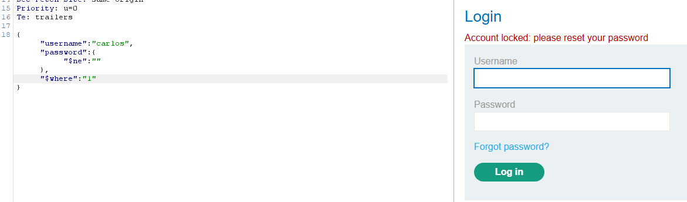

Với việc hiển thị kết quả True/False khác nhau như vậy, ta có thể inject payload để tìm dữ liệu ta cần.

Sử dụng payload `"$where":"Object.keys(this)[0].match('^.{0}$letter$.*')"`, ta có thể trích xuất tên các đầu mục. Tuy nhiên, các đầu mục ta trích xuất được là: id, username, password và email đều là những cái ta không thể lấy giá trị được. Khi này ta để ý tới chức năng forgot-password. Sử dụng chức năng đó cho `carlos`,  ta sẽ thấy hệ thống gửi 1 link reset password về email, tức là email đó sẽ chứa token reset password. Nếu ta sử dụng chức năng đó, rồi chạy lại payload `"$where":"Object.keys(this)[4].match('^.{0}$letter$.*')"` ta sẽ dò được tên của token:

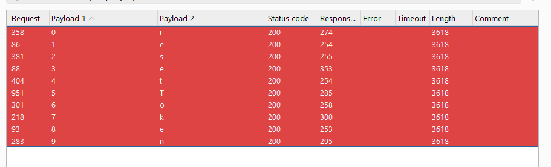

Khi này nếu nhập tên token đó lên url, ta sẽ được thông báo sau:

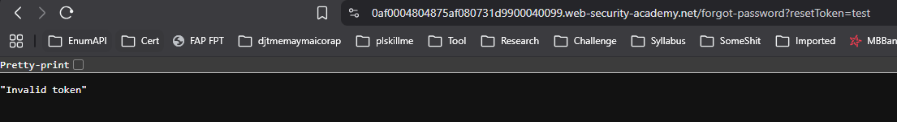

Sử dụng thông tin này, ta có thể bruteforce giá trị của token bằng payload `"$where":"this.resetToken.match('^.{}.*')"`:

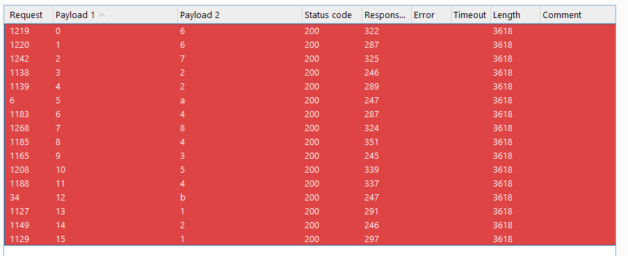

Sử dụng giá trị của token trên, ta có thể truy cập vào chức năng reset mật khẩu, từ đó đổi mật khẩu để truy cập vào `carlos`:

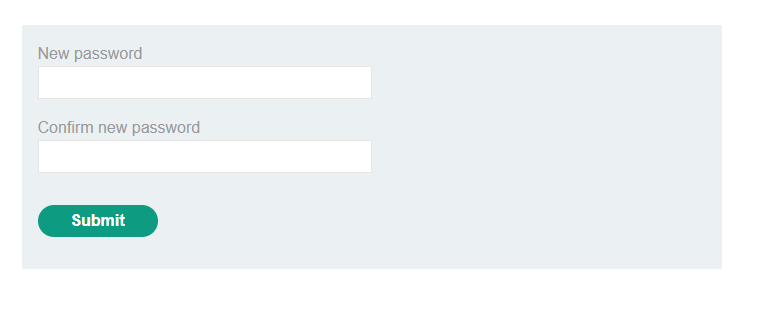

