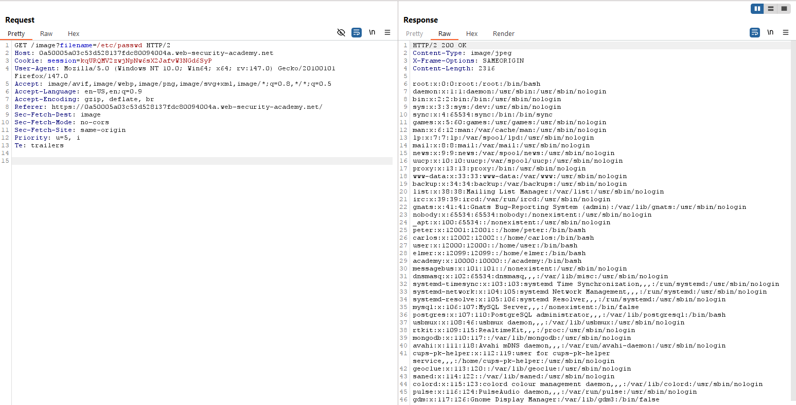
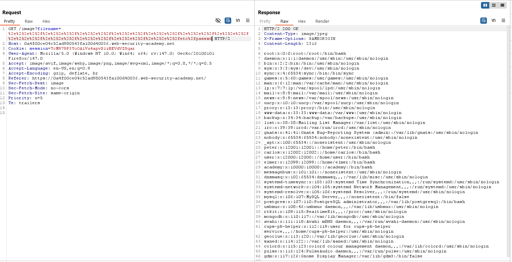
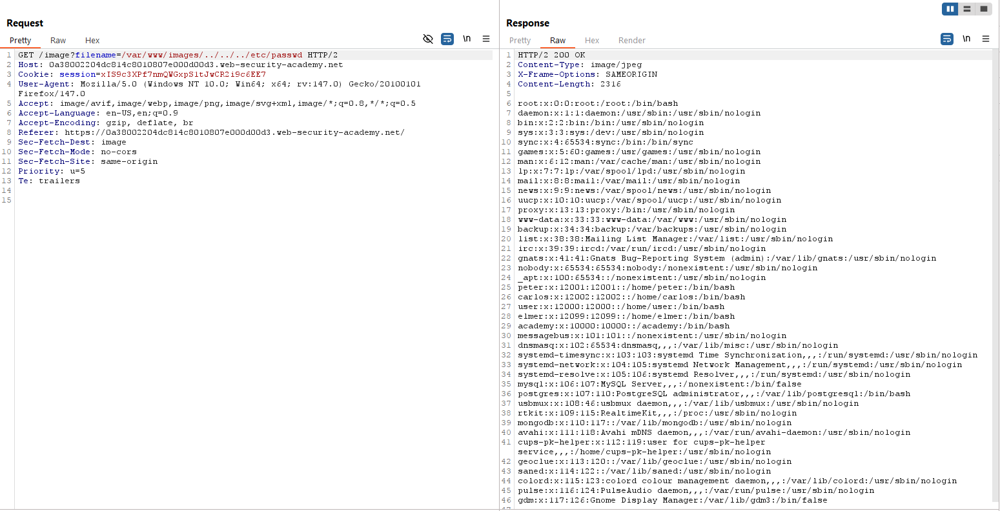

# Path Traversal
## Khái niệm:
Path Traversal là một lỗ hỏng cho phép kẻ tấn công tuỳ ý đọc được các file và thông tin trên server.
## Giải thích một số câu lệnh:
- `./`: Di chuyển đến thư mục hiện tại.
- `../`: Di chuyển đến thư mục cha của thư mục hiện tại.
## Lab:
Toàn bộ các Lab đều tập trung vào việc đọc được thông tin nằm trong /etc/passwd
### Lab: File path traversal, simple case
Giả sử vị trí ảnh của server được lưu ở đường dẫn: `/var/www/images/1.png`, để đến `/etc/passwd`, ta sẽ cần phải lùi con trỏ thư mục đi 3 lần để về thư mục gốc rồi mới tới `/etc/passwd`.

### Lab: File path traversal, traversal sequences blocked with absolute path bypass
Giả sử người tạo ra server biết đến việc người dùng có thể tấn công bằng path traversal, ở trường hợp này, họ đã đặt input đầu vào đường dẫn (path). Khi này, ta có thể bypass bằng việc sử dụng absolute path.

### Lab: File path traversal, traversal sequences stripped non-recursively
Sau khi biết được cách trên không an toàn, chủ server thêm vào một số câu lệnh sanity input. Tuy nhiên, việc sanity input này chưa triệt để hoàn toàn vì nếu input là `....//` hay `..../\`, sau khi lọc đi chỉ còn `../` hay `..\`. Lý do là vì việc filter chỉ lọc 1 lần duy nhất mà ko tính đến trường hợp vòng lặp.

### Lab: File path traversal, traversal sequences stripped with superfluous URL-decode
Ở 1 vài website khác, chủ server có thể filter URL hoặc filename bằng cách lọc đi những kí tự trên rồi mới đưa vào input. Khi này, ta vẫn có thể bypass bằng việc sử dụng URL encoding/decoding, chuyển `../` thành `%2e%2e%2f` hoặc `%252e%252e%252f` tuỳ thuộc vào việc sử dụng 1 hay 2 lần encode. Đối với lab này, ta sẽ sử dụng `Fuzzing - Path Traversal` nằm trong `Payload configuration` để tấn công:

Sử dụng kết quả ta tìm được, thay địa chỉ đích từ `/etc/hosts` thành `/etc/passwd`:

### Lab: File path traversal, validation of start of path
Một số website yêu cầu tên tệp phải bắt đầu chính xác tại thư mục gốc, ví dụ như `/var/www/images`. Dựa vào thông tin đó ta có thể biết phải lùi bao nhiêu thu mục để tới thư mục gốc.

### Lab: File path traversal, validation of file extension with null byte bypass
Ở một số website khác có thể sẽ yêu cầu tên file phải kết thúc bằng file extension chỉ định, ví dụ như ".png". Ta có thể bypass bằng cách sử dụng null byte (%00) để kết thúc file path trước khi hệ thống đọc đến file extension.

