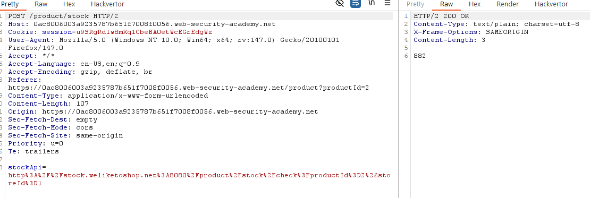
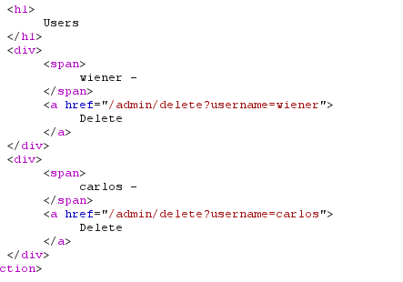
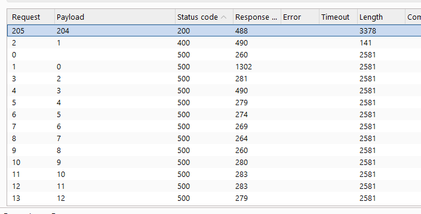
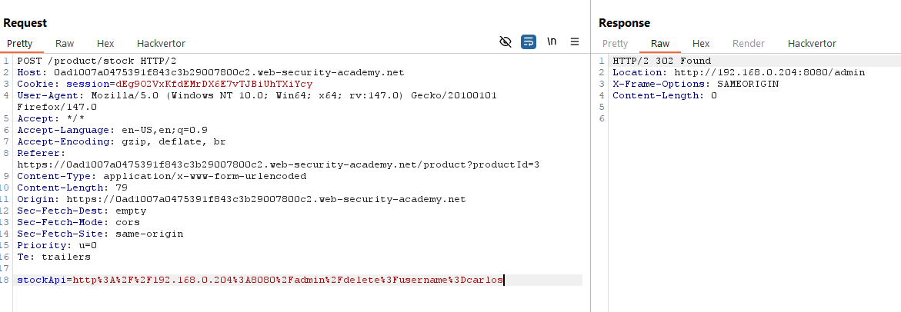
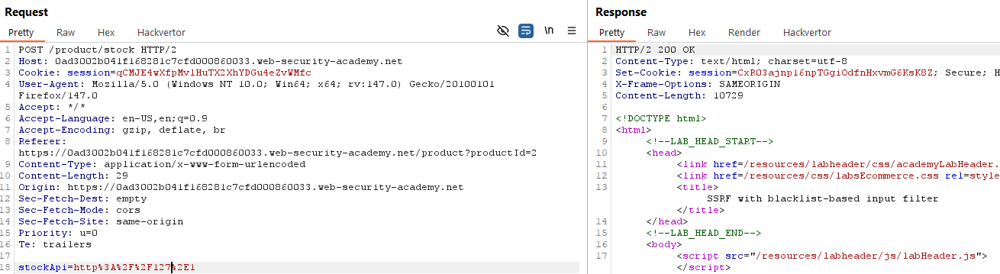
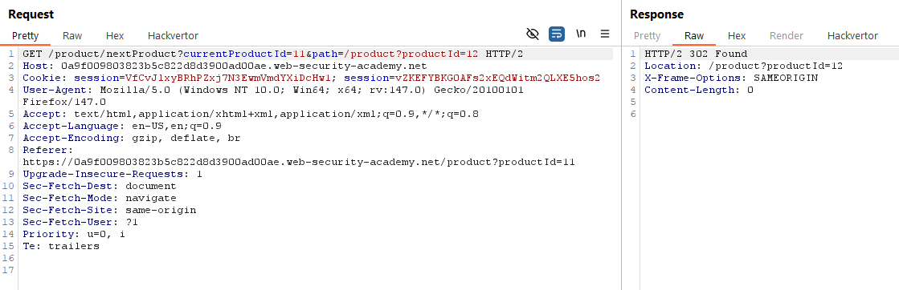
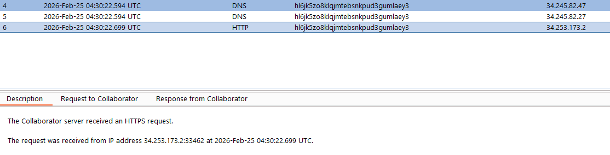

# Server-side request forgery (SSRF) attacks
## Khái niệm
SSRF có thể tạm dịch sang tiếng việt là: "Giả mạo yêu cầu phía máy chủ", tức là chỉ việc khai thác lỗ hỏng nằm ở việc giao tiếp của bên phía server. Cụ thể, đối với server sử dụng kết nối nhiều hệ thống với nhau giao tiếp qua API, nếu không được config cẩn thận, kẻ tấn công có thể lợi dụng API giao tiếp của server để vượt quyền truy cập cho phép.

## Lab
### Lab: Basic SSRF against the local server
Lab này chứa vuln nằm ở stock check. Cụ thể, khi user yêu cầu check stock, client sẽ gửi request chứa payload là API giao tiếp với phía server, sau đó server sẽ trả kết quả hiển thị cho phía client.

Để hoàn thành lab này, ta chỉ cần thay đổi API để nó trỏ tới `http://localhost/admin`, sau đó xoá user `carlos` là hoàn tất.

Để API ta cần gửi chính xác, ta cần encoding URL thành: `http%3A%2F%2Flocalhost%2Fadmin`, gửi request `/product/stock` tới Burp Repeater, thay đổi stockAPI thành link trên rồi gửi.

API xoá user `carlos` nằm ở trong source của response vừa nhận:

Encode API trên thành: `%2Fadmin%2Fdelete%3Fusername%3Dwiener` rồi gửi đến server:

### Lab: Basic SSRF against another back-end system
Tương tự với Lab trên, nhưng API gợi tới interface của admin bị chuyển tới 1 địa chỉ IP khác trong dải 192.168.0.X. 

Khi ta thay API thành: `http%3A%2F%2F192.168.0.1%3A8080%2Fadmin`, thông báo hiển thị là: `"Missing parameter"`. Điều này có nghĩa IP `192.168.0.1` chỉ có chức năng liên quan tới Product và không thể gọi tới admin interface ở địa chỉ này. Dựa vào bài lab yêu cầu ta cần tìm interface trong dải 192.168.0.X, ta sẽ sử dụng Burp Intruder để dò IP liên quan tới interface admin với payload: `stockApi=http%3A%2F%2F192.168.0.$number$%3A8080%2Fadmin` với number chạy từ 0-255:

Sau khi tìm được IP gọi được interface admin, ta lặp lại các bước ở Lab trên để xoá user `carlos`

### Lab: SSRF with blacklist-based input filter
Vẫn cùng yêu cầu trên, nhưng khi này việc gọi thẳng tên API đã bị cho vào blacklist, tức là các từ như `localhost`, `admin`, `127.0.0.1` đã bị hệ thống chặn.

Ta có thể lách luật bằng cách thay vì call API là `127.0.0.1` thành `127.1`, hệ thống vẫn sẽ coi đó là `127.0.0.1`.

Đối với từ `admin`, ta có thể double encoding trở thành: `%2561%2564%256d%2569%256e`

Còn lại là làm các bước tương tự trên.

### Lab: SSRF with filter bypass via open redirection vulnerability
Với yêu cầu như trên, nhưng khi này API truy cập tới admin đã bị chặn quyền truy cập trực tiếp, và phải truy cập qua việc "redirect" (chuyển hướng). 

Đối với lab này, vuln nằm ở chức năng `Next Product` khi nó lộ API Path dẫn tới trang mà nó trỏ tới, chứng tỏ ta có thể điều hướng stockAPI để nó redirect tới interface. 

Ta có thể khai thác lỗ hỏng này bằng cách thay đổi địa chỉ path để nó trỏ tới `http://192.168.0.12:8080/admin/%2Fdelete%3Fusername%3Dcarlos`.

### Lab: Blind SSRF with out-of-band detection
Do lab này yêu cầu rất ngắn gọn là thay đổi địa chỉ Referer thành DNS server được tạo bởi Burp Collaborator, nên nội dung ở nửa sau sẽ thiên về giải thích các chi tiết.

Đối với lab này, khi truy cập vào sản phẩm, header Referer của request hiển thị địa chỉ truy cập dẫn tới địa chỉ hiện tại. Ta sẽ thay đổi địa chỉ này thành DNS của Burp Collaborator, gửi lại request để hoàn thành lab.

Đến với phần giải thích, ở đây mình sẽ trả lời 2 câu hỏi: Blind SSRF là gì và tại sao lại sử dụng header Referer:
1. Blind SSRF
- Đầu tiên, không như SSRF hiện thị trực tiếp kết quả tới attacker, blind SSRF không hiển thị bất cứ phản hồi nào cả. Tức là cùng 1 request tới API admin của server, SSRF sẽ hiển thị trực tiếp interface nếu đúng hoặc báo lỗi nếu sai, còn Blind SSRF sẽ không cho ra kết quả trực tiếp nào dù cả đúng lẫn sai. Chính vì thế việc phát hiện và khai thác lỗ hỏng này tương đối khó, nhưng mà độ nghiêm trọng cũng tương đương với SSRF thông thường. 
- Một trong các kĩ thuật Blind SSRF được sử dụng ở đây là Out-of-Band, khi mà attacker có thể khiến server gửi request tới DNS hướng tới server của attacker. Có nhiều cách để làm như inject payload vào request, sử dụng webshell, hay như trong lab này là sử dụng Referer.
2. Tại sao là Referer?
- Header Referer theo như mô tả của [MDN](https://developer.mozilla.org/en-US/docs/Web/HTTP/Reference/Headers/Referer) chỉ đường dẫn chứa đường link dân tới trang hiện tại. Một số website sử dụng header này để phân tích và thống kê lượt truy cập hoặc để tối ưu,... Nếu việc sử dụng Header này không được xử lý tốt, thì khi mà attacker inject DNS độc vào request, server sẽ vẫn coi đó là 1 DNS của server và gửi request tới đó, từ đó attacker có thể gửi response độc tới server.
